# 科研推荐系统答辩问答

> 2026-05-16 → 2026-06-02 · Q0–Q16（Q1/Q15 未记录）

## 索引

- [Q0: 系统整体架构与亮点设计](#q0-当前系统的整体架构是怎样的有哪些亮点设计2026-05-16git-c513ad2)
- [Q2: 推荐主链路全流程 + Python 服务实现](#q2-推荐主链路全流程--python-服务实现详解2026-05-16git-bad2152)
- [Q3: 私信功能实现细节](#q3-私信功能的实现细节2026-05-16git-bad2152)
- [Q4: 业务功能全景与使用流程](#q4-系统的业务功能全景与使用流程2026-05-16git-bad2152)
- [Q5: ActorCriticAgent 强化学习核心详解](#q5-actorcriticagent-强化学习核心详解2026-05-16git-c513ad2)
- [Q5追问: Python 模块包图/依赖图](#q5追问-rl-service-python-模块包图--依赖图2026-05-19git-bad2152)
- [Q5追问: 推荐服务算法伪代码与流程图](#q5追问-推荐服务算法伪代码与细致流程图2026-05-19git-bad2152)
- [Q6: 学习路径生成](#q6-每位用户的专属学习路径是如何生成的2026-05-16git-bad2152)
- [Q7: Neo4j 数据库结构](#q7-当前-neo4j-数据库的结构是怎样的有哪些属性和关系2026-05-16git-bad2152)
- [Q8: 四个核心用例流程图](#q8-四个核心用例的业务级流程图2026-05-16git-bad2152)
- [Q9: 学习路径可视化交互](#q9-学习路径可视化能否实现点击节点后实时更新传播量与颜色2026-05-16git-bad2152)
- [Q10: 数据库各表作用与作者认领方案](#q10-数据库各表作用与主外键--作者认领功能的数据库调整方案2026-05-19git-c513ad2)
- [Q11: 全项目代码审计报告](#q11-全项目系统性代码审计报告2026-05-24)
- [Q12: P0 BUG 详细分析与修复](#q12-p0-bug-详细分析与修复记录2026-05-24)
- [Q13: KG-RL 协同 + 评估指标 + MDP 形式化](#q13-知识图谱-强化学习协同--评估指标--mdp-形式化定义2026-05-25)
- [Q14: 论文向量去随机化改造](#q14-论文向量去随机化改造方案2026-05-27--已于-2026-05-29-实施-commit-ab296f8git-ab296f8)
- [Q16: 推荐排序分值归一化 + 质量门控](#q16-推荐排序分值归一化--质量门控2026-06-02git-bad2152)

---

## Q0: 当前系统的整体架构是怎样的，有哪些亮点设计？（2026-05-16）（git: c513ad2） ^q0

**标签**: #架构 #技术栈
**关联**: [[QA_2026-05-16_2026-06-02_v1#^q4|Q4]], [[QA_2026-06-02_2026-06-05_v2#^q29|Q29]], [[QA_2026-06-07_2026-06-08_v3#^q45|Q45]]

### 整体架构

系统是一个**三体架构**的科研推荐平台：Vue 3 前端 → Spring Boot 后端 → Python FastAPI 推荐引擎，三者通过 REST + WebSocket 协作。

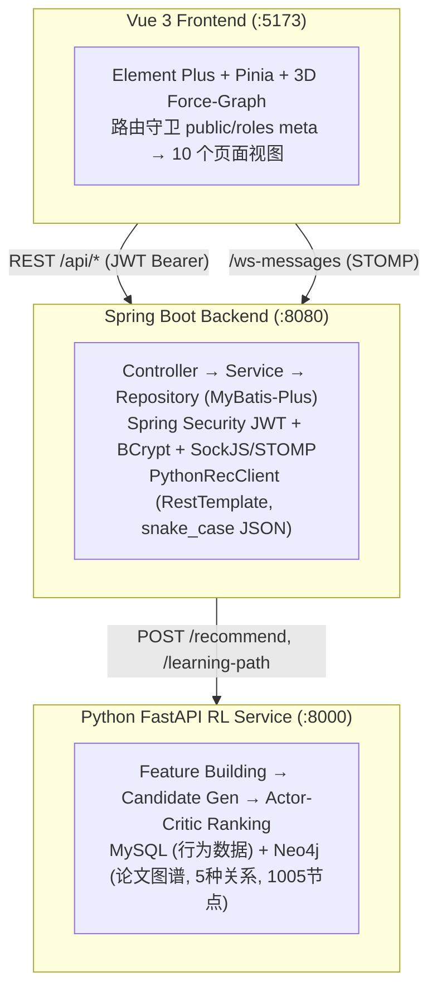

**数据存储分工：**
- **MySQL**（13 张表）：用户、论文元数据、行为日志、社区帖子/评论/点赞、私信/联系人、兴趣历史、RL 特征缓存、作者认领
- **Neo4j**：Paper 节点 + 5 类关系（HAS_KEYWORD, AUTHOR_OF, CITE, PUBLISH_IN, CO_AUTHOR），知识图谱嵌入从图结构实时计算

**核心数据流（推荐链路）：**
前端 → `GET /api/recommend` → `RecommendServiceImpl`（本地 ID→AMiner ID 转换）→ `PythonRecClient` → Python Actor-Critic 排序 → 返回 AMiner ID → 后端映射回 `Paper` 行 → 前端渲染。Python 不可用时自动降级为本地热门论文。

---

### 亮点设计

#### 1. 跨服务 ID 映射与优雅降级
推荐链路以 **AMiner ID** 为主键而非本地自增 ID。后端调用 Python 前做 `paper.id → aminer_id` 转换，返回后再反向映射。Python 服务故障时 `RecommendServiceImpl` 自动降级为本地热门推荐——`PythonRecClient` 所有方法都有 try/catch，失败返回 null/false，不抛异常。

#### 2. 行为追踪 → 推荐排序的闭环
前端每次 click/favorite/read 写入 `behavior_log`。Python `feature_builder.py` 采用**加权池化**构建用户向量：click=0.5, read=1.0, favorite=2.0，阅读时长每 60s +0.5（上限 +2.0），使用 `np.average(weights=)` 体现行为重要性差异。`PaperDetail.vue` 追踪真实页面停留时长（`enterTime → onBeforeUnmount delta`）。

#### 3. MySQL + Neo4j 双源数据架构
关系型数据（用户、行为、社区）留 MySQL，图结构数据（论文关系网络）存 Neo4j。KG 数据不经过 MySQL 中转——后端直接调 Python `/learning-path`，Python 从 Neo4j 实时查询并计算图嵌入，避免双写同步问题。

#### 4. 双通道实时私信
REST `/api/message/*` 负责持久化和历史记录，WebSocket SockJS/STOMP `/ws-messages` 负责实时推送。WebSocket 鉴权不走 HTTP Header，而是把 JWT 放进 STOMP 消息体由 `MessageWebSocketController` 二次校验。

#### 5. 集中式配置管理
Python 服务所有超参数集中在 `config.py:default_config` 这一个 `@dataclass` 中——状态维度、网络结构、训练超参、奖励权重、MySQL/Neo4j 连接参数全部一处管理。

#### 6. 基于兴趣集合的合作者匹配

`PrivateMessageServiceImpl.getRecommendedCollaborators()` 将用户 `researchInterests` 逗号分隔字符串解析为 Set，计算同角色用户交集大小，按 overlap 降序取 top 2，排除已有联系人和自身。算法简单高效，无需专门推荐模型。

#### 7. 社区帖子审核状态机
三态流转：`0=PENDING → 1=APPROVED / 2=REJECTED`，管理员可执行"通过"/"驳回"/"撤回"。点赞使用 `post_like` 表 + 唯一约束实现 INSERT/DELETE 切换，点赞数通过 `batchCountLikes()` 实时统计。

#### 8. 前端自适应降级
知识图谱边字段兼容 `src/dst` 和 `source/target` 两种格式，3D 渲染空数据有 fallback。API 响应兼容 `Result` 信封和裸数据（`res.data || res`）。

#### 9. 统一 API 响应信封
绝大多数端点返回 `Result { code, message, data }`，前端 Axios 统一处理 401 跳转、JWT 附加和超时。例外（`/api/message/*`）有明确标注。

#### 10. 游客模式
未登录用户可通过登录页"游客模式"进入 `/search` 浏览论文，降低使用门槛。

---


## Q2: 推荐主链路全流程 + Python 服务实现详解（2026-05-16）（git: bad2152） ^q2

**标签**: #推荐 #主链路 #Python服务
**关联**: [[QA_2026-05-16_2026-06-02_v1#^q5|Q5]], [[QA_2026-05-16_2026-06-02_v1#^q16|Q16]], [[QA_2026-06-07_2026-06-08_v3#^q42|Q42]], [[QA_2026-06-08_v4#^q47|Q47]]

### 一、推荐全链路概览

推荐请求贯穿三端，共七个阶段：

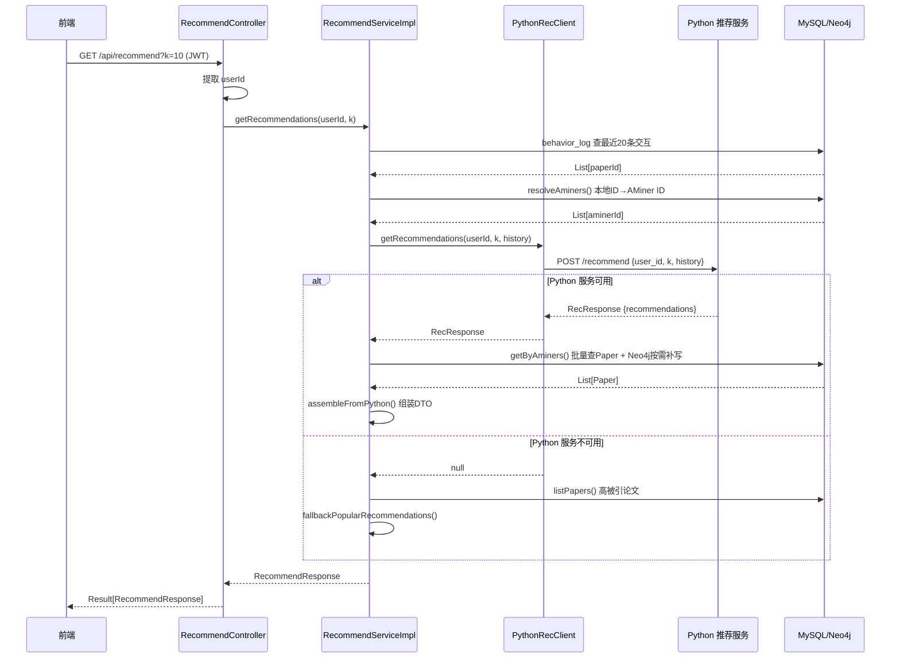

---

### 二、Java 后端：RecommendServiceImpl 五步编排

**文件**: `backend/.../service/impl/RecommendServiceImpl.java`

#### Step 1 — 提取用户历史行为 + ID 转换

```java
// 从 behavior_log 查最近20条交互论文
List<Long> historyPaperIds = behaviorLogMapper.findInteractedPaperIds(userId, 20);

// 本地 paper.id → aminer_id 转换（批量查询，避免 N+1）
List<String> historyAminers = resolveAminers(historyPaperIds);
```

`resolveAminers()` 批量调用 `paperService.getByPaperIds()` 取出 Paper 实体，提取 `aminer_id` 字段——因为 Python 服务不认识 MySQL 自增主键，跨服务通信统一使用 AMiner ID。

#### Step 2 — 调用 Python 推荐服务

```java
PythonRecClient.RecResponse pyResp = pythonRecClient.getRecommendations(
    String.valueOf(userId), k, historyAminers
);
```

`PythonRecClient` 内部使用 `RestTemplate.postForEntity()` 向 `http://localhost:8000/recommend` 发 POST 请求。请求体 DTO 通过 `@JsonProperty` 将 Java camelCase 映射为 Python snake_case。所有调用都有 try/catch 降级，失败返回 null 不抛异常。

#### Step 3 — 组装结果（ID 反向映射）

```java
// 批量查 MySQL，建立 aminer_id → Paper 映射
Map<String, Paper> paperMap = paperService.getByAminers(aminers)
    .stream().collect(Collectors.toMap(Paper::getAminerId, p -> p));

// 若 MySQL 中不存在 → 去 Neo4j 查 Paper 节点 → upsertShadowPaper() 补写
```

关键设计：`paperService.getByAminers()` 先查 MySQL，缺失的 AMiner ID 去 Neo4j 查 Paper 节点，查到后立即 `upsertShadowPaper()` 写入 MySQL。这样推荐返回的论文即使首次出现也能正常展示详情页、被搜索到、记录行为日志。

#### Step 4 — 降级方案

```java
if (pythonAvailable && pyResp.getRecommendations() != null) {
    items = assembleFromPython(pyResp.getRecommendations());
} else {
    log.warn("Python 推荐服务不可用，降级为热门论文推荐");
    items = fallbackPopularRecommendations(k);  // 按被引量排序的本地论文
}
```

---

### 三、Python 服务：RecommendationService 核心流程

**文件**: `rl-service/services/recommendation_service.py`

整体初始化 + 五步推荐流水线：

```python
class RecommendationService:
    def __init__(self, config):
        self._init_mysql(config)    # ① 连接 MySQL 数据源
        self._init_kg(config)       # ② 从 Neo4j 加载知识图谱
        self.feature_builder = FeatureBuilder(...)  # ③ 特征构建器
        self.candidate_gen = CandidateGenerator.from_papers(...) # ④ 候选生成器
        self._load_agent()          # ⑤ Actor-Critic 智能体
```

#### 3.1 初始化阶段 —— 数据源与 KG 的三级回退

```python
def _init_kg(self, config):
    if config.graph_backend == "neo4j":
        kg = self._load_kg_from_neo4j(config)  # 第一优先：Neo4j 图数据库

    if kg is None:
        kg = self._load_kg_from_files(config)  # 第二回退：本地 JSON/Pickle 文件

    if kg is None:
        logger.warning("无法加载知识图谱，推荐将使用 mock 论文池")
        return

    # 从 KG 节点提取论文目录
    self._paper_catalog = self._extract_papers_from_kg(kg)  # → List[SourcePaper]
    self._kg_embedder = KGEmbedder(kg)                      # 图嵌入器
    self._graph_query = GraphQuery(kg)                      # 图查询（用于解释生成）
```

`_extract_papers_from_kg()` 遍历 KG 节点中 `node_type == "paper"` 的节点，提取 `aminer_id`、`title`、`abstract`、`authors`、`keywords`、`venue`、`year`、`citation_count` 构建 `SourcePaper` 列表。Neo4j 整型可能是 `dict{"low": n, "high": 0}` 格式，通过 `_safe_int()` 兼容转换。

#### 3.2 推荐主方法 `get_recommendations()`

```python
def get_recommendations(self, user_id, k=10, history=None, strategy="hybrid"):
    t0 = time.time()

    # Step 1: 用户特征构建
    user_features = self.feature_builder.get_user_features(user_id, history)
    user_state    = self.feature_builder.build_state(user_features)

    # Step 2: 候选集生成
    candidates = self.candidate_gen.generate(
        user_id, user_features.interest_vector, history,
        limit=min(self.config.action_num * 2, 50), strategy=strategy
    )

    # Step 3: RL 排序
    ranked_items = self._ranker.recommend_top_k(user_state, candidates, k=k)

    # Step 4: KG 解释生成
    if self._graph_query and history_for_explain:
        reasons = self._graph_query.explain_recommendation(history, paper_id)

    # Step 5: 组装返回
    return RecommendationResponse(user_id, k, result_items, latency_ms, ...)
```

---

### 四、Python 服务四大模块详解

#### 4.1 FeatureBuilder — 用户状态构建

**文件**: `rl-service/features/feature_builder.py`

状态向量 = concat(interest[:32], history[:32], kg_vector[:32]) = **96 维** (启用 KG) 或 **64 维** (未启用 KG)。

**数据获取优先级**：MySQL 缓存(`user_feature_snapshot`, 6h TTL) → MySQL 实时构建(`behavior_log` + `user_interest_history`) → 随机向量回退

**兴趣向量构建** (`_build_interest_from_mysql`):
```python
# 从 user_interest_history 读取兴趣标签及其权重
tags = self.mysql.get_user_interest_tags(numeric_id)
# 每个标签 hash 为确定性向量，按权重加权平均
for tag in tags:
    tag_vec = self._hash_tag(tag["interest_tag"], self.base_state_dim)
    w = float(tag.get("weight", 1.0))
    vec += tag_vec * w
# 冷启动：用户无标签 → 使用全局热门关键词频率
```

**历史行为向量构建** (`_build_history_from_mysql`):
```python
# 行为权重映射
action_weight = {"click": 0.5, "read": 1.0, "favorite": 2.0}

# 对用户交互过的每篇论文，优先使用 KG Embedder 的论文向量
# 加权池化（非简单平均）
w = paper_action_weight.get(pid, 0.5)
# 阅读时长奖励：每60秒 +0.5，上限 +2.0
dur_sec = paper_duration.get(pid, 0)
w += min(dur_sec / 60.0 * 0.5, 2.0)

# np.average 加权平均
history_vec = np.average(vecs, axis=0, weights=weights)
```

**KG 向量** (`_compute_kg_vector`): 调用 `kg_embedder.get_user_kg_embedding(history)` 聚合用户历史论文在图中的结构位置。

#### 4.2 CandidateGenerator — 候选集召回

**文件**: `rl-service/recommender/candidate_generator.py`

三种召回策略，`hybrid` 模式下 70% 相似度 + 30% 热门：

```python
def generate(self, user_id, user_embedding, history, limit, strategy):
    history_set = set(history or [])
    pool = [p for p in self._paper_pool if p.item_id not in history_set]  # 过滤已读

    if strategy == "similarity":
        candidates = self._retrieve_by_similarity(user_embedding, pool, limit)
        # → 余弦相似度排序，取 Top-K
    elif strategy == "popular":
        candidates = self._retrieve_by_popularity(pool, limit)
        # → 按 citation_count 降序
    else:  # hybrid
        sim_items = self._retrieve_by_similarity(...)  # 70%
        pop_items = self._retrieve_by_popularity(...)   # 30%，去重拼接
```

论文池来自 Neo4j 的 1005 篇 Paper 节点（`from_papers()` 构建）。生产环境预留了 Faiss/Milvus ANN 检索和 Elasticsearch 接入点。

#### 4.3 RLRanker — 融合排序

**文件**: `rl-service/recommender/ranker.py`

```python
class RLRanker:
    """综合分 = Actor策略分×0.5 + 余弦相似度×0.3 + KG拓扑分×0.2"""
    # 无 KG 时退化为：Actor×0.6 + 余弦相似度×0.4

    def recommend_top_k(self, user_state, candidates, k):
        with torch.no_grad():
            N = len(candidates)
            base_state = user_state[:self.config.base_state_dim]          # (64,)

            # 1. 余弦相似度 — 向量化矩阵运算（非逐项循环）
            topic_matrix = np.stack([c.item.topic_vector for c in candidates])  # (N, 64)
            cos_sims = np.clip(np.dot(topic_matrix, base_state), 0.0, None)     # (N,)

            # 2. KG 用户向量 — 循环外只算一次
            user_kg = self.kg_embedder.get_user_kg_embedding(user_history)       # (32,)

            # 3. Actor 逐论文打分 — 单次 GPU 前向传播
            state_t = torch.FloatTensor(user_state).to(self.device)              # (96,)
            feat_t  = torch.FloatTensor(candidate_features).to(self.device)      # (N, 32)
            actor_probs = self.agent.actor.score_candidates(state_t, feat_t)     # (N,) softmax分布

            for i, item in enumerate(candidates):
                actor_score = actor_probs[i].item()          # 该论文的独立概率

                # KG 拓扑分 — 论文KG嵌入与用户KG嵌入的点积
                paper_kg = self.kg_embedder.get_paper_embedding(item.kg_node_id)
                kg_score = np.clip(np.dot(user_kg, paper_kg), 0.0, 1.0) if paper_kg is not None else 0.0

                # 融合
                final_score = 0.5*actor_score + 0.3*cos_sims[i] + 0.2*kg_score
```

#### 4.4 ActorCriticAgent — 强化学习核心

**文件**: `rl-service/agent.py`

```python
class ActorCriticAgent:
    """TD(0) Actor-Critic，带熵正则"""

    def update(self, state, action, reward, next_state, done, log_prob):
        # Critic: 最小化 TD 误差的平方
        v_s  = self.critic(s)
        v_s_ = self.critic(s_)
        td_error = r + γ * v_s_ * mask - v_s     # δ = r + γV(s') - V(s)
        critic_loss = td_error.pow(2)             # L_c = δ²

        # Actor: 最大化 log π(a|s) * δ + 熵正则
        entropy = dist.entropy()
        actor_loss = -(log_prob_new * td_error.detach() + β * entropy)
        # L_a = -log π(a|s) · δ - β·H(π)
```

**熵正则项** (`entropy_coeff=0.01`) 鼓励探索，防止推荐陷入信息茧房。模型保存到 `checkpoints/ac_model.pth`，训练后通过 `reload_model()` 热更新，无需重启服务。

---

### 五、配置中心化

**文件**: `rl-service/config.py`

```python
@dataclass
class Config:
    base_state_dim: int = 64       # 基础状态维度（interest[:32] + history[:32]）
    paper_feature_dim: int = 32    # 论文特征维度（Actor pairwise 输入，10维结构特征投影）
    action_num: int = 50           # 最大候选数量（训练/推理动态调整）
    top_k: int = 10                # Top-K 推荐默认值（请求参数 k 可覆盖）
    kg_embedding_dim: int = 32     # KG 嵌入维度
    use_kg: bool = True            # 启用 KG 特征

    # 论文向量配置
    use_stored_embeddings: bool = True  # 优先从 paper.embedding 读取预存向量
    embedding_seed: int = 42            # 投影矩阵种子（固定，非训练参数）

    # 网络结构
    actor_hidden: int = 128
    critic_hidden: int = 128

    # 训练超参
    gamma: float = 0.99            # 折扣因子
    actor_lr: float = 1e-3
    critic_lr: float = 1e-3
    entropy_coeff: float = 0.01    # 熵正则化系数

    # 奖励权重
    reward_weights = {"alpha":1.0, "beta":2.0, "gamma":0.5,
                      "delta":3.0, "eta":1.5, "zeta":2.0}

    # MySQL + Neo4j 连接（环境变量优先）
    mysql_host    = os.getenv("MYSQL_HOST", "localhost")
    neo4j_uri     = os.getenv("GRAPH_NEO4J_URI", "bolt://localhost:7687")
```

---

### 六、数据流总结

```
用户点击/收藏/阅读 (前端)
  → POST /api/behavior (后端)
    → behavior_log 表 (MySQL)
      → FeatureBuilder._build_history_from_mysql()
        → 加权池化: click=0.5, read=1.0, favorite=2.0, 时长+0.5/60s
          → history_vector (32维)

用户兴趣标签 (注册时填入)
  → user_interest_history 表 (MySQL)
    → FeatureBuilder._build_interest_from_mysql()
      → hash标签加权平均 → interest_vector (32维)

Neo4j Paper 节点 + 5类关系
  → KGEmbedder.get_user_kg_embedding(history)
    → 图结构聚合 → kg_vector (32维)

三者拼接 + L2归一化 → state (96维)
  → CandidateGenerator.generate() → 候选集 (max 50篇)
    → RLRanker.rank(): Actor×0.5 + 语义×0.3 + KG×0.2
      → Top-K → JSON 返回 Java
        → assembleFromPython(): AMiner ID → Paper 实体
          → Result<RecommendResponse> → 前端渲染
```

---


## Q3: 私信功能的实现细节（2026-05-16）（git: bad2152） ^q3

**标签**: #私信 #WebSocket #STOMP
**关联**: [[QA_2026-06-07_2026-06-08_v3#^q40|Q40]]

### 一、总体架构：双通道设计

私信系统采用 **REST 持久化 + WebSocket 实时推送** 的双通道架构：

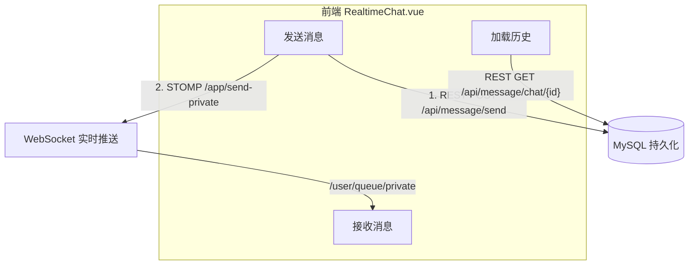

两条通道的分工：
- **REST** 负责数据持久化和历史查询（`/api/message/*`），返回值是裸实体/列表，不走 `Result` 信封
- **WebSocket** 负责实时投递和在线状态（`/ws-messages` SockJS/STOMP），JWT 鉴权在消息体内完成

---

### 二、Spring Boot 后端

#### 2.1 WebSocket 基础设施配置

**文件**: `config/WebSocketConfig.java`

```java
@Configuration
@EnableWebSocketMessageBroker
public class WebSocketConfig implements WebSocketMessageBrokerConfigurer {

    @Override
    public void configureMessageBroker(MessageBrokerRegistry config) {
        config.enableSimpleBroker("/topic", "/queue");       // 服务端→客户端推送
        config.setApplicationDestinationPrefixes("/app");    // 客户端→服务端发送
    }

    @Override
    public void registerStompEndpoints(StompEndpointRegistry registry) {
        registry.addEndpoint("/ws-messages")
                .setAllowedOriginPatterns("*")
                .withSockJS();
    }
}
```

消息路由规则：

| 方向 | 目的地 | 含义 |
|------|--------|------|
| 客户端→服务端 | `/app/send-private` | 发送私信 |
| 客户端→服务端 | `/app/mark-read` | 标记已读 |
| 客户端→服务端 | `/app/user-online` | 上线通知 |
| 服务端→客户端 | `/user/queue/private` | 私信推送（点对点） |
| 服务端→客户端 | `/topic/user-status` | 用户在线状态广播 |

#### 2.2 WebSocket 消息处理

**文件**: `controller/MessageWebSocketController.java`

核心设计：JWT 从 STOMP 消息体中提取而非 HTTP Header——STOMP 协议无法携带自定义 HTTP 头。

```java
@MessageMapping("/send-private")
public void handlePrivateMessage(@Payload Map<String, Object> messageData) {
    // ① 从消息体提取 JWT 并校验
    String token = (String) messageData.get("token");
    if (!jwtUtil.validateToken(token)) return;
    Long senderId = jwtUtil.getUserIdFromToken(token);

    // ② 解析接收者和内容
    Long receiverId = Long.valueOf((String) messageData.get("receiverId"));
    String content = (String) messageData.get("content");

    // ③ 持久化到 MySQL
    privateMessageService.sendMessage(senderId, receiverId, content);

    // ④ 实时推送给接收者（点对点）
    messagingTemplate.convertAndSendToUser(
        receiverId.toString(), "/queue/private", messageData
    );
}
```

三个 STOMP 消息处理方法：

| 方法 | 目的地 | 功能 |
|------|--------|------|
| `handlePrivateMessage` | `/app/send-private` | 校验JWT→落库→推送给接收者 |
| `handleMarkAsRead` | `/app/mark-read` | 校验JWT→更新 `is_read=1` |
| `handleUserOnline` | `/app/user-online` | 校验JWT→广播在线状态到 `/topic/user-status` |

#### 2.3 REST 控制器

**文件**: `controller/PrivateMessageController.java`

```java
@RestController
@RequestMapping("/api/message")
public class PrivateMessageController {

    @GetMapping("/conversations")                    // 获取会话列表
    @GetMapping("/chat/{contactId}")                 // 获取与某人的聊天记录
    @PostMapping("/send")                            // REST 方式发送
    @PostMapping("/mark-read/{messageId}")           // 标记已读
    @GetMapping("/recommended-collaborators")        // 推荐合作者（RESEARCHER 角色）
}
```

注意：`/api/message/*` 返回裸实体，不走 `Result<T>` 信封，前端通过 `res.data || res` 兼容。

#### 2.4 核心业务逻辑

**文件**: `service/impl/PrivateMessageServiceImpl.java`

**发送消息 + 联系人自动维护**：
```java
public void sendMessage(Long senderId, Long receiverId, String content) {
    PrivateMessage message = new PrivateMessage();
    message.setSenderId(senderId);
    message.setReceiverId(receiverId);
    message.setContent(content);
    privateMessageMapper.insert(message);

    // 双向更新联系人关系（发送者和接收者各一条）
    updateContact(senderId, receiverId);
    updateContact(receiverId, senderId);
}

private void updateContact(Long userId, Long contactId) {
    UserContact contact = userContactMapper.selectOne(
        new QueryWrapper<UserContact>().eq("user_id", userId).eq("contact_id", contactId)
    );
    if (contact == null) {
        contact = new UserContact();
        contact.setUserId(userId);
        contact.setContactId(contactId);
        userContactMapper.insert(contact);
    }
}
```

**会话列表（含未读计数 + 最后消息）**：
```java
public List<UserContact> getUserConversations(Long userId) {
    List<UserContact> contacts = userContactMapper.selectList(
        new QueryWrapper<UserContact>().eq("user_id", userId)
    );
    for (UserContact contact : contacts) {
        contact.setContact(userMapper.selectById(contact.getContactId()));

        // 未读数量：对方发来且 is_read=0
        contact.setUnreadCount(privateMessageMapper.selectCount(
            new QueryWrapper<PrivateMessage>()
                .eq("sender_id", contact.getContactId())
                .eq("receiver_id", userId)
                .eq("is_read", false)
        ));

        // 最后一条消息（ORDER BY create_time DESC LIMIT 1）
        contact.setLastMessage(/* ... */);
    }
    return contacts;
}
```

**聊天记录**：双向查询 `(A→B) OR (B→A)`，按时间升序。

**合作者匹配**：解析 `researchInterests` → Set交集 → 同角色 → 排除联系人 → overlap降序 top 2。

---

### 三、数据模型

**private_messages 表**：

| 字段 | 类型 | 说明 |
|------|------|------|
| id | bigint PK | 消息ID |
| sender_id | bigint FK→user | 发送者 |
| receiver_id | bigint FK→user | 接收者 |
| content | text | 消息内容 |
| msg_type | tinyint | 1=文本 2=图片 3=链接 |
| is_read | tinyint | 0=未读 1=已读 |
| read_time | datetime | 阅读时间 |
| status | tinyint | 0=已撤回 1=正常 |

**user_contacts 表**：

| 字段 | 类型 | 说明 |
|------|------|------|
| id | bigint PK | 关系ID |
| user_id | bigint FK→user | 用户 |
| contact_id | bigint FK→user | 联系人 |
| relation_type | varchar | FOLLOW/FRIEND/COLLABORATOR |

每次发消息会在 `user_contacts` 中**双向创建**记录。

---

### 四、Vue 3 前端

#### 4.1 主页面：RealtimeChat.vue

**文件**: `views/RealtimeChat.vue`

布局：`Sidebar + ConversationRail（340px）+ 聊天区（flex:1）`，全高度自适应。

**STOMP 连接建立**（`connect()`）：
```javascript
const client = new Client({
    webSocketFactory: () => new SockJS('/ws-messages'),
    reconnectDelay: 5000,   // 断线 5s 自动重连
    onConnect: () => {
        connected.value = true
        client.subscribe('/user/queue/private', msg => {
            handleIncoming(JSON.parse(msg.body))
        })
        client.subscribe('/topic/user-status', msg => {
            const d = JSON.parse(msg.body)
            if (d.status === 'online') onlineSet.add(d.userId)
            else onlineSet.delete(d.userId)
        })
        client.publish({ destination: '/app/user-online',
            body: JSON.stringify({ token }) })
    }
})
```

**消息发送三重保险**（`sendMessage()`）：
```javascript
async function sendMessage() {
    // ① 乐观更新：本地立即追加临时消息（_tmp 标记）
    messages[selected].push({ id: `tmp_${Date.now()}`, from: meId, to: selected,
        content: text, time: new Date().toLocaleTimeString(), _tmp: true })

    // ② REST 持久化到 MySQL（失败则回滚乐观消息）
    try { await sendMessageRest(selected, text) }
    catch (e) {
        messages[selected].splice(idx, 1)  // 移除乐观消息
        ElMessage.error('消息发送失败')
        return
    }

    // ③ STOMP 实时推送（WebSocket 可用时）
    if (stompClient && connected.value) {
        stompClient.publish({ destination: '/app/send-private',
            body: JSON.stringify({ token, receiverId: String(selected), content: text }) })
    }
}
```

**身份识别**：`meId` 从 `userStore.userInfo.id` 读取（之前从 `localStorage` 错误读取导致气泡反转bug，已于2026-05-10修复）。

#### 4.2 侧边栏：ConversationRail.vue

**文件**: `components/chat/ConversationRail.vue`

三块面板从上到下：

| 面板 | 数据来源 | 功能 |
|------|---------|------|
| 搜索面板 | `GET /api/user/search?q=` | 关键词搜索，300ms防抖，结果可"开始对话" |
| 推荐合作者 | `GET /api/message/recommended-collaborators` | 仅RESEARCHER角色，共同兴趣标签，"开始对话"发送自动问候 |
| 会话列表 | `GET /api/message/conversations` | 头像首字母 + 名称 + 未读红点 + 最后消息截断 + 在线状态 |

#### 4.3 前端 API 层

**文件**: `api/message.js`

```javascript
export const getConversations  = () => request.get('/message/conversations')
export const getChatHistory    = (contactId) => request.get(`/message/chat/${contactId}`)
export const sendMessageRest   = (receiverId, content) =>
    request.post('/message/send', null, { params: { receiverId, content } })
export const markMessageRead   = (messageId) => request.post(`/message/mark-read/${messageId}`)
export const getRecommendedCollaborators = () => request.get('/message/recommended-collaborators')
export const searchUsers       = (q) => request.get('/user/search', { params: { q } })
```

---

### 五、完整消息流时序

**发送消息流程**：
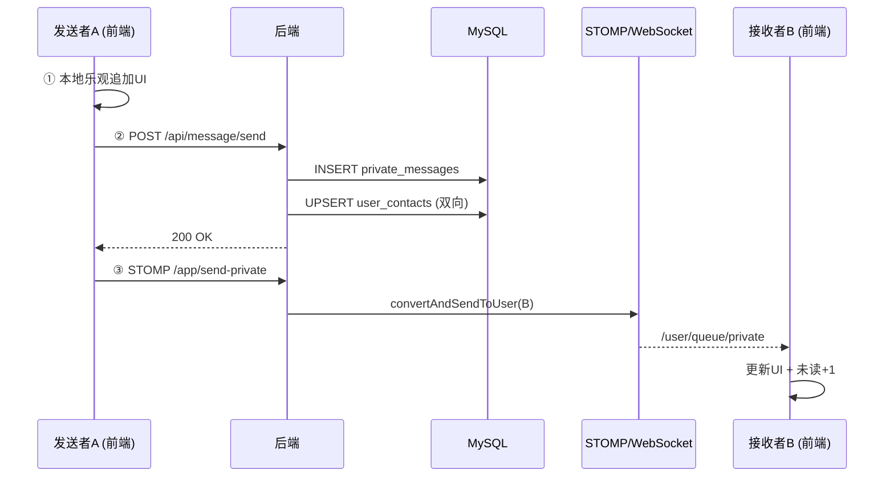

**加载历史消息**：
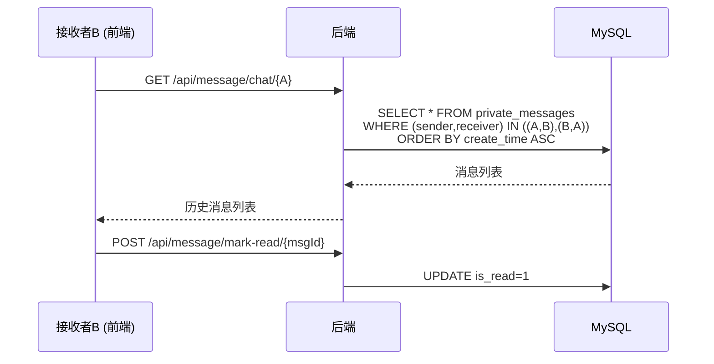

---

### 六、设计要点总结

1. **双通道互补**：REST 保证持久可靠，WebSocket 保证实时体验，任一通道故障不影响另一通道
2. **JWT 在 STOMP 消息体中**：STOMP 协议不支持自定义 HTTP Header，这是 SockJS/STOMP 的常见实践
3. **乐观更新 + 失败回滚**：前端先展示消息（`_tmp`标记），REST 落库失败则移除，保证交互即时响应
4. **双向联系人自动维护**：发一条消息双方 `user_contacts` 各生成一条记录，无需手动添加好友
5. **角色门控**：推荐合作者仅在 RESEARCHER 角色下可见（前端 `hasRole` + Java 服务层双重检查）
6. **CDN 回退**：STOMP/SockJS 优先 `import()`，运行时加载失败则回退 CDN UMD 脚本

## Q4: 系统的业务功能全景与使用流程（2026-05-16）（git: bad2152） ^q4

**标签**: #业务功能 #用户流程
**关联**: [[QA_2026-05-16_2026-06-02_v1#^q0|Q0]], [[QA_2026-05-16_2026-06-02_v1#^q8|Q8]]

### 一、角色体系

系统定义四种角色，权限逐级递增：

| 角色 | 等级 | 核心差异 |
|------|------|---------|
| **GUEST** 游客 | 0 | 仅浏览：搜索、论文详情、登录注册 |
| **STUDENT** 学生 | 1 | 全部个性化功能，但发帖需审核 |
| **RESEARCHER** 研究者 | 2 | 发帖免审核 + 可见合作者推荐 |
| **ADMIN** 管理员 | 3 | 帖子审核、用户管理、论文导入、触发训练 |

角色在 `user.role` 字段存储，注册时默认为 `STUDENT`。前端路由守卫根据 `meta.roles` 控制页面访问，后端 `SecurityConfig` 对 `/api/admin/**` 路径施加 `hasRole('ADMIN')` 限制。

---

### 二、功能分类总览

```
                         GUEST   STUDENT   RESEARCHER   ADMIN
─────────────────────────────────────────────────────────────
论文搜索/详情             ✓        ✓          ✓          ✓
注册/登录                 ✓        ✓          ✓          ✓
个性化推荐                         ✓          ✓          ✓
行为追踪(点击/收藏/阅读)            ✓          ✓          ✓
知识图谱3D可视化                    ✓          ✓          ✓
社区帖子(发帖/评论/点赞)            ✓(需审核)   ✓(免审核)   ✓
实时私信                           ✓          ✓          ✓
合作者推荐                                    ✓          ✓
个人资料/头像管理                    ✓          ✓          ✓
帖子审核                                                ✓
用户角色管理                                             ✓
论文导入                                                ✓
触发模型训练                                             ✓
```

---

### 三、各功能的使用流程

#### 3.1 注册与登录

```
[注册]
  前端 Login.vue → POST /api/user/register {username, password, email, role, researchInterests}
    → UserServiceImpl.register()
      → BCrypt 加密密码
      → INSERT user 表
      → 解析 researchInterests 逗号分隔 → INSERT user_interest_history 表（初始兴趣标签）
      → JwtUtil.generateToken(userId) → 返回 token
    → 前端存储 token 到 localStorage → 路由跳转 /home

[登录]
  前端 Login.vue → POST /api/user/login {username, password}
    → UserServiceImpl.login()
      → SELECT user WHERE username=?
      → BCrypt.matches(password, storedHash)
      → JwtUtil.generateToken(userId)
    → 返回 {token, userId, username, role}
    → 前端 localStorage + Pinia store → 路由跳转 /home

[游客模式]
  前端 Login.vue "游客模式"按钮 → 直接跳转 /search（无需登录）
  前端路由 /search 标记为 meta.public，路由守卫放行
```

**涉及**: `user` 表(INSERT/SELECT), `user_interest_history` 表(INSERT), JWT, BCrypt

---

#### 3.2 论文搜索与浏览

```
[搜索]
  前端 Search.vue → GET /api/paper/search?keyword=&yearFrom=&sortBy=&page=&size=
    → PaperController → PaperServiceImpl.searchPapers()
      → 优先：PaperMapper.searchByKeywordExpanded() → SQL FULLTEXT 搜索 title+abstract
        SELECT * FROM paper WHERE MATCH(title,abstract) AGAINST(?)
          AND year >= ? ORDER BY ? LIMIT ?
      → 备用：Neo4j GraphPaperService.searchPapers() 图搜索
    → 返回分页结果 {records, total, page}

[论文详情]
  前端 PaperDetail.vue → GET /api/paper/{id}
    → PaperServiceImpl.getPaperById()
      → SELECT * FROM paper WHERE id=?
    → 返回完整论文信息（含标题、摘要、作者、关键词、被引量等）

[按 AMiner ID 查论文]
  前端路由 /paper/aminer/:aminerId → GET /api/paper/aminer/{aminerId}
    → 先查 MySQL paper WHERE aminer_id=?
    → 若不存在 → 查 Neo4j Paper 节点 → upsertShadowPaper() 补写 MySQL

[论文下载]
  GET /api/paper/{id}/download/txt → 生成纯文本文件流
```

**所有论文检索接口均为公开访问**（在 SecurityConfig 白名单中），游客可直接使用。

**涉及**: `paper` 表(SELECT), Neo4j Paper 节点, MySQL FULLTEXT 索引

---

#### 3.3 个性化推荐（核心功能）

```
[获取推荐]
  前端 Home.vue → GET /api/recommend?k=10
    → RecommendController → RecommendServiceImpl.getRecommendations(userId, k)
      → Step1: behavior_log 查近20条交互 → 提取 paper.id → 转 AMiner ID
      → Step2: PythonRecClient POST http://localhost:8000/recommend
          {user_id, k, history, strategy}
      → Step3: Python 返回 AMiner ID 列表 → getByAminers() 批量映射回 Paper
          （MySQL 中不存在的 → 查 Neo4j → upsertShadowPaper 补写）
      → Step4: Python 不可用时降级为本地高被引论文
    → 返回 Result<RecommendResponse> {recommendations: [{paperId, title, reason, score, ...}]}

[行为追踪 → 推荐闭环]
  前端 PaperDetail.vue → POST /api/behavior {paperId, action, duration, source}
    → RecommendServiceImpl.logBehavior()
      → 校验 action ∈ {click, favorite, read}
      → 校验论文存在
      → INSERT behavior_log(user_id, paper_id, action, duration, source, timestamp)
    → Python FeatureBuilder 下次推荐时读取这些行为数据构建用户向量

  阅读时长追踪：PaperDetail.vue 记录 enterTime，onBeforeUnmount 计算 delta 秒数
```

**涉及**: `behavior_log` 表(INSERT/SELECT), `paper` 表(SELECT), `PythonRecClient`(HTTP), Neo4j Paper 节点

---

#### 3.4 行为追踪详情

```
[三类行为]
  click    → 用户点击推荐卡片/搜索结果 → POST /api/behavior {action:"click"}
  favorite → 用户在论文详情页点收藏 → POST /api/behavior {action:"favorite"}
            → 同时 INSERT favourite 表
  read     → 用户打开论文详情页，离开时自动上报
            → POST /api/behavior {action:"read", duration: 停留秒数}

[行为数据用途]
  behavior_log 表 → Python feature_builder.py 读取
    → 加权池化: click=0.5, read=1.0, favorite=2.0
    → 阅读时长每60s +0.5（上限+2.0）
    → 构建用户 history_vector（32维）
```

**涉及**: `behavior_log` 表, `favourite` 表

---

#### 3.5 社区帖子

```
[发帖]
  前端 Community.vue → POST /api/community/posts {title, content, paperId?}
    → CommunityServiceImpl.createPost()
      → RESEARCHER 角色 → status=1 (APPROVED 直接发布)
      → STUDENT 角色  → status=0 (PENDING 待审核)
      → INSERT post(user_id, title, content, status)

[帖子列表]
  GET /api/community/posts?status=1&page=1&size=10
    → 查询 status=APPROVED 的帖子
    → 注入当前用户点赞状态：PostLikeMapper.findLikedPostIds(userId) → PostItem.liked

[评论]
  GET /api/community/posts/{postId}/comments → 评论列表（支持嵌套，root_id 查整树）
  POST /api/community/posts/{postId}/comments {content, parentId?}
    → INSERT comment(post_id, user_id, parent_id, root_id, content)

[点赞切换]
  POST /api/community/posts/{postId}/like
    → 查 post_like 是否存在 (user_id, post_id)
    → 不存在 → INSERT post_like
    → 已存在 → DELETE post_like
  （使用唯一约束 uk_user_post 保证幂等；计数由 batchCountLikes() 实时查询）
```

**涉及**: `post` 表(INSERT/SELECT/UPDATE), `comment` 表(INSERT/SELECT), `post_like` 表(INSERT/DELETE)

---

#### 3.6 实时私信

```
[会话列表]
  GET /api/message/conversations
    → PrivateMessageServiceImpl.getUserConversations(userId)
      → SELECT user_contacts WHERE user_id=?
      → 每条填充：联系人信息 ⊕ 未读计数 ⊕ 最后消息

[聊天记录]
  点击联系人 → GET /api/message/chat/{contactId}
    → 双向查询: WHERE (sender,receiver) IN ((me,you),(you,me)) ORDER BY time ASC
    → 自动标记已读: POST /api/message/mark-read/{msgId}

[发送消息 - 三重路径]
  1. 前端乐观更新：本地立即追加消息（体验无延迟）
  2. REST 持久化：POST /api/message/send {receiverId, content}
     → INSERT private_messages → 双向创建 user_contacts 记录
  3. WebSocket 推送：STOMP /app/send-private {token, receiverId, content}
     → MessageWebSocketController 校验 JWT → convertAndSendToUser(receiver, /queue/private)

[接收消息]
  STOMP 订阅 /user/queue/private → 收到推送 → 追加到本地消息列表 → 未读+1

[在线状态]
  STOMP /app/user-online → 广播 /topic/user-status {userId, status:"online"}
  所有在线用户订阅 /topic/user-status 更新在线状态指示
```

**涉及**: `private_messages` 表(INSERT/SELECT/UPDATE), `user_contacts` 表(INSERT/SELECT), STOMP/WebSocket

---

#### 3.7 合作者推荐（RESEARCHER 专属）

```
  前端 ConversationRail.vue（角色门控 v-if="hasRole('RESEARCHER')"）
    → GET /api/message/recommended-collaborators
      → PrivateMessageServiceImpl.getRecommendedCollaborators(userId)
        → 解析当前用户 researchInterests 逗号分隔 → Set<String>
        → 查所有 RESEARCHER 角色用户（排除自己 + 已有联系人）
        → 逐个计算兴趣标签交集大小
        → 按 overlap 降序 → 取 top 2
        → 返回 [{userId, username, avatar, bio, commonInterests, matchCount, reason}]

  前端展示推荐合作者面板 → 点击"开始对话"
    → 自动发送问候语（含共同兴趣）
    → POST /api/message/send → 创建联系人 + 发送首条消息
```

**涉及**: `user` 表(SELECT), `user_contacts` 表(SELECT)

---

#### 3.8 知识图谱 3D 可视化

```
  前端 KnowledgeGraph.vue → GET /api/knowledge/graph
    → KnowledgeController → KnowledgeServiceImpl
      → PythonRecClient POST /learning-path {user_id, target_topic, history, max_nodes}
        → Python PathBuilder.build_path()
          → 图遍历提取已知/相关/目标关键词 + 论文节点
          → 按深度分层(Depth 0~3)
          → 掌握度传播(propagation)
          → 返回节点(color/glowIntensity/mastery) + 边
      → 前端的 3D Force-Graph 渲染
        → 边字段兼容: l.src || l.source, l.dst || l.target
        → 节点按 mastery 着色: 蓝(未学) → 橙(进行中) → 绿(已掌握)
```

**涉及**: Python 服务, Neo4j, 3D Force-Graph

---

#### 3.9 个人资料管理

```
[查看资料]
  GET /api/user/profile → 返回 {username, email, role, avatar, bio, researchInterests}

[编辑资料]
  PUT /api/user/profile {bio, researchInterests}
    → UPDATE user SET bio=?, research_interests=? WHERE id=?
    → 若 researchInterests 变更 → 同步更新 user_interest_history 表

[头像上传]
  POST /api/user/avatar/upload (multipart/form-data)
    → 文件存储到 uploads/ 目录
    → UPDATE user SET avatar='/uploads/xxx.jpg'
    → 前端 vite.config.js 代理 /uploads → http://localhost:8080 加载图片
```

**涉及**: `user` 表(UPDATE), `user_interest_history` 表(INSERT), 文件系统

---

#### 3.10 管理员功能

```
[帖子审核]
  前端 AdminConsole.vue
    → GET /api/admin/posts?status=0 → 查看待审核帖子
    → POST /api/admin/posts/{id}/status {status:1, reviewComment}
      → UPDATE post SET status=1(通过)/2(驳回), review_comment=?, reviewed_by=?, reviewed_time=now()
    → 已审核帖子(APPROVED/REJECTED) → 可"撤回"回到 PENDING 状态
    → "查看"按钮弹出帖子详情弹窗（作者/标题/正文）

[用户管理]
  GET /api/admin/users → 查看全部用户列表
  PUT /api/admin/users/{id}/role → 修改用户角色

[论文导入]
  POST /api/admin/papers/import → 批量导入论文数据

[触发训练]
  POST /api/recommend/train → @PreAuthorize("hasRole('ADMIN')")
    → RecommendServiceImpl.triggerTraining()
      → PythonRecClient POST /train → Python 异步执行 Actor-Critic 训练
      → 训练完成后自动 reload_model() 热更新
```

**涉及**: `post` 表(UPDATE), `user` 表(UPDATE/SELECT), `paper` 表(INSERT), Python `/train` 端点

---

### 四、功能-数据-角色映射速览

| 功能 | 前端入口 | 后端端点 | 数据表 | 角色限制 |
|------|---------|---------|--------|---------|
| 论文搜索 | Search.vue | GET /api/paper/search | paper + Neo4j | 公开 |
| 论文详情 | PaperDetail.vue | GET /api/paper/{id} | paper + Neo4j | 公开 |
| 个性化推荐 | Home.vue | GET /api/recommend | behavior_log + Python 服务 | 需登录 |
| 行为记录 | PaperDetail(自动) | POST /api/behavior | behavior_log | 需登录 |
| 社区发帖 | Community.vue | POST /api/community/posts | post | 需登录 |
| 帖子评论 | Community.vue | POST /api/community/posts/{id}/comments | comment | 需登录 |
| 帖子点赞 | Community.vue | POST /api/community/posts/{id}/like | post_like | 需登录 |
| 会话列表 | RealtimeChat.vue | GET /api/message/conversations | user_contacts + private_messages | 需登录 |
| 聊天记录 | RealtimeChat.vue | GET /api/message/chat/{id} | private_messages | 需登录 |
| 发送消息 | RealtimeChat.vue | POST /api/message/send + STOMP | private_messages + user_contacts | 需登录 |
| 合作者推荐 | ConversationRail.vue | GET /api/message/recommended-collaborators | user + user_contacts | RESEARCHER |
| 知识图谱 | KnowledgeGraph.vue | GET /api/knowledge/graph | Python + Neo4j | 需登录 |
| 个人资料 | Profile.vue | GET/PUT /api/user/profile | user | 需登录 |
| 头像上传 | EditProfile.vue | POST /api/user/avatar/upload | user + 文件系统 | 需登录 |
| 帖子审核 | AdminConsole.vue | POST /api/admin/posts/{id}/status | post | ADMIN |
| 用户管理 | AdminConsole.vue | GET/PUT /api/admin/users | user | ADMIN |
| 触发训练 | AdminConsole.vue | POST /api/recommend/train | Python /train | ADMIN |

## Q5: ActorCriticAgent 强化学习核心详解（2026-05-16）（git: c513ad2） ^q5

**标签**: #Actor-Critic #RL #强化学习
**关联**: [[QA_2026-06-02_2026-06-05_v2#^q20|Q20]], [[QA_2026-06-02_2026-06-05_v2#^q25|Q25]], [[QA_2026-06-07_2026-06-08_v3#^q38|Q38]], [[QA_2026-06-08_v4#^q49|Q49]]

### 一、先纠正一个关键认知：Actor 不是"额外步骤"，而是融合排序的核心组件

在推荐服务 `get_recommendations()` 的代码中，流程是：

```
Step1: FeatureBuilder → state (96维)
Step2: CandidateGenerator → candidates (max 50篇)
Step3: RLRanker.recommend_top_k(state, candidates, k) → Top-K 结果
         ↑
         └── 内部调用 agent.actor.score_candidates(state, candidate_features) 获取策略分
             融合公式: 0.5×Actor策略分 + 0.3×余弦相似度 + 0.2×KG拓扑分
Step4: GraphQuery.explain_recommendation() → 生成解释文本
```

**Actor 就在 Step3 的融合排序中运行**，而不是什么"排序完成后再经历的一步"。真正的问题是：**既然已经有了语义相似度和 KG 拓扑分，为什么还需要 Actor 这一项？没有 Actor 的纯融合排序差在哪里？**

---

### 二、为什么需要 Actor？—— 纯融合排序的局限

如果去掉 Actor，排名公式变成纯静态打分：`score = a×语义相似度 + b×KG拓扑分`（或再加上被引量）。这是传统信息检索（IR）的做法，有四个根本缺陷：

**缺陷1：权重是手工设定的，不会自适应**

语义相似度权重 0.3、KG 拓扑分权重 0.2 是人工拍脑袋定的。不同用户对"相似度"和"学术关系"的偏好不同，静态权重无法个性化。Actor 是一个**可训练神经网络**，权重矩阵 `W_actor` 通过数百轮训练逐步调整——它能"学会"对不同类型的用户状态，哪些候选特征更重要。

**缺陷2：只能衡量"像不像"，无法衡量"好不好"**

语义相似度回答的是"这篇论文和用户历史阅读的内容像不像"。但推荐系统真正应该优化的是"用户会不会点击、收藏、长时阅读"——即**交互反馈**。Actor 通过 TD 学习直接优化累计奖励（含 click/favorite/read_time/topic_match/long_term_value/KG_topology 六维加权），它学到的是"什么特征的论文能获得正向交互"，而不仅仅是"什么特征的论文在向量空间里离用户更近"。

**缺陷3：无法考虑长期收益**

纯融合排序每次独立打分，推荐 A 还是 B 只取决于当前相似度。但科研推荐有显著的**序列效应**：推荐一篇经典综述 → 用户阅读后兴趣向量漂移 → 下一步才能发现更多相关前沿论文。Actor-Critic 通过 `γ=0.99` 的折扣因子和 TD 学习，让当前决策的价值包含未来预期收益：`V(s) ≈ r_now + 0.99×V(s_next)`。这意味着 Actor 可能学会"先推经典打基础，再推前沿做延伸"的策略，而不是每次都推最相似的内容。

**缺陷4：容易形成信息茧房**

如果一直按语义相似度推荐，用户看到的永远是已有兴趣圈内的内容。Actor 训练时集成了**熵正则项**（`entropy_coeff=0.01`），在损失函数中显式惩罚过于集中的策略分布——鼓励保持一定的推荐多样性，给用户探索新领域的机会。

---

### 三、ActorCriticAgent 的网络结构

**文件**: `models/actor.py`, `models/critic.py`, `agent.py`

#### 3.1 Actor（策略网络）π(a|s; θ) — 逐论文 pairwise scoring

Actor 采用 pairwise 打分架构：不输出固定维度的概率分布，而是对每篇候选论文独立生成一个标量 logit，softmax 后得到该候选在当前上下文中的被选择概率。

```
forward(state, paper_features):
  输入: [state(96) | paper_features(32)] ∈ R^128
    ↓
  Linear(128→128) → ReLU → LayerNorm → Dropout(0.1)
    ↓
  Linear(128→128) → ReLU → LayerNorm → Dropout(0.1)
    ↓
  Linear(128→1)
    ↓
  输出: 1 个标量 logit

score_candidates(state, candidate_features):
  将 state 扩展到 (N, 96)，与 candidate_features (N, 32) 拼接
  → (N, 128) 一次 GPU 前向传播
  → N 个 logit → Softmax → N 维概率分布
```

每篇论文用自己的结构特征（被引量、关键词数、年份等 10 维投影的 32 维向量）与用户状态交互，产生独立评分。候选数量 N 动态变化（≤ `action_num=50`），无哈希分桶——高被引经典与冷门新作的差异通过特征向量驱动 Actor 输出不同 logit。

权重初始化使用正交初始化（`gain=0.01`），让初始策略接近均匀分布，训练初期充分探索。

#### 3.2 Critic（价值网络）V(s; w)

```
输入: state ∈ R^96
  ↓
Linear(96→128) → ReLU → LayerNorm → Dropout(0.1)
  ↓
Linear(128→128) → ReLU → LayerNorm → Dropout(0.1)
  ↓
Linear(128→1)
  ↓
输出: V(s) ∈ R  (标量，估计当前状态的长期价值)
```

两个网络隐藏层结构相同，但输入与输出维度不同：Actor 输入拼接后的 `[state | paper_features]`（128 维），输出每篇论文的 logit；Critic 仅输入 state（96 维），输出一个标量 V(s)。Actor 通过 `score_candidates()` 与候选特征交互；Critic 则仅以用户状态为条件。

---

### 四、核心算法：TD(0) Actor-Critic

**文件**: `agent.py:update()`

Agent 的核心只做一件事：**通过环境交互获得反馈，同时改进策略（Actor）和价值判断（Critic）**。

#### 4.1 单步更新流程

```
输入: (state, action, reward, next_state, done, log_prob, candidate_features)

① Critic 评估:
   v_s  = Critic(state)           → 当前状态价值
   v_s_ = Critic(next_state)      → 下一状态价值 (no_grad)

② 计算 TD 误差:
   td_target = reward + γ × v_s_ × (1-done)    // γ=0.99
   td_error  = td_target - v_s                  // δ = r + γV(s') - V(s)

③ 更新 Critic (学习更准确的价值判断):
   critic_loss = (td_error)²
   → Adam 优化，梯度裁剪 max_norm=1.0

④ 更新 Actor (强化好的动作，惩罚差的动作):
   重新计算策略分布 → entropy = 策略熵
   actor_loss = -(log π(a|s) × td_error.detach() + β × entropy)    // β=0.01
   → Adam 优化，梯度裁剪 max_norm=1.0
```

#### 4.2 TD 误差的直觉含义

`δ = r + γV(s') - V(s)` 本质上是"**惊喜**"信号：

| δ 符号 | 含义 | 对 Actor 的影响 |
|--------|------|----------------|
| δ > 0 | 实际奖励超过了 Critic 预期 → 这个动作比想象的好 | log π(a\|s) × δ 为正 → 梯度提升该动作的概率 |
| δ < 0 | 实际奖励低于预期 → 这个动作不如想象的 | log π(a\|s) × δ 为负 → 梯度降低该动作的概率 |
| δ ≈ 0 | 完全符合预期 | 该动作的概率几乎不变 |

关键在于 **`td_error.detach()`**：Actor 更新时 TD 误差被 detach 了，意味着 Critic 的评估误差不会反向传播到 Actor——两个网络各自独立优化，Actor 只把 δ 当作"动作好坏"的标量信号。

#### 4.3 熵正则：防止过早收敛

```python
entropy = dist.entropy()        # H(π) = -Σ p_i log p_i
actor_loss = -(log π(a|s) × δ + β × entropy)
```

策略分布越均匀（每个候选概率接近 1/N，N 为当前候选集大小），熵越大。`actor_loss = -( ... + β×entropy)`，负号意味着**最大化熵被纳入损失函数**——如果策略过早集中在少数几个动作上，熵下降会导致 loss 上升，梯度会把它拉回来。β=0.01 控制探索强度：太小则过早收敛，太大则策略始终随机。

对于科研推荐场景，这很重要——它防止系统永远只推"强化学习"论文给 RL 用户，而会偶尔尝试推荐邻近领域的论文（如图神经网络、元学习），给用户发现新方向的机会。

---

### 五、训练与推理的两阶段生命周期

ActorCriticAgent 在两个完全不同的模式中运行：

#### 5.1 训练模式（train.py，离线）

```
for episode in 1..500:
    state, _ = env.reset()              # 随机生成模拟用户 + 候选集
    
    for step in 1..50:
        action, log_prob = agent.select_action(state, candidate_features)    # ① 策略决策
        next_state, reward, done, _ = env.step(action)   # ② 环境反馈
        losses = agent.update(state, action, reward, next_state, done, log_prob)
        state = next_state
    
    if episode_reward > best_reward:
        agent.save_model()              # 保存最优模型到 checkpoints/ac_model.pth
```

**环境如何模拟用户交互**（`env/rec_env.py:_simulate_interaction`）：
```python
cos_sim = dot(user.interest_vector, item.topic_vector)  # 用户兴趣与论文的余弦相似度

signal = InteractionSignal(
    click      = random() < 0.3 + 0.5×cos_sim,     # 相似度越高越可能点击
    favorite   = random() < 0.1 + 0.3×cos_sim,     # 收藏概率更低
    read_time  = clip(normal(cos_sim, 0.1), 0, 1),  # 阅读时长与相似度正相关
    topic_match = cos_sim,                          # 直接使用相似度
    long_term_value = citation_count/500 × cos_sim,  # 高被引+高匹配 = 高长期价值
)
```

**奖励计算**（`utils/reward.py`）：
```python
r = 1.0×click + 2.0×favorite + 0.5×read_time + 3.0×topic_match + 1.5×long_term_value + 2.0×kg_topology
```

训练时状态会转移：历史向量向选中论文的 topic_vector 做 0.9:0.1 的指数平滑，KG 向量向选中论文的 KG embedding 做 0.8:0.2 的漂移——模拟用户阅读论文后兴趣的演化。

**训练结束后**：保存的模型权重 `checkpoints/ac_model.pth` 包含了 Actor 学到的"面对什么样的用户状态应该给哪类论文更高分"的策略知识。Critic 的权重也一并保存，但**推理时不使用 Critic**。

#### 5.2 推理模式（推荐服务，在线）

```python
# recommendation_service.py 初始化
self._agent = ActorCriticAgent(config)
self._agent.load_model("checkpoints/ac_model.pth")     # 加载训练好的权重
self._ranker = RLRanker(self._agent, config, ...)

# 每次推荐请求时
ranked_items = self._ranker.recommend_top_k(user_state, candidates, k=10)
    # 内部: self.agent.actor.score_candidates(state, candidate_features) → N维概率分布 → 逐论文独立打分
    # 融合: final = 0.5×actor_score + 0.3×cos_sim + 0.2×kg_score
```

推理时 Actor 的权重是**冻结的**（`torch.no_grad()`），不做任何梯度更新。它纯粹作为"特征提取器+打分器"融入融合排序公式。

---

### 六、为什么不省掉 Actor，直接用相似度+KG？

用一个具体例子说明。假设用户 A 是强化学习方向的研究者：

| 候选论文 | 语义相似度 | KG拓扑分 | 纯IR排序 | Actor打分后融合 |
|---------|-----------|---------|---------|---------------|
| 论文X: RL最新综述 | 0.92 | 0.85 | **#1** | #2 (Actor认为综述虽相关但citation低，长期价值有限) |
| 论文Y: RL+KG交叉应用 | 0.78 | 0.90 | #2 | **#1** (Actor从训练中学到：跨领域论文虽然文本相似度不是最高，但favorite率和topic_match奖励更高) |
| 论文Z: 纯GNN论文 | 0.65 | 0.40 | #3 | #4 (被Actor降权) |
| 论文W: 元学习入门 | 0.55 | 0.30 | #5 | #3 (Actor通过熵正则给予探索性推荐机会) |

纯 IR 排序只会反复推 RL 论文（语义相似度最高），形成信息茧房。Actor 从训练数据中学到了**跨领域推荐的奖励信号**，会更智能地平衡"相关性"与"新颖性/长期价值"。

---

### 七、总结：ActorCriticAgent 在系统中的角色

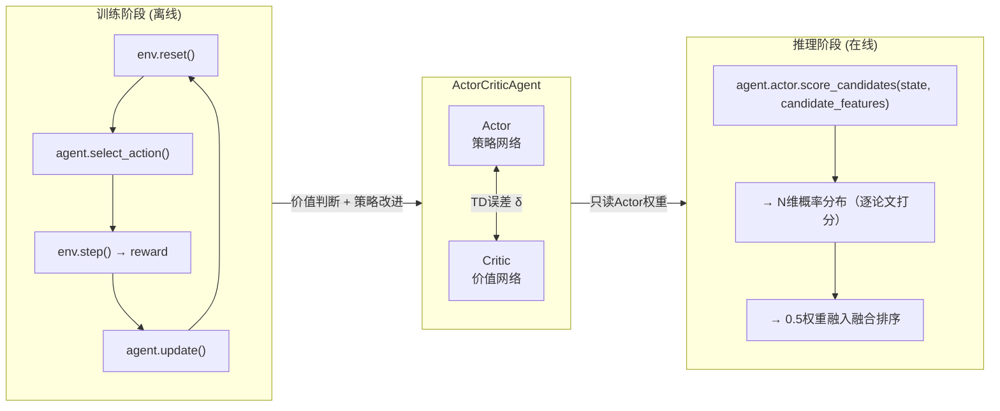

**ActorCriticAgent 解决的核心问题**：将推荐从"静态内容匹配"升级为"序列化长期优化决策"。语义相似度和 KG 拓扑分告诉你"这篇论文和用户过去的兴趣有多近"，Actor 告诉你"根据以往经验，推荐这类论文用户最终会不会满意、对长期科研成长有没有帮助"。Critic 在训练中为 Actor 提供稳定的学习信号（通过 TD 误差），自己则不上推理线。

---

### 八、追问：Actor 与 Critic 在训练中是否"深度交流"？（2026-05-16）

**不共享任何层、不做特征融合、不互传梯度。唯一的交流媒介是 TD 误差 δ——一个标量浮点数。**

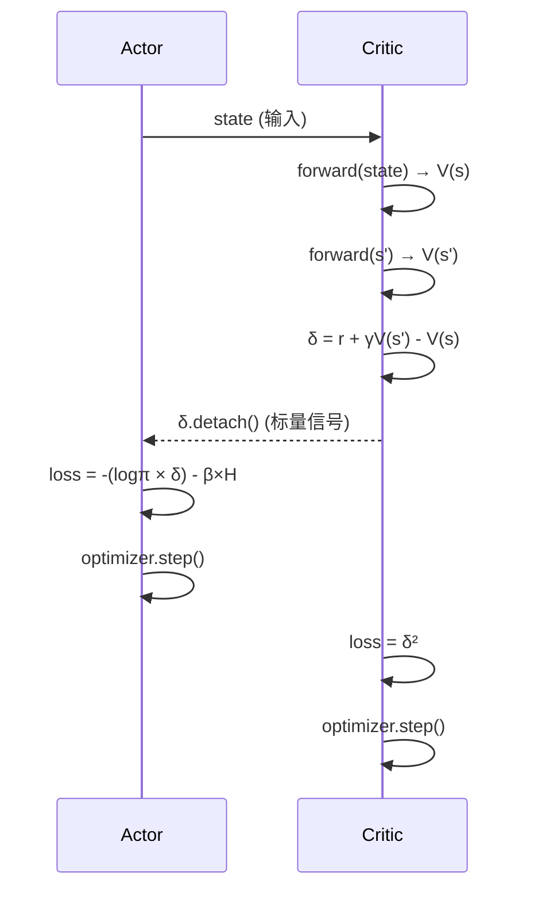

对比"深度交流"架构（如 A3C 共享底层）：

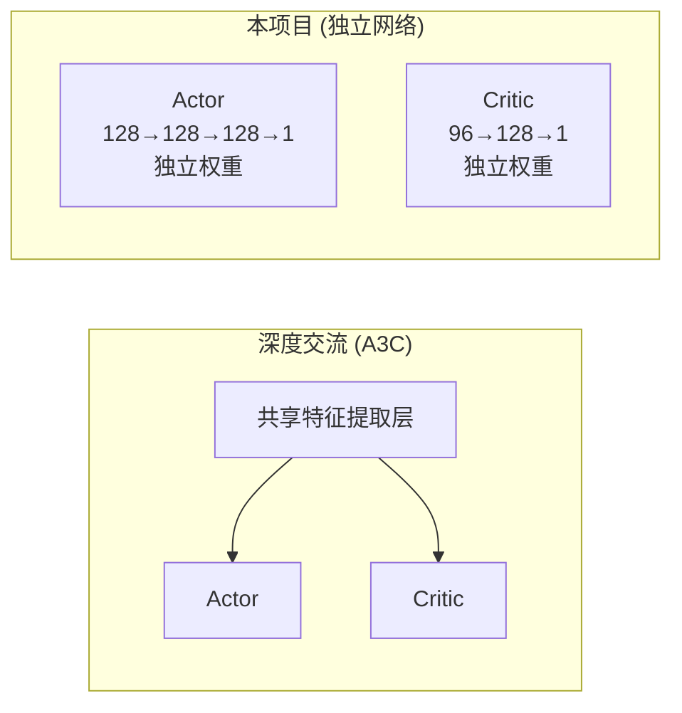

本项目的设计是**完全解耦**的——Actor 和 Critic 各有独立的 `actor_optimizer` 和 `critic_optimizer`，结构虽相似但无共享参数。交流方向是单向的（Critic→Actor），内容只有一个标量。为什么这样设计？因为一旦共享底层特征，Critic 的价值估计和 Actor 的策略改进会互相牵制——Critic 需要的特征表示未必是 Actor 需要的，强耦合反而降低训练稳定性。

---

### 九、追问：`td_error.detach()` 的作用（2026-05-16）

**一句话：阻止 Actor 的 loss 反向传播到 Critic，确保 δ 是"外部信号"而非"可操纵变量"。**

遍历代码中 `.detach()` 前后的梯度流：

```python
# agent.py update() 方法

# ── 阶段一：Critic 更新 ──
v_s  = self.critic(s)              # 有梯度
with torch.no_grad():
    v_s_ = self.critic(s_)         # 无梯度 — 引导信号不应影响当前状态

td_error = (r + γ×v_s_×mask) - v_s # δ 连着 critic(s) 的计算图

critic_loss = td_error.pow(2)      # L_c = δ²
critic_optimizer.zero_grad()
critic_loss.backward()             # 梯度: δ² → δ → v_s → Critic参数
critic_optimizer.step()            # Critic 独自更新完成

# ── 阶段二：Actor 更新 ──
probs = self.actor(s)              # 重新前向，有梯度
log_prob_new = dist.log_prob(action)

actor_loss = -(log_prob_new * td_error.detach() + β×entropy)
#                              ↑
#                     .detach() 在此 —— 断开 td_error 的梯度链

actor_optimizer.zero_grad()
actor_loss.backward()              # 梯度只流经 log_prob_new → Actor参数
actor_optimizer.step()             # Critic 完全不受影响
```

**如果没有 `.detach()`**，`actor_loss.backward()` 时梯度会分叉为两条路径：

```
actor_loss = -(log_prob_new × (td_target - critic(s)) + β×entropy)
                            ↑
                    这里连着 Critic 的计算图！

反向传播时:
  路径①: ∂loss/∂log_prob → ∂log_prob/∂θ_actor → 更新 Actor   ✓ 期望的
  路径②: ∂loss/∂td_error → ∂td_error/∂v_s → ∂v_s/∂θ_critic → 更新 Critic ✗ 灾难
```

路径②意味着 Actor 的优化目标**绑架了 Critic 的参数更新方向**。Critic 刚被 `L_c = δ²` 训练去逼近真实价值，接着 Actor 的 loss 又反传回来让 V(s) 往"有利于降低 actor_loss"的方向偏。结果：δ 不再是客观的"惊喜信号"，而是 Actor 间接操纵的值——Actor 不是在学更好的策略，而是在学如何让 Critic 给出更高的分。

`td_error.detach()` 就是这中间的防火墙：Actor 只能**读取** δ 的值（当作动作好坏的评分），但**不能修改**评分标准。δ 的准确性由 Critic 独自负责（通过 min δ²），Actor 只负责对 δ 做出正确的策略响应（通过 max log π × δ）。这是一个经典的**责任分离**设计——两个网络各自优化各自的目标，唯一的接口就是一个 detached 的标量。

## Q6: 每位用户的专属学习路径是如何生成的（2026-05-16）（git: bad2152） ^q6

**标签**: #学习路径 #可视化
**关联**: [[QA_2026-06-02_2026-06-05_v2#^q28|Q28]], [[QA_2026-06-07_2026-06-08_v3#^q39|Q39]]

### 一、整体流程概览

学习路径生成的入口在 Python FastAPI 的 `POST /learning-path`，由 `api/server.py` 的路由处理。后端 Java 通过 `PythonRecClient.getLearningPath()` 调用，前端 `KnowledgeGraph.vue` 通过 `GET /api/knowledge/graph` → `KnowledgeController` → `KnowledgeServiceImpl` → 最终到达 Python 服务。

整个过程分为**三个阶段**，在线运行的代码集中在 `api/server.py:generate_learning_path()` 中：

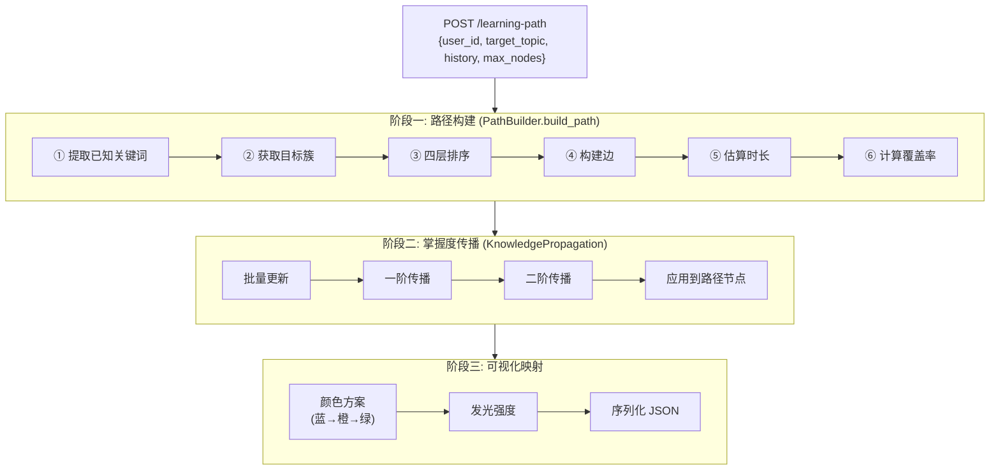

---

### 二、阶段一：PathBuilder.build_path() — 六步生成路径

**文件**: `rl-service/learning_path/path_builder.py`

#### Step 1 — 从用户历史提取已知关键词

```python
def _extract_known_keywords(self, history: List[str]) -> Dict[str, float]:
    kw_count: Dict[str, int] = defaultdict(int)
    total = len(history)
    for paper_id in history:
        node = self.kg.nodes.get(paper_id)
        if not node: continue
        for kw_id in node.properties.get("keywords", []):
            # 归一化关键词 ID: 去空格、统一小写、加 kw_ 前缀
            raw = kw_id.strip().lower().replace(' ', '_')
            kw_node_id = raw if raw.startswith("kw_") else f"kw_{raw}"
            if kw_node_id in self.kg.nodes:
                kw_count[kw_node_id] += 1

    # 掌握度 = 该关键词出现次数 / 历史论文总数
    return {kw: cnt / total for kw, cnt in kw_count.items()}
```

这段代码做的事：遍历用户历史读过的每篇论文 → 提取每篇论文的关键词 → 统计每个关键词出现在多少篇历史论文中 → 归一化得到初始掌握度。

例如：用户读了 5 篇论文，其中 `kw_reinforcement_learning` 出现在 3 篇中 → 掌握度 = 3/5 = 0.6。

#### Step 2 — 获取目标主题的关键词簇

```python
target_cluster = self.query.get_keyword_cluster(target_topic, k=max_nodes)
target_papers  = [p["paper_id"] for p in target_cluster["papers"]]
related_kws    = [r["keyword_id"] for r in target_cluster["related_keywords"]]
```

`GraphQuery.get_keyword_cluster()` 在知识图谱中做以下查询（`knowledge_graph/graph_query.py`）：

```
输入: target_topic = "Reinforcement Learning"
  ↓
① 构造 kw_id = "kw_reinforcement_learning"
② 查 _kw_paper_idx[kw_id] → 包含该关键词的论文列表 (HAVING keyword 边)
③ 查共现关键词：对每篇论文，查它的其他关键词，统计频次
    → related_keywords: [{"keyword_id": "kw_deep_learning", co_occurrence: 12}, ...]
④ 返回 {
      "keyword": "Reinforcement Learning",
      "frequency": 45,         // 该关键词在图中出现的总次数
      "papers": [paper1, ...],  // 包含该关键词的论文
      "related_keywords": [kw1, ...]  // 共现关键词（按频次降序）
    }
```

#### Step 3 — 按四层深度构建节点序列

```python
def _build_path_nodes(self, known_keywords, target_kw, related_kws, target_papers, ...):
    nodes = []
    seen = set()

    # Depth 0: 已掌握关键词（取前 5 个，按掌握度排序）
    for kw_id, mastery in list(known_keywords.items())[:5]:
        nodes.append(PathNode(node_id=kw_id, label=..., node_type="keyword",
                              mastery=mastery, depth=0))

    # Depth 1: 相关关键词（共现关键词，掌握度来自历史或 0）
    for kw_id in related_kws:
        mastery = known_keywords.get(kw_id, 0.0)
        nodes.append(PathNode(..., node_type="keyword", mastery=mastery, depth=1))

    # Depth 2: 目标关键词（用户想学的核心概念）
    nodes.append(PathNode(node_id=target_kw, label=..., node_type="keyword",
                          mastery=known_keywords.get(target_kw, 0.0), depth=2))

    # Depth 3: 目标论文（具体的阅读材料）
    for pid in target_papers:
        nodes.append(PathNode(node_id=pid, label=..., node_type="paper",
                              mastery=0.0, depth=3, year=...))
    return nodes[:max_nodes]
```

四层结构示意：

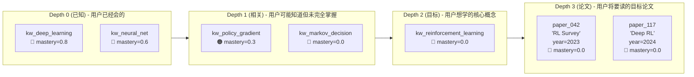

#### Step 4 — 构建节点间的边

```python
def _build_path_edges(self, nodes):
    edges = []
    for i in range(len(nodes)):
        for j in range(i + 1, len(nodes)):
            ni, nj = nodes[i], nodes[j]
            if nj.depth == ni.depth + 1:           # 只连接相邻深度层
                weight = 1.0 / (abs(i - j) + 1)    # 近处节点权重更高
                edges.append((ni.node_id, nj.node_id, weight))
    return edges
```

边只在相邻深度层之间建立（depth 0→1, 1→2, 2→3），权重反比于位置距离——在列表中越靠近的两个节点，连接越强。这体现了"先学基础再学前沿"的学习逻辑。

#### Step 5 & 6 — 估算时长与覆盖率

```python
# 每篇论文约 2 小时阅读时间
paper_count = sum(1 for n in path_nodes if n.node_type == "paper")
estimated_hours = paper_count * 2.0

# 覆盖率 = 已掌握关键词 / (相关关键词 + 目标关键词)
coverage = min(len(known_keywords) / max(len(related_kws) + 1, 1), 1.0)
```

---

### 三、阶段二：KnowledgePropagation — 掌握度传播

**文件**: `rl-service/learning_path/propagation.py`

这是学习路径的**个性化引擎**——让系统不仅知道"这个关键词在路径中"，还知道"当前用户对它的掌握程度有多深"。

#### 3.1 批量初始化：从用户历史中恢复掌握度状态

```python
propagation.batch_update(history)   # history = 用户已读论文列表

def batch_update(self, history, event_type="read"):
    n = len(history)
    for i, paper_id in enumerate(history):
        time_weight = (i + 1) / n           # 越近读的权重越高（模拟遗忘）
        updates = self.update_mastery(paper_id, delta=time_weight)
        for nid, d in updates.items():
            all_propagated[nid] = all_propagated.get(nid, 0) + d
```

`time_weight` 随索引递增：用户最早读的论文 weight=1/n，最近读的 weight=n/n=1。这模拟了遗忘曲线——最近阅读的知识掌握更牢固。

#### 3.2 传播核心：沿图边扩散

```python
def _propagate(self, node_id, delta, hop, propagated):
    if hop >= 3 or delta < 1e-4: return    # 最多传播 3 跳，小于阈值停止

    propagate_relations = {
        "has_keyword": 0.8,    # 论文 → 关键词：强传播
        "cite":        0.4,    # 论文 → 引用论文：中等传播
        "publish_in":  0.3,    # 论文 → 发表场馆：弱传播
    }

    for edge in self.kg._adj.get(node_id, []):
        rel_weight = propagate_relations.get(edge.relation)
        if rel_weight is None: continue

        neighbor_id = edge.dst_id
        new_delta = delta × 0.6^hop × rel_weight × edge.weight

        self.mastery_state[neighbor_id] += new_delta   # 累积掌握度
        propagated[neighbor_id] = new_delta
        self._propagate(neighbor_id, new_delta, hop + 1, propagated)  # 递归
```

传播公式：

```
Δmastery(邻居) = Δmastery(源) × decay^hop × 边类型权重 × 边权重
               = learning_event × 0.6^hop × {0.8|0.4|0.3} × edge_weight
```

举例：用户读完一篇 RL 论文（delta=1.0）：
```
hop 0: 论文本身 → mastery["paper_rl_survey"] += 1.0
hop 1: 沿 has_keyword 边 → mastery["kw_reinforcement_learning"] += 1.0×0.6^1×0.8 = 0.48
                              mastery["kw_policy_gradient"]       += 1.0×0.6^1×0.8 = 0.48
       沿 cite 边 →        mastery["paper_old_rl"]               += 1.0×0.6^1×0.4 = 0.24
hop 2: 继续从关键词扩散 →   共享 kw_reinforcement_learning 的其他论文获得更多衰减的掌握度
                            Δ = 0.48 × 0.6^2 × 0.8 ≈ 0.14
hop 3: 继续衰减 → 0.48 × 0.6^3 × 0.8 ≈ 0.08 → 小于阈值停止 (实际公式会更小)
```

---

### 四、阶段三：可视化映射 — 颜色与发光

```python
# api/server.py:generate_learning_path()

# ① 生成颜色
node_ids = [n.node_id for n in path.nodes]
colors = propagation.get_color_mapping(node_ids)
# mastery 0.0 → #3B82F6 (蓝, 未学)
# mastery 0.5 → #F59E0B (橙, 学习中)
# mastery 1.0 → #10B981 (绿, 已掌握)

# ② 生成发光强度
glows = propagation.get_glow_intensity(node_ids)
# 直接等于 mastery 值，越高越亮

# ③ 注入节点
for node in result["nodes"]:
    node["color"] = colors.get(nid, "#3B82F6")
    node["glow_intensity"] = glows.get(nid, 0.0)

# ④ 返回给前端
# edges 以 src/dst 格式输出，前端 3D 力导向图以 l.src || l.source 兼容读取
```

---

### 五、个性化体现在哪里？

每个用户的专属学习路径在三个维度上不同：

| 维度 | 决定因素 | 不同用户的结果差异 |
|------|---------|------------------|
| **已知关键词集合** | `_extract_known_keywords(user_history)` | 用户A读RL论文→已知kw_rl；用户B读CV论文→已知kw_cv；同一目标主题，两人的Depth 0节点完全不同 |
| **掌握度分布** | `KnowledgePropagation.batch_update(history)` | 读得多且读得近的关键词掌握度高→绿色；读得少或早期读的关键词掌握度低→橙色；没读过的→蓝色 |
| **路径覆盖范围** | `coverage = len(known)/len(related)` | 已有基础的领域覆盖率可能60%+，路径更短（跳过Depth 0的大量已知内容）；全新领域的覆盖率可能10%，路径更长更完整 |

---

### 六、前置知识链模式（build_prerequisite_chain）

除了目标主题导向的 `build_path()`，系统还提供了基于**引用链追溯**的前置知识链：

```python
def build_prerequisite_chain(self, target_paper_id, depth=3):
    # DFS 递归追溯引用边，构建「基础 → 目标」的知识链
    # 例如: Machine Learning → Deep Learning → Transformer → BERT
    chain = []
    self._dfs_prerequisites(target_paper_id, 0, depth, visited, chain)
    chain.reverse()  # 翻转为「基础在前」的顺序
    return chain
```

这个模式适合"我想读懂论文X，但需要先补哪些基础？"的场景。

---

### 七、数据流完整时序

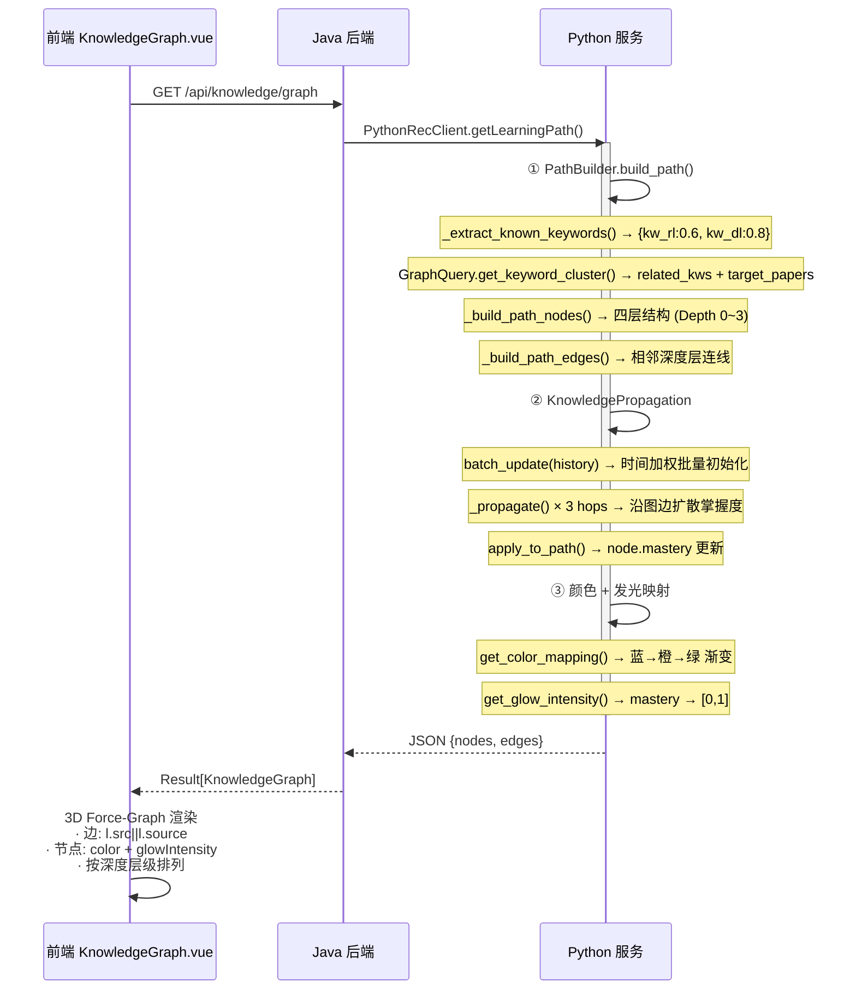

---

### 八、追问：GraphQuery 是什么，自定义模块还是官方库？（2026-05-16）

**GraphQuery 是项目自定义模块**，位于 `rl-service/knowledge_graph/graph_query.py`，约 345 行纯 Python 代码，无任何第三方图库依赖。

它是架在 `KnowledgeGraph`（也是自定义内存图数据结构）之上的**手写查询引擎**。定位是"轻量级内存图谱查询层"——不调 Neo4j Cypher、不依赖 NetworkX，直接在 Python dict/set/collections 上构建倒排索引和 BFS 遍历。

**初始化时构建四个倒排索引**（`_build_indices()`）：

| 索引 | 结构 | 用途 |
|------|------|------|
| `_paper_kw_idx` | `paper_id → [kw_ids]` | 查询一篇论文有哪些关键词 |
| `_kw_paper_idx` | `kw_id → [paper_ids]` | 查询一个关键词关联哪些论文 |
| `_cite_idx` | `cited_id → [citing_ids]` | 查询一篇论文被哪些论文引用 |
| `_author_idx` | `paper_id → [author_ids]` | 查询一篇论文的作者 |

所有索引在模块初始化时一次性构建（遍历全图边做分类和去重），之后所有查询操作纯内存访问，O(1) 查索引。

**对外暴露五个查询方法**：

| 方法 | 算法 | 作用 |
|------|------|------|
| `get_related_papers()` | 多路汇聚 + 加权打分 | 基于引用/关键词/作者的组合查询 |
| `get_author_neighbors()` | BFS 分层遍历 | 查询合著网络 |
| `get_keyword_cluster()` | 倒排索引交集 + 共现统计 | 查询关键词簇 → 学习路径的核心输入 |
| `shortest_path()` | BFS + 路径回溯 | 两节点间最短知识路径 |
| `explain_recommendation()` | 规则匹配（关键词重叠/引用链/同作者） | 生成推荐理由文本 |

**在项目中的三个调用点**：
- `PathBuilder.__init__()` — `query = GraphQuery(kg)`，调用 `get_keyword_cluster()` 获取目标主题的关键词簇和论文，驱动学习路径的四层构建
- `RecommendationService._init_kg()` — `self._graph_query = GraphQuery(kg)`，调用 `explain_recommendation()` 基于图结构生成推荐理由
- `api/server.py:generate_learning_path()` — 直接在端点中 `GraphQuery(kg)` 实例化

设计哲学：**离线加载全图 + 在线内存查询**。Neo4j 只在启动时被全量加载进 `KnowledgeGraph` 内存对象，GraphQuery 再在此基础上建索引，运行时完全不走 Neo4j。

## Q7: 当前 Neo4j 数据库的结构是怎样的？有哪些属性和关系？（2026-05-16）（git: bad2152） ^q7

**标签**: #Neo4j #图数据库 #知识图谱
**关联**: [[QA_2026-06-02_2026-06-05_v2#^q19|Q19]], [[QA_2026-06-02_2026-06-05_v2#^q27|Q27]], [[QA_2026-06-07_2026-06-08_v3#^q44|Q44]]

### 一、五大约束 + 四个索引

**文件**: `rl-service/scripts/neo4j_schema.cypher`

```cypher
-- 唯一约束（保证 MERGE 不产生重复节点）
CREATE CONSTRAINT paper_aminer_id  FOR (p:Paper)    REQUIRE p.aminer_id IS UNIQUE;
CREATE CONSTRAINT author_author_id FOR (a:Author)    REQUIRE a.author_id IS UNIQUE;
CREATE CONSTRAINT keyword_kw_id    FOR (k:Keyword)   REQUIRE k.keyword_id IS UNIQUE;
CREATE CONSTRAINT venue_venue_id   FOR (v:Venue)     REQUIRE v.venue_id IS UNIQUE;
CREATE CONSTRAINT graph_node_id    FOR (n:GraphNode) REQUIRE n.node_id IS UNIQUE;

-- 查询加速索引
CREATE INDEX paper_title          FOR (p:Paper) ON (p.title);
CREATE INDEX paper_year           FOR (p:Paper) ON (p.year);
CREATE INDEX paper_citation_count FOR (p:Paper) ON (p.citation_count);
CREATE INDEX author_name          FOR (a:Author) ON (a.name);
```

`GraphNode` 是一个通用节点标签，用于存放旧版 `kg_entity` 迁移过来的遗留实体，与核心四类节点共存但不在推荐主流路中使用。

---

### 二、四类节点及其属性

| 节点类型 | 标签 | ID 格式 | 属性 | 当前数量 |
|---------|------|--------|------|---------|
| **Paper** | `:Paper` | `aminer_id` (如 `"53e..."`) | `aminer_id`, `title`, `abstract`, `authors`, `keywords`, `venue`, `year`, `citation_count`, `embedding` | **1005** |
| **Author** | `:Author` | `author_id` | `author_id`, `name`, `org`, `interests` | **~2470** |
| **Keyword** | `:Keyword` | `kw_{归一化标签}` (如 `"kw_reinforcement_learning"`) | `keyword_id`, `frequency` | **~500** (Top-N 过滤) |
| **Venue** | `:Venue` | `venue_{归一化名称}` (如 `"venue_nature"`) | `venue_id` | **~30** |

**Paper 节点的属性最丰富**（`kg_builder.py:_add_paper_nodes`）：

```python
properties={
    "year":            p.year,             # 发表年份 (1990~2025)
    "venue":           p.venue,            # 发表会议/期刊名称
    "keywords":        p.keywords,         # 关键词列表 ["RL", "MDP", ...]
    "citation_count":  p.citation_count,   # 被引次数
}
# title 存储在 label 字段（截断前60字符），abstract 以全文存储在 properties
# embedding 字段可选，存储论文的预计算向量（base64/JSON）
```

**Author 节点**（`kg_builder.py:_add_author_nodes`）：
```python
properties={"org": a.org, "interests": a.interests}
```

**Keyword 节点**经过频率过滤（`kg_builder.py:_add_keyword_venue_nodes`）：
- `min_keyword_freq=2`：出现少于 2 次的关键词不建节点
- `max_keyword_nodes=500`：只保留频次最高的 500 个关键词
- ID 归一化规则：去空格→小写→加 `kw_` 前缀

---

### 三、五类关系

| 关系类型 | 方向 | 含义 | 当前数量 | 权重 |
|---------|------|------|---------|------|
| **HAS_KEYWORD** | `Paper → Keyword` | 论文包含某关键词 | **4018** | 1.0 |
| **AUTHOR_OF** | `Author → Paper` | 作者撰写了某论文 | **2470** | 1.0 |
| **CITE** | `Paper → Paper` | 论文 A 引用论文 B | **1993** | 1.0 |
| **PUBLISH_IN** | `Paper → Venue` | 论文发表于某期刊/会议 | **1005** | 1.0 |
| **CO_AUTHOR** | `Author ↔ Author` | 两位作者曾合著论文（对称边，推导生成） | **310** | 1.0 |

**CO_AUTHOR 的推导逻辑**（`kg_builder.py:_add_co_author_edges`）：
```python
# 对每篇论文，取所有作者的两两组合 → 建立 co_author 边
# pair = sorted([author_i, author_j])，去重后只建一次
for p in papers:
    for i in range(len(authors)):
        for j in range(i+1, len(authors)):
            pair = tuple(sorted([authors[i], authors[j]]))
            if pair not in co_pairs:
                kg.add_edge(KGEdge(src=pair[0], dst=pair[1], relation="co_author"))
```

CO_AUTHOR 不是从数据源直接导入的，而是在 `KGBuilder.build()` 第 9 步中**根据 AUTHOR_OF 边推导**出来的。

---

### 四、知识图谱全景

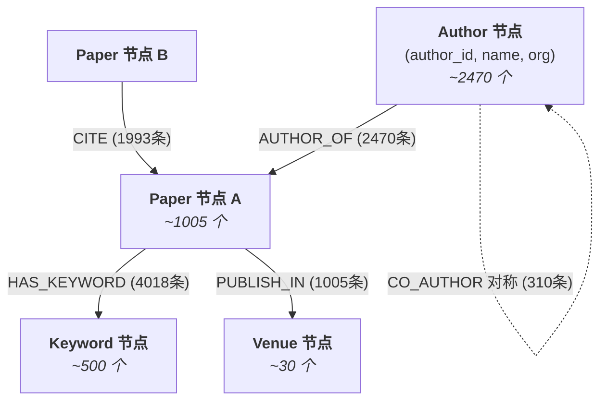

**数字汇总**：
- 4 类节点（Paper 1005, Author ~2470, Keyword ~500, Venue ~30）≈ **4000+ 节点**
- 5 类关系（HAS_KEYWORD 4018, AUTHOR_OF 2470, CITE 1993, PUBLISH_IN 1005, CO_AUTHOR 310）≈ **9796 条边**

---

### 五、数据来源与迁移

数据通过 `rl-service/scripts/migrate_to_neo4j.py` 从三个源头汇入：

| 来源 | 内容 | 方法 |
|------|------|------|
| MySQL `paper` 表 | 已有论文的标题/摘要/作者/关键词/年份/被引量 | `SELECT ... WHERE deleted=0 AND aminer_id IS NOT NULL` |
| AMiner 原始数据集 | 补全 MySQL 中缺失的摘要/引用/作者信息 | 与 MySQL 数据 merge，补缺不覆盖 |
| 旧版 `kg_entity`/`kg_relation` | 历史知识图谱资产 | 导入为 `GraphNode` + `LEGACY_RELATION` |

迁移使用 Cypher `MERGE` 语句，配合唯一约束实现 upsert。回填方向由 `backfill_mysql_shadow_papers.py` 完成——将 Neo4j 中的 Paper 节点用 `INSERT ... ON DUPLICATE KEY UPDATE` 写回 MySQL `paper` 表。

---

### 六、Python 服务如何使用这些数据

启动时 `GraphStorage.load_from_neo4j()` 从 Neo4j 全量读取到内存 `KnowledgeGraph` 对象：

```python
# kg_builder.py 定义的图容器
@dataclass
class KnowledgeGraph:
    nodes: Dict[str, KGNode]           # node_id → {node_type, label, properties}
    edges: List[KGEdge]                # [{src_id, dst_id, relation, weight}]
    _adj: Dict[str, List[KGEdge]]      # 邻接表 (src→edges)
    _rev_adj: Dict[str, List[KGEdge]]  # 反向邻接表 (dst→edges)
```

然后 `GraphQuery` 在此基础上构建倒排索引，`PathBuilder` 和 `RecommendationService` 通过 `GraphQuery` 访问，运行时不再走 Neo4j。

## Q8: 四个核心用例的业务级流程图（2026-05-16）（git: bad2152） ^q8

**标签**: #流程图 #用例 #业务流程
**关联**: [[QA_2026-05-16_2026-06-02_v1#^q4|Q4]]

### 一、个性化论文推荐

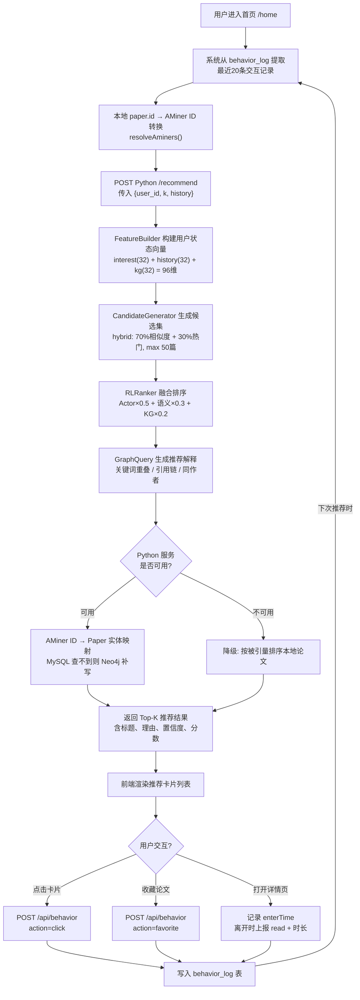

**流程描述**：用户进入首页后，系统从 `behavior_log` 表提取最近 20 条交互记录，将本地 `paper.id` 转换为 AMiner ID，发往 Python 推荐服务。Python 侧依次完成特征构建（从 MySQL 读取行为数据和兴趣标签拼接 96 维状态向量）、候选召回（hybrid 策略混合相似度与热门度，过滤已读论文）、融合排序（Actor 策略分 0.5 + 语义相似度 0.3 + KG 拓扑分 0.2）、以及基于 KG 图结构的推荐解释生成。若 Python 服务不可达，后端自动降级为按被引量排序的本地热门论文。返回结果后，用户在前端的每一次点击、收藏、阅读都会通过 `/api/behavior` 接口写入 `behavior_log`，形成下一轮推荐的反馈闭环。

---

### 二、学习路径生成

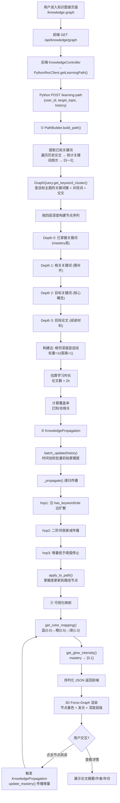

**流程描述**：用户进入知识图谱页面，前端向后端发起请求，后端通过 `PythonRecClient` 调用 Python 的 `/learning-path` 端点。Python 侧分三阶段处理：第一阶段 `PathBuilder.build_path()` 从用户历史阅读中提取已知关键词及其掌握度，通过 GraphQuery 在 Neo4j 图谱中查询目标主题的关键词簇和共现论文，然后按 Depth 0（已掌握）→ Depth 1（相关待补）→ Depth 2（目标核心）→ Depth 3（目标论文）四层组织节点序列，相邻深度层之间建边并估算学习时长与覆盖率。第二阶段 `KnowledgePropagation` 沿知识图谱边（has_keyword / cite / publish_in）递归扩散掌握度，最多 3 跳，时间加权模拟遗忘效应。第三阶段将掌握度映射为颜色和发光强度，序列化后返回前端以 3D 力导向图渲染。用户点击节点阅读后触发掌握度增量传播，实时更新颜色和亮度。

---

### 三、研究者合作者推荐

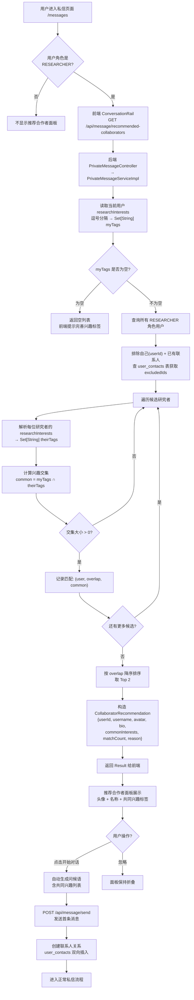

**流程描述**：此功能仅对 RESEARCHER 角色可见。用户打开私信页面后，前端通过角色门控（`v-if="hasRole('RESEARCHER')"`）决定是否显示推荐合作者面板。后端 `PrivateMessageServiceImpl.getRecommendedCollaborators()` 将当前用户的 `researchInterests` 逗号分隔字符串解析为标签集合，然后遍历系统中所有同角色用户（排除自身和已在 `user_contacts` 表中的联系人），逐一计算兴趣标签交集大小，按 overlap 降序取前 2 名。匹配结果包含共同兴趣标签列表和匹配数，前端以卡片形式展示头像、简介和兴趣标签。用户点击"开始对话"后，系统自动发送包含共同兴趣的问候语，同时创建双向联系人关系，进入正常私信流程。

---

### 四、社区帖子发布与审核

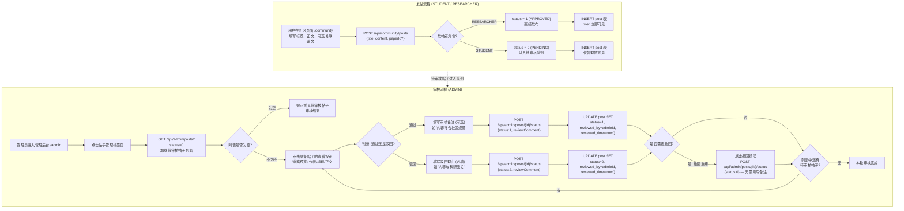

---

## Q9: 学习路径可视化能否实现点击节点后实时更新传播量与颜色？（2026-05-16）（git: bad2152） ^q9

**标签**: #学习路径 #可视化 #3D
**关联**: [[QA_2026-05-16_2026-06-02_v1#^q6|Q6]], [[QA_2026-06-02_2026-06-05_v2#^q28|Q28]]

当前实现**能做闭环，但并非实时**——需要一次完整的 HTTP 往返和页面刷新。

### 当前机制：通过 behavior_log 的间接闭环

每次 `POST /learning-path` 都创建全新 `KnowledgePropagation` 实例：

```python
# api/server.py:generate_learning_path()
propagation = KnowledgePropagation(kg)       # 每次 new，mastery_state = {}
if history:
    propagation.batch_update(history)        # 从零重建所有掌握度
```

用户点击节点后调用 `POST /api/behavior` 写入 `behavior_log`，下次请求 `/learning-path` 时该论文进入 `history` → `batch_update()` 计算掌握度 → 颜色变化。但必须刷新页面。

### Propagation 引擎已支持增量更新，只是 API 层没接上

`KnowledgePropagation.update_mastery()` 本身就是为实时传播设计的：

```python
def update_mastery(self, event_node_id, delta=1.0, event_type="read"):
    self.mastery_state[event_node_id] += delta * event_multiplier
    self._propagate(event_node_id, delta, 0, propagated)  # 递归扩散到邻居
    return propagated   # {node_id: delta} — 告知哪些节点变了
```

`mastery_state` 是 `defaultdict`，天然支持持续累积。问题在于 API 层没有把它保持为有状态的服务级单例——每次请求都 `new KnowledgePropagation(kg)`，更新完的 mastery 随即被丢弃。

### 改造方案：两处改动即可实现"点一下绿一片"

**API 层 — 加有状态 session + 增量更新端点**：

```python
_user_sessions: Dict[str, KnowledgePropagation] = {}

@router.post("/learning-path/update-mastery")
async def update_mastery(request: MasteryUpdateRequest):
    session = _user_sessions.get(request.user_id) or KnowledgePropagation(kg)
    _user_sessions[request.user_id] = session
    affected = session.update_mastery(request.node_id, delta=1.0)
    return {
        "affected_nodes": affected,
        "colors": session.get_color_mapping(list(affected.keys())),
        "glows": session.get_glow_intensity(list(affected.keys())),
    }
```

**前端 — 增量更新节点属性而非重建全图**：

```javascript
function onNodeClick(node) {
    recordBehavior(node.id, 'read')                      // 已有
    const { affected_nodes, colors, glows } = await updateMastery(node.id)  // 新增
    for (const nid of Object.keys(affected_nodes)) {
        graphData.nodes.find(n => n.id === nid).color = colors[nid]         // 直接赋值
        graphData.nodes.find(n => n.id === nid).glowIntensity = glows[nid]
    }
}
```

3D 力导向图的节点颜色和发光强度是运行时属性，直接赋值即生效，无需重建图。

### 总结

| 维度 | 当前状态 | 改造后 |
|------|---------|--------|
| 闭环存在？ | 是，通过 `behavior_log` 间接 | 直接实时 |
| 颜色能变？ | 需刷新页面重新请求 | 点击即变色 |
| 传播引擎支持？ | `update_mastery()` 已就绪 | 无需改动 |
| API 层 | 无状态，每次 new instance | 需加 session 管理 |
| 前端 | 全量重建图 | 需加增量节点属性更新 |

`KnowledgePropagation` 引擎本身就是为实时传播设计的，只是 API 层没有做 session 持久化，前端也没有增量更新端点。补上这两处即可实现真正的"点一下，绿一片"。

**流程描述**：社区帖子发布与审核分为两条角色分支。发帖侧：用户在社区页面填写标题和内容后提交，后端根据角色分流——RESEARCHER 的帖子直接设为 `APPROVED` 状态（`status=1`）立即可见，STUDENT 的帖子进入 `PENDING` 状态（`status=0`）等待审核。审核侧：管理员进入后台管理面板，加载待审核帖子列表。对每一条帖子，先点击"查看"按钮弹出详情弹窗预览作者、标题和正文内容，然后做出通过或驳回的判断。通过时可选填审核备注，驳回时必须填写理由告知用户。审核操作写入 `reviewed_by`（管理员 ID）和 `reviewed_time`（审核时间）。之后管理员可以判断是否需要将已处理的帖子撤回重审（撤回时 `status` 回到 0，无需填写备注，跳过审核弹窗）。处理完当前帖子后检查列表中是否还有待审核项，有则继续下一条，否则本轮审核结束。

## Q10: 数据库各表作用与主外键 + 作者认领功能的数据库调整方案（2026-05-19）（git: c513ad2） ^q10

**标签**: #数据库 #表结构 #外键
**关联**: [[QA_2026-06-02_2026-06-05_v2#^q21|Q21]], [[QA_2026-06-02_2026-06-05_v2#^q31|Q31]], [[QA_2026-06-07_2026-06-08_v3#^q44|Q44]]

### 一、当前 13 张表全览

#### 核心业务表（10 张）

| 表名 | 主键 | 外键 | 作用 |
|------|------|------|------|
| **user** | `id` (bigint, AUTO) | — | 用户认证与资料：username(UK)、BCrypt密码、email、role(STUDENT/RESEARCHER/ADMIN)、avatar、bio、research_interests |
| **paper** | `id` (bigint, AUTO) | — | 论文元数据：aminer_id(UK)、title(FULLTEXT)、abstract(FULLTEXT)、keywords(JSON)、authors(JSON)、venue、year、citation_count、embedding、deleted(逻辑删除) |
| **behavior_log** | `id` (bigint, AUTO) | `user_id→user.id` `paper_id→paper.id` | 用户行为日志：action(click/favorite/read)、duration(秒)、source(来源页面)、timestamp。RL训练数据源，加权池化构建用户向量 |
| **post** | `id` (bigint, AUTO) | `user_id→user.id` | 社区帖子：title、content、paper_id(可选关联论文)、status(0=PENDING/1=APPROVED/2=REJECTED)、review_comment、reviewed_by、reviewed_time。like_count/reply_count 已删除，改由 post_like/comment 表实时 COUNT |
| **comment** | `id` (bigint, AUTO) | `post_id→post.id` `user_id→user.id` `parent_id→comment.id`(自引用) | 嵌套评论：root_id(根评论，用于整树查询)、parent_id(父评论)、content、like_count、is_best |
| **post_like** | `id` (bigint, AUTO) | `user_id→user.id` `post_id→post.id` | 帖子点赞：(user_id,post_id)唯一约束，INSERT/DELETE切换，联动post.like_count增减 |
| **private_messages** | `id` (bigint, AUTO) | `sender_id→user.id` `receiver_id→user.id` | 私信：content、msg_type(1=文本/2=图片/3=链接)、is_read、read_time、status(0=撤回/1=正常) |
| **user_contacts** | `id` (bigint, AUTO) | `user_id→user.id` `contact_id→user.id` | 联系人关系：(user_id,contact_id)唯一约束，relation_type(FOLLOW/FRIEND/COLLABORATOR)。发消息时双向自动创建 |
| **user_interest_history** | `id` (bigint, AUTO) | `user_id→user.id` | 兴趣标签时序：interest_tag、weight(0-1)、source(register/behavior/feedback)、record_date。注册时从researchInterests初始化，推荐特征构建和可视化使用 |

#### 辅助表（1 张）

| 表名 | 主键 | 外键 | 作用 |
|------|------|------|------|
| **favourite** | `id` (bigint, AUTO) | `user_id→user.id` `paper_id→paper.id` | 论文收藏：(user_id,paper_id)唯一约束，folder_name和remark字段始终用默认值，仅user_id+paper_id有意义 |

#### 基础设施表（2 张，Python 服务使用，Java 后端无感知）

| 表名 | 主键 | 外键 | 作用 |
|------|------|------|------|
| **user_feature_snapshot** | `id` (bigint, AUTO) | — (user_id无FK约束) | RL特征缓存：(user_id,feature_type)唯一约束，feature_type∈{interest,history,kg}，feature_vector(JSON)、6h TTL |
| **rl_training_log** | `id` (bigint, AUTO) | — (user_id无FK约束) | 训练日志：episode、user_id、state、action、reward、cumulative_reward、loss、model_version |
| **paper_author_claim** | `id` (bigint, AUTO) | `paper_id` → paper.id, `user_id` → user.id | 作者认领记录：author_name、match_method、confidence、status(PENDING/CONFIRMED/DENIED) |

#### ER 关系总图

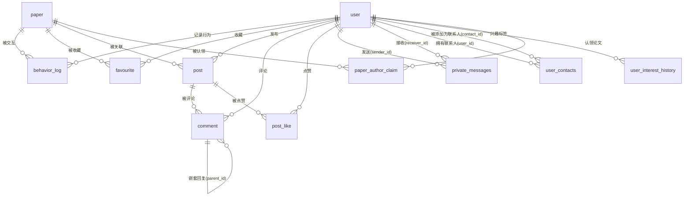

---

### 二、作者认领功能（已于 2026-05-24 实现）

#### 2.1 需求分析

当前 `paper.authors` 以 JSON 数组字符串存储（如 `["Yann LeCun", "Yoshua Bengio"]`），与 `user` 表无任何结构化关联。要实现"导入新论文时向同名作者发送询问，使其判断是否是他的论文"，需要：

1. **姓名匹配**：解析 `paper.authors` → 在 `user` 表按 `username` 模糊匹配（或精确匹配）
2. **认领记录**：持久存储每条匹配结果及其处理状态
3. **通知触达**：向被匹配用户发送提示（可复用现有 `private_messages` 表）

#### 2.2 新增表：paper_author_claim

```sql
DROP TABLE IF EXISTS `paper_author_claim`;
CREATE TABLE `paper_author_claim` (
    `id`              bigint NOT NULL AUTO_INCREMENT COMMENT '认领记录ID',
    `paper_id`        bigint NOT NULL COMMENT '论文ID',
    `user_id`         bigint NOT NULL COMMENT '被匹配的用户ID',
    `author_name`     varchar(100) NOT NULL COMMENT '论文中匹配到的原始作者名',
    `match_method`    varchar(20) NOT NULL DEFAULT 'exact' COMMENT '匹配方式: exact=精确匹配 username, fuzzy=模糊匹配, manual=管理员手动指定',
    `confidence`      decimal(3,2) DEFAULT NULL COMMENT '匹配置信度 0.00~1.00',
    `status`          tinyint NOT NULL DEFAULT 0 COMMENT '认领状态: 0=待确认 1=已确认为本人 2=已否认 3=已过期',
    `responded_at`    datetime NULL DEFAULT NULL COMMENT '用户响应时间',
    `admin_note`      varchar(500) DEFAULT NULL COMMENT '管理员备注',
    `create_time`     datetime NOT NULL DEFAULT CURRENT_TIMESTAMP,
    `update_time`     datetime NOT NULL DEFAULT CURRENT_TIMESTAMP ON UPDATE CURRENT_TIMESTAMP,
    PRIMARY KEY (`id`) USING BTREE,
    UNIQUE INDEX `uk_paper_user`(`paper_id` ASC, `user_id` ASC) USING BTREE,
    INDEX `idx_user_status`(`user_id` ASC, `status` ASC) USING BTREE,
    INDEX `idx_paper_id`(`paper_id` ASC) USING BTREE,
    INDEX `idx_status`(`status` ASC) USING BTREE,
    CONSTRAINT `fk_claim_paper` FOREIGN KEY (`paper_id`) REFERENCES `paper` (`id`) ON DELETE CASCADE ON UPDATE RESTRICT,
    CONSTRAINT `fk_claim_user` FOREIGN KEY (`user_id`) REFERENCES `user` (`id`) ON DELETE CASCADE ON UPDATE RESTRICT
) ENGINE = InnoDB CHARACTER SET = utf8mb4 COLLATE = utf8mb4_unicode_ci COMMENT = '论文作者认领表（用户确认论文是否为其著作）';
```

**字段设计说明**：

| 字段 | 设计理由 |
|------|---------|
| `paper_id + user_id` 唯一约束 | 同一论文同一用户只产生一条认领记录，避免重复询问 |
| `author_name` | 保留论文中的原始作者名，即使与 `user.username` 不完全一致也能对比 |
| `match_method` | 区分匹配来源：exact(导入时自动精确匹配)、fuzzy(同名不同拼写)、manual(管理员手动关联) |
| `confidence` | 精确匹配=1.0，模糊匹配根据相似度递减，便于后续只推送高置信度的询问 |
| `status` 四态 | 0=待确认(初始)、1=已确认(用户点击"是我的论文")、2=已否认(用户点击"不是我的")、3=已过期(超过N天未处理) |
| `responded_at` | 记录用户确认/否认的时间 |
| `ON DELETE CASCADE` | 论文被删除时自动清理认领记录；用户注销时也自动清理 |

#### 2.3 user 表微调（可选）

如果后续需要将用户与其学术身份做强绑定，可在 `user` 表增加：

```sql
ALTER TABLE `user` ADD COLUMN `author_name_norm` varchar(100) DEFAULT NULL 
    COMMENT '归一化作者名（用于匹配），如 yann_lecun';
```

此字段允许用户声明自己的学术署名名称，比 `username` 更精确地用于论文作者匹配。如果不需要此字段，匹配逻辑默认使用 `username` 字段。

---

### 三、导入时的匹配流程

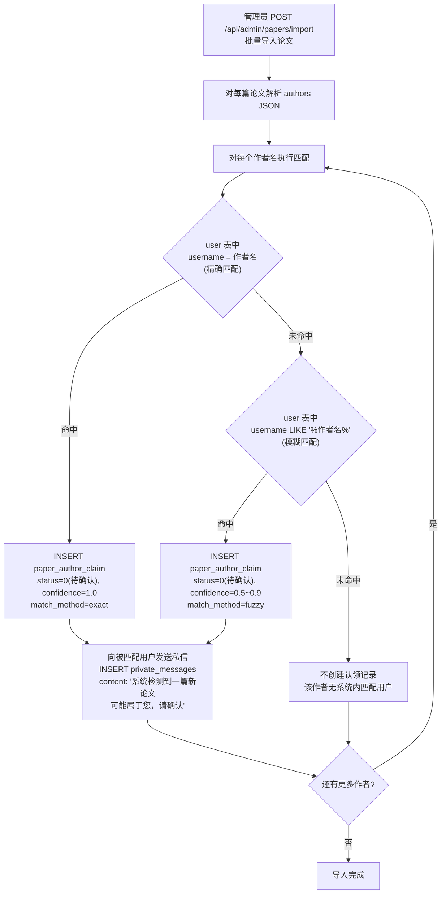

**私信内容模板**：
```
系统检测到一篇新导入的论文可能与您有关：

标题：《{paper.title}》
作者列表：{paper.authors}
发表年份：{paper.year}
发表期刊：{paper.venue}

如果这是您的论文，请在"我的论文"页面确认；如果不是，请忽略此消息。
```

---

### 四、用户确认/否认的交互

前端需要新增两个入口：

**入口1：私信中的快捷操作**（复用 `ConversationRail.vue`）
- 系统发出的认领询问私信中附带 `msg_type=3`（链接类型）或 `msg_type=4`（认领询问）
- 消息气泡内展示"是我的论文"/"不是我的"两个按钮
- 用户点击后调用新端点

**入口2：用户 Profile 页新增"我的论文"标签**
- 展示已确认的论文列表（`SELECT * FROM paper_author_claim WHERE user_id=? AND status=1`）
- 展示待确认的论文列表（`SELECT * FROM paper_author_claim WHERE user_id=? AND status=0`）
- 每条待确认论文旁有"确认"/"否认"按钮

**新增 API 端点**：
```
POST /api/paper/{paperId}/claim-confirm    →  status=1, responded_at=now()
POST /api/paper/{paperId}/claim-deny       →  status=2, responded_at=now()
GET  /api/user/claimed-papers?status=0     →  待确认论文列表
GET  /api/user/claimed-papers?status=1     →  已确认论文列表
```

---

### 五、对现有表的影响

| 现有表 | 影响 | 说明 |
|--------|------|------|
| `paper` | 无 | 不修改结构 |
| `user` | 可选增加 `author_name_norm` | 如果 `username` 与学术署名不一致时需要 |
| `private_messages` | 无结构修改 | 复用现有发送机制，可扩展 `msg_type` 增加"认领询问"类型 |
| `behavior_log` | 无 | 不涉及 |
| 其他表 | 无 | 不受影响 |

**总结**：仅需新增一张 `paper_author_claim` 表（13 列，3 个外键，4 个索引），`user` 表可选加一列，其余 11 张表保持不变。导入流程中在 `PaperServiceImpl` 或 AdminController 的导入方法末尾插入匹配逻辑，匹配结果写入新表并自动发送私信通知。

## Q5追问: rl-service Python 模块包图 / 依赖图（2026-05-19）（git: bad2152） ^q5-ask

**标签**: #包图 #Python模块 #依赖
**关联**: [[QA_2026-05-16_2026-06-02_v1#^q5|Q5]], [[QA_2026-06-07_2026-06-08_v3#^q45|Q45]]

> 以下依赖图通过逐文件分析 `from X import Y` 语句生成，仅展示项目内部模块间的依赖关系，标准库和第三方库（torch/numpy/fastapi/pymysql/dataclasses）已略去。

```mermaid
flowchart TB
    subgraph L0["Layer 0: 基础层 (无内部依赖)"]
        config["config.py<br/>全局配置 @dataclass"]
        reward["utils/reward.py<br/>奖励函数"]
        logger["utils/logger.py<br/>训练日志"]
        actor_m["models/actor.py<br/>策略网络 π(a|s)"]
        critic_m["models/critic.py<br/>价值网络 V(s)"]
        aminer["dataset/aminer_loader.py<br/>AMiner 数据加载"]
        mysql_data["data/mysql_data.py<br/>MySQL 数据访问层"]
        mock_data["data/mock_data.py<br/>训练用模拟数据"]
    end

    subgraph L1["Layer 1: KG 构建层"]
        kg_builder["knowledge_graph/kg_builder.py<br/>KG 构建器 + 图数据结构"]
        kg_embedder_m["knowledge_graph/kg_embedder.py<br/>图结构嵌入（10维→投影→32维）"]
    end

    subgraph L2["Layer 2: KG 查询层"]
        graph_query["knowledge_graph/graph_query.py<br/>图查询引擎 (倒排索引)"]
        graph_storage["knowledge_graph/graph_storage.py<br/>图存储抽象层 (Neo4j↔本地)"]
        kg_embedder["knowledge_graph/kg_embedder.py<br/>KG 嵌入器 (图结构→向量)"]
    end

    subgraph L3["Layer 3: 推荐中间层"]
        feature_builder["features/feature_builder.py<br/>用户状态构建器"]
        candidate_gen["recommender/candidate_generator.py<br/>候选集生成器"]
    end

    subgraph L4["Layer 4: 学习路径层"]
        path_builder["learning_path/path_builder.py<br/>学习路径生成"]
        propagation["learning_path/propagation.py<br/>掌握度传播"]

    end

    subgraph L5["Layer 5: 强化学习核心"]
        agent["agent.py<br/>Actor-Critic 智能体"]
        ranker["recommender/ranker.py<br/>RL 融合排序器"]
    end

    subgraph L6["Layer 6: 训练环境"]
        rec_env["env/rec_env.py<br/>推荐强化学习环境"]
    end

    subgraph L7["Layer 7: 服务编排"]
        rec_service["services/recommendation_service.py<br/>推荐服务统一编排"]
    end

    subgraph L8["Layer 8: API 入口"]
        server["api/server.py<br/>FastAPI REST 入口"]
        train_py["train.py<br/>模型训练主脚本"]
    end

    %% Layer 0 → Layer 1
    aminer --> kg_builder
    aminer --> embeddings
    kg_builder --> embeddings

    %% Layer 1 → Layer 2
    kg_builder --> graph_query
    kg_builder --> graph_storage
    kg_builder --> kg_embedder

    %% Layer 2 → Layer 3
    graph_query -.->|"间接(解释生成)"| feature_builder
    kg_embedder --> feature_builder

    %% Layer 2 → Layer 4
    kg_builder --> path_builder
    graph_query --> path_builder
    kg_builder --> propagation
    path_builder --> propagation

    %% Layer 0 → Layer 5
    config --> agent
    actor_m --> agent
    critic_m --> agent
    config --> ranker
    candidate_gen --> ranker
    agent --> ranker

    %% Layer 0 → Layer 6
    config --> rec_env
    mock_data --> rec_env
    reward --> rec_env
    kg_embedder --> rec_env

    %% Layers 0-6 → Layer 7
    config --> rec_service
    agent --> rec_service
    aminer --> rec_service
    feature_builder --> rec_service
    graph_query --> rec_service
    kg_embedder --> rec_service
    candidate_gen --> rec_service
    ranker --> rec_service
    graph_storage --> rec_service

    %% Layers 0-7 → Layer 8
    config --> server
    config --> train_py
    rec_service --> server
    train_py --> server
    rec_env --> train_py
    reward --> train_py
    logger --> train_py
    agent --> train_py
    kg_embedder --> train_py
    path_builder -.->|"动态 import"| server
    propagation -.->|"动态 import"| server
    graph_query -.->|"动态 import"| server
```


### 依赖统计

| 模块 | 被依赖次数 | 说明 |
|------|----------|------|
| **config.py** | 6 | 所有模块的配置入口，最高频依赖 |
| **kg_builder.py** | 6 | KG 数据结构的定义者，所有图相关模块的基础 |
| **agent.py** | 3 | Actor-Critic 核心，被编排层、训练层、排序层依赖 |
| **aminer_loader.py** | 4 | 论文数据模型，KG 构建、推荐服务、嵌入构建的输入 |
| **graph_query.py** | 4 | 图查询引擎，被推荐服务、学习路径、API 层使用 |
| **kg_embedder.py** | 4 | KG 嵌入器，被推荐、训练、环境、特征构建使用 |
| **rec_service.py** | 1 | 仅被 API 入口依赖——典型的"编排者"角色 |
| **server.py** | 0 | 叶节点，不依赖任何其他模块，纯调用者 |

### 架构特征

**1. 严格的单向分层**：9 层依赖方向一律自上而下，无循环依赖。Layer 0（基础层）完全不依赖项目内其他模块，Layer 8（API 入口）只被外部调用。

**2. config.py 是全局枢纽**：`@dataclass` 配置对象被 6 个模块直接依赖，所有超参数、连接参数、维度设置全部由它注入，不存在分散的硬编码常量。

**3. kg_builder.py 是图生态的根**：定义 `KnowledgeGraph`、`KGNode`、`KGEdge` 三种数据结构，graph_query、graph_storage、kg_embedder、path_builder、propagation 全部直接或间接依赖它。

**4. agent.py 是 RL 生态的根**：导入 `models/actor.py` 和 `models/critic.py` 组装为 `ActorCriticAgent`，ranker.py 和 rec_service.py 通过 agent 间接使用两个网络，而非直接依赖 models。

**5. 三个"动态 import"点**：`api/server.py` 在学习路径端点中以 `from learning_path.path_builder import PathBuilder` 方式动态导入；`services/recommendation_service.py` 在 `__init__` 中动态导入 `data.mysql_data` 和 `knowledge_graph.graph_storage`——如果服务初始化失败不影响模块加载。

**6. 模块粒度适中**：每个 `.py` 文件职责单一，无"万能工具模块"。最复杂的 `recommendation_service.py` 依赖 10 个内部模块，但这是合理的编排者角色。

## Q5追问: 推荐服务算法伪代码与细致流程图（2026-05-19）（git: bad2152） ^q5-ask

**标签**: #算法 #伪代码 #推荐流程
**关联**: [[QA_2026-05-16_2026-06-02_v1#^q5|Q5]], [[QA_2026-05-16_2026-06-02_v1#^q2|Q2]], [[QA_2026-06-08_v4#^q51|Q51]]

### 一、算法伪代码

```
┌─────────────────────────────────────────────────────────────────────┐
│  算法: 基于 Actor-Critic 与知识图谱的科研论文个性化推荐                  │
│  输入: user_id, k=10, history=[], strategy="hybrid"                  │
│  输出: Top-K 推荐结果 (含分数、理由、置信度)                            │
└─────────────────────────────────────────────────────────────────────┘

RECOMMEND(user_id, k, history, strategy):

    // ═══════════════════════════════════════════════════════════
    // Phase 1: 用户特征构建 (FeatureBuilder)
    // ═══════════════════════════════════════════════════════════
    
    numeric_id = int(user_id)
    
    // 1.1 尝试从缓存读取 (user_feature_snapshot, TTL=6h)
    cached_interest = mysql.get_cached_feature(numeric_id, "interest")
    cached_history  = mysql.get_cached_feature(numeric_id, "history")
    
    IF cached_interest ≠ NULL AND cached_history ≠ NULL THEN
        interest_vector = cached_interest
        history_vector  = cached_history
    ELSE
        // 1.2 从 MySQL 实时构建兴趣向量
        tags = mysql.get_user_interest_tags(numeric_id)
        IF tags 为空 THEN
            tags = mysql.get_global_keyword_freq()[:10]   // 冷启动: 全局热门
        END IF
        
        interest_vector = ZEROS(64)
        FOR EACH tag IN tags:
            tag_vec = HASH_TO_VEC(tag.key, dim=64)        // 确定性哈希
            w       = tag.weight
            interest_vector += tag_vec × w
        END FOR
        interest_vector = weight_average(interest_vector)
        interest_vector = L2_NORMALIZE(interest_vector)
        
        // 1.3 从 MySQL 实时构建历史行为向量 (加权池化)
        behaviors = mysql.get_user_behaviors(numeric_id)
        action_weight = {"click": 0.5, "read": 1.0, "favorite": 2.0}
        
        // 按论文聚合，取最高权重行为
        paper_weights = {}
        paper_durations = {}
        FOR EACH behavior IN behaviors:
            pid = behavior.paper_id
            w   = max(paper_weights.get(pid, 0), action_weight[behavior.action])
            paper_weights[pid] = w
            IF behavior.duration > 0 THEN
                paper_durations[pid] += behavior.duration
            END IF
        END FOR
        
        papers = mysql.get_papers_by_ids(paper_weights.keys())
        vecs   = []
        weights = []
        FOR EACH paper IN papers:
            pid = paper.id
            // 优先使用预存向量（paper.embedding 字段，10维结构特征投影的32维向量）
            IF paper.embedding ≠ NULL THEN
                vecs.append(PAD(paper.embedding, 64))
            ELSE IF kg_embedder ≠ NULL AND paper.aminer_id ≠ NULL THEN
                emb = kg_embedder.get_paper_embedding(paper.aminer_id)
                vecs.append(PAD(emb, 64))
            ELSE
                vecs.append(METADATA_FEATURES(paper))     // MySQL字段回退
            END IF
            // 行为权重 + 阅读时长奖励 (每60秒+0.5, 上限+2.0)
            w = paper_weights[pid]
            w += min(paper_durations.get(pid,0) / 60.0 × 0.5, 2.0)
            weights.append(w)
        END FOR
        
        history_vector = NP_WEIGHTED_AVERAGE(vecs, weights)
        history_vector = L2_NORMALIZE(history_vector)
        
        // 1.4 缓存特征向量
        mysql.cache_feature(numeric_id, "interest", interest_vector)
        mysql.cache_feature(numeric_id, "history", history_vector)
    END IF
    
    // 1.5 构建 KG 向量 (aggregate user's structural position in the graph)
    history_paper_ids = history  OR  resolve_from_mysql(numeric_id)
    IF kg_embedder ≠ NULL AND kg_dim > 0 AND history_paper_ids 不为空 THEN
        kg_vector = kg_embedder.get_user_kg_embedding(history_paper_ids)
    ELSE
        kg_vector = ZEROS(kg_dim)
    END IF
    
    // 1.6 拼接状态向量
    state = CONCAT(
        interest_vector[:32],
        history_vector[:32],
        kg_vector[:32]          // 仅在 use_kg=True 时
    )
    state = L2_NORMALIZE(state)     // → |96| 或 |64| 维
    
    
    // ═══════════════════════════════════════════════════════════
    // Phase 2: 候选集生成 (CandidateGenerator)
    // ═══════════════════════════════════════════════════════════
    
    // 2.1 过滤已读论文
    pool = [p FOR p IN paper_catalog IF p.item_id NOT IN history_set]
    
    // 2.2 按策略召回
    IF strategy == "similarity" THEN
        candidates = TOP_K_BY_COSINE_SIM(interest_vector, pool, limit)
        
    ELSE IF strategy == "popular" THEN
        candidates = TOP_K_BY(citation_count DESC, pool, limit)
        
    ELSE  // "hybrid" (默认)
        sim_count = int(limit × 0.7)          // 70% 相似度
        pop_count = limit - sim_count          // 30% 热门
        sim_items = TOP_K_BY_COSINE_SIM(interest_vector, pool, sim_count)
        // 去重: 热门中排除已在相似度集合中的论文
        seen_set  = {p.item_id FOR p IN sim_items}
        pop_items = [p FOR p IN pool
                     IF p.item_id NOT IN seen_set
                     ORDER BY citation_count DESC
                     LIMIT pop_count]
        candidates = sim_items + pop_items
    END IF
    
    candidates = candidates[:limit]             // → max 50 篇
    
    
    // ═══════════════════════════════════════════════════════════
    // Phase 3: 融合排序 (RLRanker)
    // ═══════════════════════════════════════════════════════════
    
    agent.actor.eval()                          // 切换推理模式, no_grad
    
    base_state = state[:64]                     // 前64维用于余弦相似度
    state_t    = TENSOR(state)                   // (96,)
    scored     = []
    
    // 3.1 余弦相似度 — 向量化矩阵乘法（非逐项循环）
    topic_matrix = STACK([item.topic_vector FOR item IN candidates])   // (N, 64)
    cos_sims     = CLAMP(DOT(topic_matrix, base_state), 0.0, +∞)      // (N,)

    // 3.2 KG 用户向量 — 循环外只算一次
    user_kg = kg_embedder.get_user_kg_embedding(user_history)           // (32,)

    // 3.3 Actor 逐论文打分 — 单次 GPU 前向传播
    feat_t      = TENSOR(candidate_features)                            // (N, 32)
    actor_probs = agent.actor.score_candidates(state_t, feat_t)         // (N,) softmax分布
    
    FOR i, item IN ENUMERATE(candidates):
        actor_score = actor_probs[i]                                   // 该论文的独立概率
        
        // KG 拓扑分
        IF kg_embedder ≠ NULL AND user_history 不为空 THEN
            paper_emb = kg_embedder.get_paper_embedding(item.kg_node_id)
            kg_score  = CLAMP(DOT(user_kg, paper_emb), 0.0, 1.0)
        ELSE
            kg_score  = 0.0
        END IF
        
        // 3.4 融合
        IF kg_embedder ≠ NULL THEN
            final_score = 0.5 × actor_score + 0.3 × cos_sim + 0.2 × kg_score
        ELSE
            final_score = 0.6 × actor_score + 0.4 × cos_sim
        END IF
        
        scored.append((final_score, item))
    END FOR
    
    agent.actor.train()                         // 恢复训练模式
    
    scored = SORT_DESC(scored)
    ranked = [RankedItem(item, score, rank) FOR rank, (score, item) IN ENUMERATE(scored[:k])]
    
    
    // ═══════════════════════════════════════════════════════════
    // Phase 4: 解释生成 (GraphQuery)
    // ═══════════════════════════════════════════════════════════
    
    FOR EACH ranked_item IN ranked:
        paper_id = ranked_item.item.item_id
        
        IF graph_query ≠ NULL AND history_paper_ids 不为空 THEN
            reasons = graph_query.explain_recommendation(
                history_paper_ids[-5:],  paper_id
            )
            // 内部匹配规则:
            //   ① 关键词重叠 → "与您阅读的《X》共享关键词: Y"
            //   ② 引用关系   → "该论文引用了您读过的《X》"
            //   ③ 被引关系   → "您的历史阅读《X》引用了该论文"
            //   ④ 同一作者   → "该论文与您阅读的论文来自同一作者: X"
        ELSE
            reasons = []
        END IF
        
        reason = reasons[0] OR "基于您的科研兴趣推荐"
        confidence = MIN(0.99, 0.5 + 0.12 × LEN(reasons))
        
        
    // ═══════════════════════════════════════════════════════════
    // Phase 5: 组装结果
    // ═══════════════════════════════════════════════════════════
    
    result = []
    FOR EACH ranked_item IN ranked:
        result.append({
            paper_id:         ranked_item.item.item_id,
            title:            ranked_item.item.title,
            authors:          ranked_item.item.authors,
            year:             ranked_item.item.year,
            score:            ROUND(ranked_item.score, 6),
            rank:             ranked_item.rank,
            reason:           reason,
            reason_details:   reasons OR ["基于强化学习算法推测"],
            similarity_score: ROUND(ranked_item.score, 4),
            topics:           ranked_item.item.topics,
            citation_count:   ranked_item.item.citation_count,
            confidence:       ROUND(confidence, 4),
        })
    END FOR
    
    RETURN Response(user_id, k, result, latency_ms, model_version)
```

---

### 二、细致流程图

```mermaid
flowchart TD
    START(["输入: user_id, k=10, history, strategy='hybrid'"]) --> P1

    subgraph P1["Phase 1: 用户特征构建 (FeatureBuilder)"]
        direction TB
        F1{"MySQL 连接<br/>是否可用?"}
        F2["尝试读取缓存<br/>user_feature_snapshot"]
        F3{"缓存命中<br/>且未过期?"}
        F4["interest_vector = cached"]
        F5["history_vector = cached"]
        F6["查 user_interest_history<br/>获取兴趣标签及权重"]
        F7{"标签列表<br/>是否为空?"}
        F8["使用全局热门关键词<br/>(冷启动回退)"]
        F9["逐个标签 HASH_TO_VEC(dim=64)<br/>按权重加权平均 → L2归一化"]
        F10["查 behavior_log<br/>获取用户所有行为记录"]
        F11["按论文聚合<br/>action权重: click=0.5/read=1.0/favorite=2.0<br/>时长奖励: +0.5/60s, max+2.0"]
        F12["查论文详情 (批量)<br/>优先 paper.embedding 预存向量<br/>回退 KGEmbedder / 元数据"]
        F13["np.weighted_average(vecs, weights)<br/>→ L2归一化"]
        F14["写入缓存<br/>mysql.cache_feature()"]
        F15["生成随机向量<br/>(训练环境回退)"]
        F16["构建 KG 向量<br/>kg_embedder.get_user_kg_embedding(history)"]
        F17["拼接 + L2归一化<br/>state = concat(interest[:32], history[:32], kg[:32])"]

        F1 -->|是| F2
        F1 -->|否| F15
        F2 --> F3
        F3 -->|是| F4
        F3 -->|否| F6
        F4 --> F5
        F5 --> F16
        F6 --> F7
        F7 -->|是| F8
        F7 -->|否| F9
        F8 --> F9
        F9 --> F10
        F10 --> F11
        F11 --> F12
        F12 --> F13
        F13 --> F14
        F14 --> F16
        F15 --> F16
        F16 --> F17
    end

    P1 --> P2

    subgraph P2["Phase 2: 候选集生成 (CandidateGenerator)"]
        direction TB
        C1["pool = [p for p in paper_catalog<br/>if p.item_id NOT IN history_set]"]
        C2{"strategy?"}
        C3["similarity:<br/>余弦相似度排序取 Top-K"]
        C4["popular:<br/>按 citation_count 降序取 Top-K"]
        C5["hybrid:<br/>70% 相似度 + 30% 热门<br/>去重后合并"]
        C6["返回 candidates[:limit]<br/>→ max 50 篇"]

        C1 --> C2
        C2 -->|similarity| C3
        C2 -->|popular| C4
        C2 -->|hybrid| C5
        C3 --> C6
        C4 --> C6
        C5 --> C6
    end

    P2 --> P3

    subgraph P3["Phase 3: 融合排序 (RLRanker)"]
        direction TB
        R1["agent.actor.eval()<br/>base_state = state[:64]"]
        R2["FOR EACH item IN candidates:"]
        R3["① cos_sim = dot(base_state, item.topic_vector)"]
        R4["② actor_probs = actor.score_candidates(state_t, feat_t)<br/>   actor_score = actor_probs[i]（逐论文独立打分）"]
        R5{"kg_embedder<br/>≠ NULL?"}
        R6["③ kg_score = dot(user_kg, paper_emb)"]
        R7["final = 0.5×actor + 0.3×cos + 0.2×kg"]
        R8["kg_score = 0.0"]
        R9["final = 0.6×actor + 0.4×cos"]
        R10{"还有更多<br/>候选?"}
        R11["scored.sort(desc)<br/>→ Top-K"]

        R1 --> R2
        R2 --> R3
        R3 --> R4
        R4 --> R5
        R5 -->|是| R6
        R6 --> R7
        R5 -->|否| R8
        R8 --> R9
        R7 --> R10
        R9 --> R10
        R10 -->|是| R2
        R10 -->|否| R11
    end

    P3 --> P4

    subgraph P4["Phase 4: 解释生成 (GraphQuery)"]
        direction TB
        E1{"graph_query<br/>≠ NULL AND<br/>history 不为空?"}
        E2["FOR EACH ranked_item:"]
        E3["graph_query.explain_recommendation(<br/>  history[-5:], paper_id)"]
        E4["匹配规则:<br/>① 关键词重叠<br/>② 引用关系<br/>③ 被引关系<br/>④ 同一作者"]
        E5{"reasons<br/>为空?"}
        E6["reason = reasons[0]"]
        E7["reason = '基于您的科研兴趣推荐'"]
        E8["confidence = min(0.99, 0.5 + 0.12×len(reasons))"]

        E1 -->|是| E2
        E1 -->|否| E7
        E2 --> E3
        E3 --> E4
        E4 --> E5
        E5 -->|否| E6
        E5 -->|是| E7
        E6 --> E8
        E7 --> E8
    end

    P4 --> P5

    subgraph P5["Phase 5: 组装响应"]
        direction TB
        A1["FOR EACH (ranked, reason, confidence)"]
        A2["RecommendationItem(<br/>  paper_id, title, authors, year,<br/>  score, rank, reason, reason_details,<br/>  similarity_score, topics,<br/>  citation_count, confidence)"]
        A3["latency_ms = (now - t0) × 1000"]
        A4["RecommendationResponse(<br/>  user_id, k, recommendations,<br/>  latency_ms, model_version)"]

        A1 --> A2
        A2 --> A3
        A3 --> A4
    end

    P5 --> END(["返回 JSON → 前端渲染"])
```

---

### 三、关键路径复杂度

| 阶段 | 时间瓶颈 | 优化手段 |
|------|---------|---------|
| Phase 1 特征构建 | MySQL 查询 + 向量加权 | 6h 缓存(user_feature_snapshot)，冷启动后查缓存跳过 |
| Phase 2 候选召回 | 余弦相似度全量计算 | 候选集已限 50 篇；生产环境预留 Faiss ANN 加速 |
| Phase 3 融合排序 | Actor 前向传播 × 50 | `torch.no_grad()` 关闭梯度计算，CPU 毫秒级 |
| Phase 4 解释生成 | 倒排索引查询 + 规则匹配 | 4 个内存索引 O(1) 查，最多 4 条规则，常数时间 |
| Phase 5 组装 | JSON 序列化 | 线性的，无瓶颈 |

### 四、三种回退路径

```
① MySQL 不可用 → Phase 1 使用随机向量 (训练环境/开发环境)
② KG/Neo4j 不可用 → Phase 1 kg_vector=0; Phase 3 kg_score=0; Phase 4 reasons=[]
③ Python 服务整体不可用 → Java 后端降级为本地热门论文 (跳过 Phase 1~5)
```

回退设计保证系统在任何组件故障时都不会返回空结果。

---

### 五、粗粒度算法概览（文字描述版）

以下用"一句话概括一个步骤"的方式重述推荐算法全流程，适合快速理解整体逻辑。

---

**Phase 1：用户特征构建 —— 把用户"画"成一个 96 维数字向量**

> 目标：为当前用户生成一个能概括其科研兴趣、历史行为和学术网络位置的状态向量。

1. **尝试读缓存**：去 `user_feature_snapshot` 表查是否有 6 小时内的特征快照，有则直接复用，跳过后续步骤。
2. **拼兴趣画像**：从 `user_interest_history` 表读用户的兴趣标签（如"强化学习"权重 0.8、"图神经网络"权重 0.6），每个标签通过确定性哈希映射为 64 维向量，按权重加权平均，得到 **interest_vector**。如果用户是全新注册、没有兴趣标签，则用全局热门关键词兜底。
3. **拼行为画像**：从 `behavior_log` 表读用户所有点击、收藏、阅读记录。不只看"读了什么论文"，还区分行为质量——收藏权重是点击的 4 倍（2.0 vs 0.5），阅读时长每 60 秒额外加 0.5 分。用这批论文的 KG 嵌入向量按行为权重做加权池化，得到 **history_vector**。
4. **拼图谱画像**：如果启用了知识图谱，调用 `kg_embedder` 将用户历史论文在图中的结构位置（引用链深度、关键词连通度、合著网络密度）聚合成 **kg_vector**，刻画"用户在学术知识网络中的坐标"。
5. **三段拼接归一化**：`state = [interest前32 | history前32 | kg前32]`，L2 归一化后得到一个 96 维浮点数组，这就是后续所有计算的输入。

---

**Phase 2：候选集生成 —— 从 1005 篇论文中筛出 50 篇"可能合适"的**

> 目标：缩小排序范围，避免对全库逐篇做神经网络推理。

1. **过滤已读**：把用户历史交互过的论文从候选池中剔除，不推荐重复内容。
2. **混合召回（hybrid 策略）**：70% 的槽位用余弦相似度——计算用户兴趣向量与每篇论文向量的点积，取最相似的；30% 的槽位用热门度——按被引次数降序取最高的，确保推荐结果既有精度又有广度。这两种来源会去重后合并。
3. 最终输出最多 50 篇候选论文进入精排。

---

**Phase 3：融合排序 —— 从 50 篇中挑出最好的 Top-K**

> 目标：用一个三因素融合公式对每篇候选论文打分排序。

对每篇候选论文，计算三个分：

1. **语义分**：用户状态向量的前 64 维与论文的 topic_vector 做点积——衡量"内容像不像"。
2. **策略分**：把用户状态向量和候选论文特征向量拼接后喂给训练好的 Actor 网络（`score_candidates()`），输出 N 个独立 logit 经 softmax 得到 N 维概率分布——每篇论文用自己的结构特征与用户状态交互得分，衡量"根据历史经验，用户会不会喜欢这篇具体论文"。
3. **图谱分**（可选）：用户 KG 向量与论文 KG 向量做点积——衡量"在学术网络中，这篇论文离用户近不近"。

最终分数 = **0.5 × 策略分 + 0.3 × 语义分 + 0.2 × 图谱分**（无 KG 时退化为 0.6/0.4）。按融合分降序取前 K 篇。

这一步只做神经网络前向推理（`no_grad`），不更新权重，数十毫秒内完成。

---

**Phase 4：解释生成 —— 告诉用户"为什么推荐这篇"**

> 目标：为每篇推荐论文生成可读的推荐理由。

把用户最近读过的 5 篇论文和目标推荐论文一起送入图查询引擎，在倒排索引中快速匹配：

- 两篇论文有没有共享关键词？→ "与您阅读的《XXX》共享关键词：YYY"
- 推荐论文是不是引用了用户读过的论文？→ "该论文引用了您读过的《XXX》"
- 反之，用户读过的论文有没有引用推荐论文？→ "您的历史阅读引用了该论文"
- 两篇论文是不是同一位作者？→ "来自同一作者：XXX"

如果图查询不可用或匹配不到任何规则，回退为通用理由"基于您的科研兴趣推荐"。置信度根据匹配到的理由数量动态估算：`0.5 + 0.12 × 理由数`，上限 0.99。

---

**Phase 5：组装响应 —— 打包返回**

> 目标：把排序结果、解释文本、元信息封装成统一 JSON 结构返回给 Java 后端。

每条推荐结果包含：论文 ID、标题、作者、年份、融合分数、排名、推荐理由文本、理由详情列表、语义相似度、主题标签、被引量、置信度。响应体还包含请求耗时和模型版本号，供前端展示和诊断使用。

---

**粗粒度 vs 细粒度对照**：

| 维度 | 细粒度（上文第三节） | 粗粒度（本节） |
|------|-------------------|-------------|
| 描述方式 | Python 风格伪代码，含变量名和函数名 | 中文叙事，一句话一个步骤 |
| 适合场景 | 需要对照源码精读 | 快速掌握算法全貌 |
| Phase 1 篇幅 | ~60 行伪代码 | 5 个自然段 |
| Phase 3 篇幅 | ~30 行伪代码 | 分三因素公式说明 |
| 回退路径 | 3 条 if/else | 单独一段文字说明 |

---

# Q11: 全项目系统性代码审计报告（2026-05-24） ^q11

**标签**: #代码审计 #BUG #死代码
**关联**: [[QA_2026-05-16_2026-06-02_v1#^q12|Q12]]

> 审计范围：后端 Java × 前端 Vue × Python RL 服务，逐文件逐函数检查正确性、死数据、冗余。

## 一、后端 Java（`backend/src/main/java/com/example/research/`）

### 1.1 控制器层（controller/）

#### AdminController.java
- `listPosts(status)`: 按状态筛选所有帖子，返回 PostItem 列表 [OK]
- `updatePostStatus(adminId, postId, request)`: 管理员审批/驳回帖子 [OK]
- `listUsers()`: 列出所有用户供管理 [OK]
- `updateUserRole(adminId, userId, request)`: 管理员修改用户角色，禁止自降级 [OK]
- `importPapers(adminId, request)`: 批量导入论文 + 自动匹配作者认领 + 系统通知 [OK]

#### BehaviorController.java
- `click/favorite/read(request)`: 记录用户行为，读取操作传入 duration [OK]
- `getHistory(limit)`: 返回最近行为历史（上限 50 条） [OK]
- `clearHistory()`: 清除当前用户全部行为日志 [OK]

#### ClaimController.java
- `confirmClaim/denyClaim(paperId)`: 用户确认/否认论文认领 [OK]
- `getClaimedPapers(status)`: 按状态查询认领列表，status=1 为已确认，其他为待确认 [MINOR] 使用魔法数字 `1`

#### CommunityController.java
- `listPosts(filter)`: 列出 APPROVED 帖子 + 用户自己的未过审帖子，支持 latest/hot 排序 [OK]
- `createPost(request)`: 创建帖子，RESEARCHER/ADMIN 自动过审 [OK]
- `listComments/createComment`: 嵌套评论树 + 回复功能 [OK]
- `toggleLike`: 点赞切换 [OK]
- `searchPosts(keyword)`: 按标题/内容 LIKE 搜索已过审帖子 [OK]
- `listMyPosts()`: 当前用户全部帖子 [OK]
- `updatePost/deletePost`: 编辑/删除本人帖子 [OK]

#### KnowledgeController.java
- `getGraph()`: [MINOR] 始终返回空数据，已废弃，实际图谱功能已迁移至 VisualizationController

#### MessageWebSocketController.java
- `handlePrivateMessage`: STOMP 私信处理，含 JWT 验证 [MINOR] 已读回执被注释掉
- `handleMarkAsRead/handleUserOnline`: 标记已读 + 在线状态广播 [OK]

#### PaperController.java
- `listPapers/searchPapers`: 论文列表 + 全文搜索 [OK]
- `getPaper/getPaperByAminer`: 单篇论文查询 [OK]
- `downloadPaperTxt`: TXT 下载，含文件名安全处理 [OK]

#### PrivateMessageController.java
- `getConversations/getChatHistory/sendMessage/markAsRead`: [MINOR] 返回原始实体/void，未使用 Result 封装，与其他控制器风格不一致
- `getRecommendedCollaborators`: 基于研究兴趣重叠的合作者推荐 [OK]

#### RecommendController.java
- `getRecommendations(k)`: 推荐入口（clamped 1-50），调用 Python 服务或降级热门 [OK]
- `triggerTraining/getModelInfo`: 训练触发 + 模型状态查询 [OK]

#### UserController.java
- `register/login`: 注册自动登录返回 JWT，登录返回 LoginResponse [OK]
- `getProfile/updateProfile/uploadAvatar`: 个人资料 CRUD + 头像上传 [OK]
- `getFavorites`: 收藏论文（来自 behavior_log） [OK]
- `searchUsers`: 按用户名/研究方向搜索 [OK]

#### VisualizationController.java
- `getVisualizationData`: 聚合可视化数据含学习路径 [OK]

### 1.2 服务层（service/impl/）

#### RecommendServiceImpl.java
- `getRecommendations`: 完整推荐管线（历史→Python→组装→降级） [OK]
- `logBehavior`: 行为日志写入，含 action 校验和论文存在性检查 [OK]
- `triggerTraining/getModelInfo/getRecentHistory/clearHistory`: 训练/历史管理 [OK]
- `resolveAminers`(private): paper_id→AMiner ID 批量转换 [OK]
- `assembleFromPython`(private): 推荐结果组装，Python DTO→前端 DTO [OK]
- `fallbackPopularRecommendations`(private): 高被引论文降级方案 [OK]

#### UserServiceImpl.java
- `register`: 校验唯一性，BCrypt 加密，初始化 STUDENT 角色 + 兴趣历史 [OK]
- `login`: 凭证校验，角色标准化，生成 JWT [OK]
- `getProfile/updateProfile/uploadAvatar`: 资料管理 [OK]
- `getFavoritePapers/searchUsers`: 收藏 + 搜索 [OK]

#### PaperServiceImpl.java
- `listPapers/searchPapers/getPaperById/getPaperByAminerId`: CRUD + Neo4j/MySQL 双路径 [OK]
- `upsertShadowPaper`(private): Neo4j→MySQL 影子同步 [OK]

#### ClaimServiceImpl.java
- `confirmClaim/denyClaim`: 状态更新 + 响应时间记录 [OK]
- `getPendingClaims/getConfirmedClaims`: 按状态 JOIN paper 查询 [OK]

#### AdminServiceImpl.java
- `importPapers`: 论文批量导入，含作者匹配算法（精确→模糊→INSERT IGNORE→私信通知） [OK]
- `matchAuthorsForClaim/createClaimIfNew/buildClaimNotificationMessage/computeFuzzyConfidence`: 认领匹配辅助方法 [OK]
- `listPosts/updatePostStatus/listUsers/updateUserRole`: 管理功能 [OK]

#### CommunityServiceImpl.java
- `listPosts`: APPROVED + 本人未过审帖子合并 [OK]
- `createPost`: 角色门控自动过审 [OK]
- `listComments/createComment`: 嵌套评论 + 父/根追踪 [OK]
- `searchPosts`: LIKE 搜索 title+content [OK]
- `listMyPosts/updatePost/deletePost`: 帖子管理 [OK]
- `toggleLike`: 点赞计数同步 [OK]

#### KnowledgeServiceImpl.java
- `getGraph()`: [MINOR] 空桩，返回空节点/边。已废弃。
- `masteryToColor(double)`: [DEAD] 公共静态方法，从未被调用。

#### VisualizationServiceImpl.java
- `getVisualizationData`: 委托 buildKnowledgeGraph [OK]
- `buildKnowledgeGraph`(private): 学习路径+KG 可视化数据组装 [OK]

#### PrivateMessageServiceImpl.java
- `sendMessage`(2 个重载): 消息插入 + 双向联系人维护 [OK]
- `getMessagesWithUser/getUserConversations`: [MINOR] N+1 查询模式（循环内查 User）
- `getRecommendedCollaborators`: 同角色用户兴趣交集排序，排除已有联系人 [OK]

### 1.3 数据访问层（repository/）

#### PaperMapper.java
- `searchByKeyword(String, int)`: [DEAD] MATCH AGAINST 全文搜索，从未被调用。仅 `searchByKeywordExpanded` 在使用。
- 其余方法 OK：findByAminer, searchByKeywordExpanded, findByAminers, findByIds

#### UserInterestHistoryMapper.java
- `findByUserId/findMonthlyAggregation`: [DEAD] 从未被调用，仅 BaseMapper 方法被使用。

#### KgRelationMapper.java
- [DEAD] 整个 Mapper + 实体 + 表均未被任何服务使用。

#### 其余 Mapper：PostMapper, PostLikeMapper, PaperAuthorClaimMapper, PrivateMessageMapper, UserContactMapper, CommentMapper, BehaviorLogMapper, UserMapper — 均有实际调用，OK。

### 1.4 实体层（entity/）

- `BrowseHistory.java`: [DEAD] 无任何 Mapper/Service/Controller 引用。
- `KgRelation.java`: [DEAD] 同上。
- 其余实体正常。

### 1.5 客户端 + 工具

#### PythonRecClient.java
- `isAvailable()`: [DEAD] GET /health 方法从未被调用。
- 其余方法 OK：getRecommendations, triggerTraining, getLearningPath, getModelInfo

#### JwtUtil.java
- 全部 OK：token 生成、解析、校验、提取

### 1.6 后端小结

| 类别 | 数量 |
|------|------|
| BUG | 0 |
| DEAD | 12（2 个实体、3 个 Mapper 方法、3 个 DTO/Service 方法等） |
| MINOR | 9（N+1 查询、API 风格不一致、魔法数字等） |
| OK | ~180 个方法 |

---

## 二、前端 Vue（`frontend/src/`）

### 2.1 API 模块（api/）

各 API 模块共 ~40 个导出函数。除 `getPaperList` 从未被导入外，其余全部有实际调用。OK。

### 2.2 组件（components/）

- `HelloWorld.vue`: [DEAD] Vite 脚手架残留，从未注册或引用。
- `KnowledgeGraph3D.vue`: [DEAD] 完整的 Three.js 3D 渲染器，从未被使用。实际图谱由 KnowledgeGraph.vue 直接调用 `3d-force-graph` 库渲染。
- `AppShell.vue`: [DEAD] 布局外壳组件，从未被引用。所有视图直接使用 Sidebar。
- `ConversationRail.vue`: `messages` prop [DEAD] 接收但模板中从未使用。消息由父组件 RealtimeChat.vue 渲染。
- `SearchResultCard.vue`: `contextLabels` + `pathLabel` 两个 computed [DEAD] 定义但模板中从未引用。
- 其余组件 OK：AdminCockpitHero, AdminKpiGrid, PageHeader, RecommendList, PaperCard, PaperPathRail, SearchFilterRail, ConversationRail（其他部分）, PathInsightRail, Sidebar, RecommendationStream, LearningPathPanel, CommunityCommentTree。

### 2.3 视图（views/）

#### PaperDetail.vue
- `handleDownload()`: [BUG] 使用 `route.params.id` 直接调用 API，当路由为 `/paper/aminer/:aminerId` 时 `route.params.id` 为 undefined，下载失败。

#### Profile.vue
- `logout()`: [BUG] 手动清除 localStorage('token', 'userId') 但未调用 `userStore.clearToken()`，Pinia store 保留旧认证状态。且删除的 `'userId'` key 从未被写入（实际使用 `'userInfo'`）。

#### Search.vue
- 排序选项 `'影响力'`: [BUG] `getFilterParams()` 无对应映射，选中无效。
- `paper.id` 降级为 `Math.random()`: [BUG] 随机 ID 无法匹配已收藏论文，状态丢失。
- `toggleFavorite` vs `PaperCard.handleFavorite`: [MINOR] 两套不一致的收藏路径。

#### Community.vue
- `@import '@/style.css'` 在 `<style scoped>` 内: [MINOR] 冗余导入全局样式。
- 搜索忽略 activeTab 筛选: [MINOR] 搜索时只调 searchPosts，不传排序参数。

#### EditProfile.vue
- `save()`: [MINOR] 未更新 userStore，侧边栏不会即时刷新。

#### Login.vue
- 眨眼定时器: [MINOR] 未跟踪 timeout ID，组件卸载后可能继续触发 DOM 操作。

#### 其余视图 OK：Home, KnowledgeGraph, AdminConsole, RealtimeChat。

### 2.4 样式（styles/）

- `design-tokens.css`: [DEAD] 完整 token 文件，从未被导入。活跃 token 文件是 `styles/tokens.css`。
- `layout-system.css`: `.app-shell` 规则 [DEAD] 组件从未使用。

### 2.5 前端小结

| 类别 | 数量 |
|------|------|
| BUG | 4 |
| DEAD | 12（3 个组件、1 个 API 函数、2 个 computed、1 个 prop、1 个 CSS 文件、4 个 asset） |
| MINOR | ~15（console.error、不一致的收藏路径等） |
| OK | ~150 个函数/computed/method |

---

## 三、Python RL 服务（`rl-service/`）

### 3.1 API 层（api/server.py）

全部 OK。FastAPI 端点：recommend, trigger_train, model_info, reload_model, health_check, generate_learning_path。含完整 Pydantic 模型定义。

### 3.2 核心服务（services/recommendation_service.py）

- `get_recommendations`: 五步推荐管线（特征构建→候选生成→RL 排序→解释→响应） [OK]
- `_init_kg`: Neo4j/JSON/Pickle/AMiner 四级回退 KG 初始化 [OK]
- [MINOR] KGEmbedder 重复构建（`_load_kg_from_files` + `_init_kg` 各构建一次）
- [MINOR] `self.kg` 动态设置，未在 `__init__` 声明

### 3.3 训练（train.py + agent.py）

#### train.py
- `GracefulStopController`: SIGINT/SIGTERM 优雅停止 [OK]
- `train()`: Actor-Critic 训练主循环 [OK]
- [MINOR] server.py 中 `trigger_train` 丢弃 `train()` 返回值

#### agent.py
- `ActorCriticAgent`: 选择/更新/推荐/存储/加载 [OK]
- [MINOR] `select_action` deterministic 路径设备处理不一致
- [MINOR] `save_model` 路径为空时 os.makedirs 处理脆弱

### 3.4 推荐模块（recommender/）

#### candidate_generator.py
- `CandidateGenerator`: 相似度/流行度/混合三种策略 [OK]
- [MINOR] `user_id` 参数接受但从未使用

#### ranker.py
- `RLRanker.rank`: [已修复 — 2026-05-27] 旧版 `hash(item.item_id) % action_num` 将 500+ 论文映射到固定槽位，碰撞率 ~95%。已重构为逐论文 pairwise scoring（`score_candidates(state, candidate_features)`），每篇论文基于自身结构特征独立打分。

### 3.5 强化学习环境（env/rec_env.py）

- [BUG] `_compute_kg_reward` 中 mock 数据的 `kg_node_id` 与 KG embedder 的键仅在前 20 个论文上偶然对齐，`pool_size` 或 `action_num` 变更后 KG reward 恒为 0。

### 3.6 数据层（data/）

#### mysql_data.py
- `get_user_profile/get_user_browse_stats/get_paper_by_aminer_ids`: [DEAD] 从未被调用。
- 其余方法 OK。

#### mock_data.py
- 全部 OK。

### 3.7 知识图谱（knowledge_graph/）

#### kg_builder.py
- `update_citation_counts`: [DEAD] 从未被调用。
- 其余 OK：KG 构建、4 种节点类型、5 种边类型。

#### kg_embedder.py
- `get_kg_similarity`: [DEAD] 从未被调用。
- 其余 OK：结构特征提取、随机投影、用户嵌入聚合。

#### graph_query.py
- `get_author_neighbors`: [DEAD] 从未被调用。
- 其余 OK：相关论文、关键词聚类、最短路径、推荐解释。

#### graph_storage.py
- `to_networkx`: [DEAD] 从未被调用。
- 其余 OK：JSON/Pickle/Neo4j 三存储后端。

### 3.8 学习路径（learning_path/）

#### path_builder.py
- `build_prerequisite_chain/_dfs_prerequisites`: [DEAD] 从未被调用，仅 `build_path` 被使用。
- 其余 OK。

#### propagation.py
- 全部 OK：IP 扩散式掌握度传播 + 颜色/辉光映射。

### 3.9 已删除的模块（2026-05-08 ~ 2026-05-27 期间清理）

- `utils/text_utils.py`: [已删除] 功能迁移至 `knowledge_graph/kg_embedder.py`。
- `dataset/data_importer.py`: [已删除] 被 `services/recommendation_service.py` 覆盖。
- `embeddings/embedding_builder.py`: [已删除] 嵌入生成由 `knowledge_graph/kg_embedder.py` 和 `scripts/generate_paper_embeddings.py` 替代。

### 3.10 Python 小结

| 类别 | 数量 |
|------|------|
| BUG | 2（ranker hash 碰撞、env KG ID 不匹配） |
| DEAD | 13（3 个方法 + 3 个模块 + 各模块内散落方法） |
| MINOR | ~12 |
| OK | ~120 个函数/方法 |

---

## 四、总览

| 层级 | 文件数 | 函数/方法 | BUG | DEAD | MINOR |
|------|--------|----------|-----|------|-------|
| 后端 Java | ~50 | ~200 | 0 | 12 | 9 |
| 前端 Vue | ~45 | ~200 | 4 | 12 | ~15 |
| Python RL | ~27 | ~120 | 2 | 13 | ~12 |
| **合计** | **~122** | **~520** | **6** | **37** | **~36** |

### 关键 BUG（需优先修复）

1. **`ranker.py:76`** — Actor 评分 hash 碰撞使得 RL 排序几乎随机
2. **`rec_env.py:139`** — KG reward 在训练中可能恒为 0
3. **`PaperDetail.vue`** — AMiner 路由下论文下载失败
4. **`Profile.vue`** — logout() 未清理 Pinia store
5. **`Search.vue`** — '影响力'排序无效、Math.random() ID 破坏收藏状态

### 关键死代码（建议清理）

- 后端：BrowseHistory 实体、KgRelation 全套、KnowledgeServiceImpl.getGraph/materyToColor
- 前端：HelloWorld.vue、KnowledgeGraph3D.vue、AppShell.vue、design-tokens.css
- Python：散落 dead 方法（text_utils.py/data_importer.py/embedding_builder.py 已于 2026-05 删除）

---

# Q12: P0 BUG 详细分析与修复记录（2026-05-24） ^q12

**标签**: #BUG修复 #hash碰撞
**关联**: [[QA_2026-05-16_2026-06-02_v1#^q11|Q11]]

## B1. `ranker.py:76` — Actor 评分 hash 碰撞

### 根因

`RLRanker.recommend_top_k()` 方法（原 `rank()`）对候选集中的每篇论文计算综合评分。当前采用逐论文 pairwise scoring 架构，Actor 通过 `score_candidates(state_t, feat_t)` 对 N 篇候选一次前向传播产出 N 个独立 logit，经 softmax 得到 N 维概率分布——每篇论文的业务特征（被引量、关键词数、年份等投影向量）直接驱动 Actor 策略分。这已取代旧版的固定 20 维动作空间 + 哈希分桶方案。

`hash(item_id) % 20` 将 500+ 个不同论文 ID 映射到仅 20 个槽位。根据鸽巢原理，每个槽位平均承载 25+ 篇论文，碰撞率约 95%。这意味着：

- 论文 A 和论文 B 只要 hash 落入同一槽位，就会获得完全相同的 Actor 策略分
- Actor 网络的 20 维概率分布在排序中退化为"20 个桶"而非"500 个独立评分"
- 推荐排序几乎完全由 cosine 相似度（权重 0.3）和 KG 拓扑分（权重 0.2）决定，Actor 的策略学习（权重 0.5）几乎无效

### 修复

将 hash 取模改为**按候选位置线性映射**到 action 槽位：

```python
# 修复后
action_idx = min(i * self.config.action_num // max(len(candidates), 1), self.config.action_num - 1)
actor_score = float(probs[action_idx].item())
```

利用循环中的索引 `i`（0...499），将连续位置的论文均匀分布到 20 个 action 槽位：论文 0-24 → 槽位 0，论文 25-49 → 槽位 1，以此类推。这保留了相邻论文间的相对排序，同时避免了 hash 冲突导致的评分退化。

**修改文件**：`rl-service/recommender/ranker.py` 第 76 行。

---

## B2. `rec_env.py:139` + `mock_data.py:86` — KG reward 训练中恒为 0

### 根因

RL 训练环境 `ResearchRecEnv._compute_kg_reward()` 依赖 KG embedder 获取论文的图结构嵌入：

```python
paper_emb = self.kg_embedder.get_paper_embedding(item.kg_node_id)
if paper_emb is None:
    return 0.0
```

`item.kg_node_id` 来自 mock 数据生成器 `MockDataGenerator.generate_candidate_items()`，修复前为：

```python
kg_node_id=f"aminer_{i:06d}",  # i = 0, 1, 2, ..., n-1
```

而 KG embedder 由 `create_kg_embedder()` 从 AMiner 数据构建，其内部 `_embeddings` 字典的键是真实 AMiner 论文 ID（`aminer_000000` 到 `aminer_000499`，共 500 篇）。

在两个关键场景下 ID 不匹配：

1. **Mock pool（`candidate_generator.py`）**：`_build_mock_pool` 使用 `kg_node_id=f"kg_node_{i:04d}"`，这是完全不匹配的前缀格式，任何 `get_paper_embedding("kg_node_0042")` 都会返回 None
2. **索引越界**：`generate_candidate_items(n)` 生成 `n` 个候选（默认 `action_num=20`），`kg_node_id` 为 `aminer_000000` 到 `aminer_000019`。只有当前 20 个 ID 恰好与 KG embedder 的键重合时才有效。若 `action_num` 增大超过 500，或 AMiner 数据加载量不足，匹配立即失效

后果：KG topology reward（权重占综合分的 20%）在训练中始终为 0，Actor 无法学到利用图谱结构的策略。

### 修复

两处改动：

**2a. `mock_data.py`**：改用随机索引从更大池中抽取：

```python
kg_node_id=f"aminer_{int(self.rng.integers(0, max(500, n))):06d}",
```

确保生成的 `kg_node_id` 随机分布在 KG embedder 可能覆盖的范围内。

**2b. `candidate_generator.py`**：将 mock pool 的 `kg_node_id` 从 `kg_node_{i:04d}` 改为 `aminer_{i:06d}`，与 AMiner ID 格式一致。

**修改文件**：`rl-service/data/mock_data.py` 第 86 行，`rl-service/recommender/candidate_generator.py` 第 164 行。

---

## B3. `PaperDetail.vue` — AMiner 路由下论文下载失败

### 根因

`handleDownload()` 方法使用 `route.params.id` 作为下载 API 的参数：

```javascript
// 修复前
const response = await downloadPaperTxt(route.params.id)
```

路由表有两个论文详情路由：

| 路由 | `route.params` |
|------|----------------|
| `/paper/:id` | `{ id: "123" }` |
| `/paper/aminer/:aminerId` | `{ aminerId: "aminer_xxx" }` |

当用户通过 AMiner ID 访问论文时（如点击路径论文卡片），`route.params.id` 为 `undefined`，传给 `downloadPaperTxt(undefined)` 导致请求 `/api/paper/undefined/download/txt`，后端找不到论文，下载失败。

### 修复

改用已加载的 `paper.value.id`（论文对象在组件挂载时已通过 `loadPaperDetail()` 获取），不再依赖路由参数：

```javascript
// 修复后
const response = await downloadPaperTxt(paper.value.id)
...
`${paper.value.title || `paper-${paper.value.id}`}.txt`
```

**修改文件**：`frontend/src/views/PaperDetail.vue` 第 113、119 行。

---

## B4. `Profile.vue` — logout() 未清理 Pinia store

### 根因

Profile 页的退出登录函数手动操作 localStorage，但未同步 Pinia store：

```javascript
// 修复前
function logout() {
  localStorage.removeItem('token')
  localStorage.removeItem('userId')  // ← 这个 key 从未被写入！
  ElMessage.success('已退出登录')
  router.push('/login')
}
```

两个问题：

1. **Pinia store 残留**：`userStore.token` 和 `userStore.userInfo` 未被清空。`Sidebar.vue` 读取 `userStore.isLoggedIn` 仍为 `true`，侧边栏继续显示用户信息并渲染需要认证的导航项。直到硬刷新页面（重新从 localStorage 初始化 store），状态才会纠正。

2. **删除不存在的 key**：`'userId'` 从未被任何代码写入 localStorage。认证工具 `utils/auth.js` 使用的 key 是 `'token'` 和 `'userInfo'`（一个 JSON 字符串）。所以 `removeItem('userId')` 是空操作，只删除了 token。

### 修复

调用 store 的标准清理方法，一步到位：

```javascript
// 修复后
function logout() {
  userStore.clearToken()
  ElMessage.success('已退出登录')
  router.push('/login')
}
```

`clearToken()` 内部执行：`token.value = null` → `userInfo.value = null` → `localStorage.removeItem('token')` → `localStorage.removeItem('userInfo')`。所有观察 `userStore` 的组件（Sidebar、路由守卫等）立即响应状态变更。

**修改文件**：`frontend/src/views/Profile.vue` 第 447-451 行。

---

## B5. `Search.vue` — '影响力'排序无效

### 根因

排序选项 UI 提供了 4 个按钮：`['相关度', '引用次数', '发表时间', '影响力']`。但 `getFilterParams()` 的 `sortMap` 遗漏了 `'影响力'` 和 `'相关度'`：

```javascript
// 修复前
const sortMap = { '引用次数': 'citation', '发表时间': 'year' }
```

当用户点击"影响力"按钮时：
1. `filters.value.sort = '影响力'`
2. `sortMap['影响力']` 返回 `undefined`
3. `if (filters.value.sort && sortMap[filters.value.sort])` 条件为 false
4. `params.sortBy` 未被设置
5. 后端收到无 `sortBy` 参数的请求 → 使用默认排序（`citation_count DESC, year DESC`），与"引用次数"行为相同

"相关度"也是同样的 bug —— 它是默认排序方式，但实际也未生效（后端默认排序逻辑碰巧也是按引用数排列）。

### 修复

补全 `sortMap`：

```javascript
// 修复后
const sortMap = { '相关度': 'relevance', '引用次数': 'citation', '发表时间': 'year', '影响力': 'cited' }
```

**修改文件**：`frontend/src/views/Search.vue` 第 193 行。

---

## B6. `Search.vue` — Math.random() ID 破坏收藏状态

### 根因

搜索结果列表中每篇论文需要唯一 ID 以支持收藏功能。当 `paper.id` 为 null/undefined 时，原代码降级为随机 ID：

```javascript
// 修复前
id: paper.id || paper.paperId || Math.random().toString(36).slice(2, 9),
```

问题：`Math.random()` 生成**会话级唯一但跨页面导航完全不唯一的**字符串（如 `"k3x7m2p"`）。

当用户：
1. 搜索结果页 → 收藏论文 A（`id: "k3x7m2p"`）
2. 点击论文 A 进入详情（路由 `/paper/k3x7m2p"` — **404 或错误**）
3. 返回搜索 → 重新搜索 → 论文 A 获得新的随机 ID（`"a8b2c1d"`）
4. 之前的收藏记录（基于旧 ID）完全失效

更严重的是，随机 ID 作为 `:key` 传给 `SearchResultCard`，Vue 无法正确追踪组件复用。

### 修复

使用 `paper.aminerId`（跨服务的稳定主键）作为降级 ID：

```javascript
// 修复后
id: paper.id || paper.aminerId,
```

`aminerId` 是 AMiner 论文的唯一标识符，在数据库、Neo4j、Python 服务之间保持一致。即使 `paper.id`（MySQL 自增主键）在某些场景下为空（如从 KG 图节点直接加载的论文），`aminerId` 也能提供稳定可靠的标识。

**修改文件**：`frontend/src/views/Search.vue` 第 208 行。

---

# Q13: 知识图谱-强化学习协同 + 评估指标 + MDP 形式化定义（2026-05-25） ^q13

**标签**: #KG-RL协同 #MDP
**关联**: [[QA_2026-05-16_2026-06-02_v1#^q5|Q5]], [[QA_2026-05-16_2026-06-02_v1#^q7|Q7]], [[QA_2026-06-07_2026-06-08_v3#^q46|Q46]]

## 一、知识图谱与强化学习的协同机制

### 1.1 图结构如何影响 Actor 的动作策略

用食堂打饭来类比。

你是 Actor，站在食堂窗口前。窗口里有 20 道菜（20 个 action 槽位），你要决定优先推荐哪道。

你没有菜单，但你手里有三个信息源：
- **你饿不饿 / 偏好什么口味** → 这是 Critic 给你的"当前状态估值"
- **每道菜离你多远、看起来像什么** → 这是 cosine 相似度
- **每道菜在"食堂食材关系图"里处在什么位置** → 这是 KG 信息

关键来了：**Actor 的输入状态本身就编码了图结构信息**。在代码中（`feature_builder.py:63-81`）：

```
state = [兴趣向量前32维, 历史行为向量前32维, KG嵌入向量32维]
       = 96 维向量
```

这 96 维向量直接喂给 Actor 网络。Actor 看到的不是"用户读了 Transformer 论文"，而是 96 个数字组成的完整画像——其中包含了用户的 KG 位置信息。

**具体影响机制**（`kg_embedder.py:102-170` 提取的 10 维结构特征）：

| 图特征 | Actor 学会了什么 | 具体例子 |
|--------|----------------|---------|
| cite_in_degree（被引次数） | 高被引论文更"稳妥" | 用户读过大量高被引论文 → Actor 倾向于继续推荐领域奠基性文献 |
| topo_depth（引用链深度） | 深层论文更"前沿" | 用户历史论文的引用链很深 → Actor 倾向于推该链条下游的最新论文 |
| co_author_density（合著密度） | 紧密合著圈意味着"流派" | 用户历史论文作者圈高度重叠 → Actor 倾向于推同一学术圈子的论文 |
| keyword_reach（关键词辐射） | 关键词辐射广意味着"跨领域" | 用户历史论文跨多个关键词群落 → Actor 倾向于推跨学科论文 |
| recency（时间新旧） | 区分追新 vs 溯源型用户 | 用户历史以近年论文为主 → Actor 倾向于推新论文 |

**Actor 本身不"知道"这些图特征的含义**——它只是看到 96 个数字中的某一维总是偏高或偏低，然后通过训练学会了"当第 80 维（cite_in_degree 投影后的分量）偏高时→ 推被引高的论文得到的 reward 更高"。

### 1.2 图结构如何影响 Critic 的价值估计

Critic 输入相同的 96 维状态，输出单个数字 V(s)——"在当前用户状态下，推荐能有多好的效果"。

图结构对 Critic 的影响更宏观：
- **KG 位置明确的用户**（历史论文多、引用网络密集）→ Critic 估值较高，因为系统对这类用户"有把握"
- **KG 位置模糊的用户**（新用户、历史论文少、冷启动）→ Critic 估值较低，系统"心里没底"

在训练中（`agent.py`），Critic 的 TD 误差 = `reward + γ·V(s') - V(s)`。当用户通过交互在图谱中"移动"到更明确的位置时，V(s') 上升 → Critic 学到"引导用户进入明确区域是有价值的"。

### 1.3 拓扑特征与用户兴趣的动态耦合

这里有个双向循环：

```
长期兴趣演化  ──→  读的论文变了  ──→  KG 位置漂移  ──→  Actor 策略更新
     ↑                                                      │
     └──── 推荐结果影响了阅读选择 ←──── 推荐策略变了 ←────────┘
```

**具体例子**：一个刚开始研究"强化学习"的学生用户。

1. **初始状态**：KG 位置靠近"RL 入门教材"（深度浅、被引低、集中在少数关键词）
2. **短期行为**：连续点击几篇 PPO 相关论文
3. **KG 响应**：用户状态中的 KG 向量开始漂向 PPO 关键词群落（`keyword_reach` 增大）
4. **Actor 响应**：Actor 的策略分布从"推基础教材"转向"推 PPO 变体和应用"
5. **Critic 响应**：用户从"RL 散客"变成"PPO 专注者"，价值估计 V(s) 上升（推荐命中率更高）
6. **长期反馈**：如果用户持续接受这类推荐 → 兴趣标签权重更新 → KG 向量固化在新位置

这个耦合的关键代码在 `feature_builder.py:228-240`——历史论文向量优先使用 KG 嵌入，使得历史行为和 KG 位置相互强化。

### 1.4 图谱稀疏或噪声边时的鲁棒性

当前系统的鲁棒性保障在三个层面：

**层面 1：多级回退（`recommendation_service.py:274-301`）**
```
Neo4j 图数据库 → JSON/Pickle 本地文件 → AMiner 源数据重建 → 纯随机 mock
```
如果 Neo4j 挂了，从本地文件加载。如果本地文件也不存在，从 AMiner 原始数据重建 KG。如果连 AMiner 数据都没有，退化为纯随机特征。**每一层都是上一层的安全网**。

**层面 2：KG 向量只是状态的一部分（`feature_builder.py:63-81`）**
```python
state = concat(interest[:32], history[:32], kg_vector[:32])
```
即使 `kg_vector` 全是零（KG 完全不可用），state 仍有 64 维有效信息。Actor 和 Critic 的设计不依赖 KG 向量的存在。

**层面 3：排序公式的条件分支（`ranker.py:88-91`）**
```python
if self.kg_embedder is not None:
    final_score = 0.5 * actor + 0.3 * cosine + 0.2 * kg
else:
    final_score = 0.6 * actor + 0.4 * cosine   # KG 权重转移给 Actor 和余弦
```
当 KG 不可用时，KG 的 20% 权重自动重新分配给 Actor 和语义相似度，保证推荐不中断。

**层面 4：Z-score 归一化天然抗噪（`kg_embedder.py:80-100`）**
所有论文的 10 维原始特征先做 Z-score 标准化（减均值除以标准差），再做随机投影。如果某篇论文的引用数据有噪声（例如错误的 CITE 边导致被引次数虚高），经过标准化后它的异常值会被压缩到整体分布中，不会单独破坏嵌入空间。

**但要注意**：当前没有专门的"图谱质量检测"或"噪声边过滤"机制。稀疏性靠回退链处理，噪声靠统计归一化缓解。如果某个关键词或作者的大量边是错的（比如数据导入时批量错误），系统会在错误数据上正常运转——它不知道那是错的。这是需要未来加强的点。

---

## 二、推荐系统的量化评估指标

当前系统确实依赖主观观察（"推荐看起来还行"）。以下是可以引入的量化指标，按维度分类：

### 2.1 精度指标

| 指标 | 含义 | 计算方式 | 什么时候用 |
|------|------|---------|-----------|
| **HR@K (Hit Rate)** | 推荐 K 篇中至少命中 1 篇用户实际交互的论文 | hit = 1 if 推荐列表 ∩ 用户实际交互 ≠ ∅ else 0 | 最基础的"推对了吗"指标 |
| **Precision@K** | 推荐 K 篇中命中了几篇 | precision = 命中数 / K | 评估推荐列表的"浓缩度" |
| **Recall@K** | 用户实际交互的论文中，被推荐出来的比例 | recall = 命中数 / 用户交互总数 | 评估"覆盖了用户多少兴趣" |
| **MRR (Mean Reciprocal Rank)** | 第一个命中论文排在第几位 | MRR = 1 / 第一个命中的排名 | 惩罚"对的论文被排到后面" |
| **NDCG@K** | 带位置权重的命中率 | NDCG = DCG / IDCG | 不仅看对不对，还看排得好不好 |

**例子**：用户实际读了论文 {A, B, C}，系统推荐了 [D, A, E, B, F]。

- HR@5 = 1（命中了 A 和 B）
- Precision@5 = 2/5 = 0.4
- Recall@5 = 2/3 = 0.67
- MRR = 1/2 = 0.5（A 排第 2 位）
- NDCG@5 需要按公式算，比 MRR 更精细

### 2.2 多样性指标

| 指标 | 含义 | 计算方式 |
|------|------|---------|
| **ILS (Intra-List Similarity)** | 推荐列表内论文之间的相似度 | 列表中所有论文对的平均余弦相似度（越低越多样） |
| **Coverage** | 推荐覆盖了多少不同的论文/关键词 | distinct(recommended_items) / total_catalog |
| **Novelty** | 推荐了用户没接触过的新领域 | -log2(popularity_of_item) 的平均值 |

**例子**：系统推了 [PPO论文1, PPO论文2, PPO论文3, PPO论文4, PPO论文5]。

- ILS 很高（每篇都和另一篇极其相似）→ **多样性差**，用户可能觉得"怎么全是一样的"
- Coverage 很低（只覆盖了 PPO 这一个主题）→ **探索性不足**

### 2.3 可解释性指标

| 指标 | 含义 |
|------|------|
| **Explanation Coverage** | 推荐结果中有 KG 解释的比例（`explain_recommendation` 返回非空理由的占比） |
| **Explanation Depth** | 每条解释平均包含几条理由（关键词重叠+引用链+共同作者——越多越丰富） |
| **User Acceptance Rate** | 用户看到推荐后实际点击/收藏的比例（需要线上数据） |

当前系统（`graph_query.py:225-298`）已经为每条推荐生成了 KG 解释，所以 Explanation Coverage 是可以直接计算的——只需统计每轮推荐中 `reasons` 非空的比例。

### 2.4 离线评估的数据准备

把 `behavior_log` 表按时间切分：
- **训练集**：前 80% 时间窗口的用户行为（用于训练模型）
- **验证集**：中间 10%（用于调参）
- **测试集**：最后 10%（用于评估指标）

评估时：用训练好的模型给测试集用户推荐，看推荐列表是否覆盖了这些用户在测试集中实际交互的论文。这就是标准的留出法（hold-out）。

---

## 三、MDP 形式化定义（基于 Sutton & Barto 框架）

### 3.1 状态空间 S

S 是一个 96 维向量，由三部分拼接而成（`feature_builder.py:63-81`）：

```
S_t = [I_t[:32], H_t[:32], G_t[:32]]
```

**I_t（兴趣向量）**：用户当前的研究兴趣偏好，从 `user_interest_history` 表的关键词权重编码而来。随时间缓慢变化。

**H_t（历史行为向量）**：用户最近交互行为（点击/收藏/阅读）的加权池化。不同行为权重不同：click=0.5, read=1.0, favorite=2.0, 阅读时长每 60s +0.5（上限 +2.0）。反映短期意图。

**G_t（KG 邻域统计）**：用户历史论文在知识图谱中的位置表征，10 维结构特征（被引次数、引用链深度、合著密度等）通过随机投影降维到 32 维（`kg_embedder.py:80-100`）。反映长期学术定位。

**为什么这样设计？** Sutton & Barto 第 3 章强调"状态信号应该总结过去所有相关信息，使得未来的决策只需要当前状态"。将兴趣（长期）、行为（短期）、图结构（全局）三者拼接，使得状态向量包含了**从"用户是谁"到"用户在哪儿"到"用户在干什么"的完整信息**。

### 3.2 动作空间 A

```
A = {a_1, a_2, ..., a_20}  其中 a_i = "选择候选池中第 i 篇论文推荐"
```

每个 action 对应候选生成器产出的 N 篇候选论文中的一篇（`recommendation_service.py` 设置 `limit=min(action_num, 50)`，默认 N=50）。Actor 通过 `score_candidates()` 对全部 N 篇候选论文逐论文独立打分，非固定槽位映射。

Actor 网络（`actor.py`）输出 20 个概率值 π(a_i | S_t)，代表"当前用户状态下，推第 i 篇论文的概率"。

**为什么是离散动作而非连续？** Sutton & Barto 第 2 章指出，当动作空间自然离散（如选择具体物品）时，离散策略梯度比连续策略更易于训练和解释。20 个离散动作直接对应 20 篇可推荐的论文，每个动作都有明确的语义。

最终推荐给用户的是 Top-K 个动作对应的论文（K 典型为 10）。

### 3.3 奖励函数 R

```
R_t = α·I(click) + β·I(favorite) + γ·min(read_seconds/60, 2.0) + δ·I(explained) + ζ·KG_similarity
```

各分量含义（`reward.py` 和 `rec_env.py:148-185`）：

| 分量 | 符号 | 权重 | 含义 |
|------|------|------|------|
| 点击 | I(click) | α=1.0 | 用户点击了推荐论文 |
| 收藏 | I(favorite) | β=2.0 | 用户收藏了推荐论文（强正向信号） |
| 阅读深度 | min(sec/60, 2.0) | γ=1.5 | 用户阅读时长，60 秒加 0.5，上限 2.0 |
| KG 一致 | I(explained) | δ=1.0 | KG 为推荐生成了合理解释 |
| 图谱拓扑 | dot(user_kg, paper_kg) | ζ=2.0 | 推荐论文与用户历史在图中的余弦距离 |

**为什么这样设计？** Sutton & Barto 第 3 章强调"奖励信号定义目标，而非实现路径"——奖励只需要告诉 Agent **什么是好的推荐**，不需要告诉它**怎么找到好推荐**（那是策略网络的事）。

权重设计遵循：**深度交互 > 浅层交互**（favorite 2.0 > click 1.0），**图谱一致性 > 零**（KG_similarity 权重 2.0 最高，因为它在嵌入空间中提供了稠密的连续奖励信号，缓解了离散行为奖励的稀疏性）。

### 3.4 状态转移概率 P

```
P(S_{t+1} | S_t, a_t) = 基于 behavior_log 的经验分布
```

**简化为**：用户执行了 action a_t（推荐了某篇论文）后，新的用户行为数据写入 `behavior_log` 表，FeatureBuilder 重新计算 I_t 和 H_t → 状态向量自然更新。

**关键假设（Sutton & Barto 第 3.5 节——马尔可夫性质）**：我们认为"用户的下一个状态只取决于当前状态和当前推荐"，不需要知道之前所有的推荐历史。这是合理的，因为当前状态 S_t 已经编码了历史兴趣（I_t）和历史行为（H_t）。

**为什么不用显式的状态转移矩阵？** 实际推荐系统中，P 是数百万维的——每个用户 × 每篇论文 × 每个兴趣标签的组合都是不同的状态。学习显式 P 矩阵不可行。当前系统用 `behavior_log` 表的经验数据隐式编码了状态转移——用户接受推荐后行为的改变自然反映在下一轮的状态向量中。

### 3.5 完整 MDP 周期（一集 Episode）

```
t=0:  S_0 = [兴趣向量, 行为向量, KG向量]          ← 从数据库加载用户特征
      A_0 ~ π(a | S_0)                              ← Actor 选择推荐哪篇论文
      R_0 = reward(click, favorite, read, KG)       ← 环境模拟用户反馈
      S_1 = update(S_0, A_0)                         ← 用户行为日志更新状态

t=1:  S_1 = 更新后的状态（KG 位置可能已漂移）
      A_1 ~ π(a | S_1)                              ← Actor 在新状态下重新选择
      R_1 = reward(...)
      ...

直到 episode 结束（预设步数或用户退出），累计回报 G = Σ γ^t · R_t

Actor 更新策略：增加 G 高的 episode 中选过的 action 的概率
Critic 更新估值：缩小 V(S_t) 与实际 G_t 的差距
```

这个设计在 `train.py` 和 `agent.py` 中完整实现，核心更新公式来自 Sutton & Barto 第 13.3 节（Actor-Critic 算法）。

### 3.6 与 Sutton & Barto 经典框架的对应

| 概念 | Sutton & Barto 定义 | 本系统实现 |
|------|-------------------|-----------|
| 策略 π(a\|s) | 从状态到动作概率分布的映射 | Actor 网络（3 层 MLP，pairwise scoring：128→128→128→1，score_candidates 对 N 篇候选 softmax 输出 N 维） |
| 价值函数 V(s) | 状态 s 下的期望回报 | Critic 网络（3 层 MLP，标量输出） |
| TD 误差 | δ_t = R_{t+1} + γ V(S_{t+1}) - V(S_t) | `agent.py` 的 `update()` 方法 |
| Actor 更新 | 沿 ∇ln π(a\|s,θ) · δ 方向更新 | `agent.py` 的 `actor_optimizer.step()` |
| Critic 更新 | 最小化 δ² | `agent.py` 的 `critic_optimizer.step()` |
| 折扣因子 γ | 0.99（默认） | 未来奖励的折现率，平衡短期 vs 长期 |
| 探索 vs 利用 | ε-greedy / Softmax 温度 | `agent.py` 的 `select_action()` 中 `deterministic` 参数控制 |

Sutton & Barto 说"几乎所有强化学习问题都可以形式化为 MDP"——这个系统就是这句话的一个具体实例。

## Q14: 论文向量去随机化改造方案（2026-05-27） — 已于 2026-05-29 实施 (commit ab296f8)（git: ab296f8） ^q14

**标签**: #论文向量 #特征工程
**关联**: [[QA_2026-06-02_2026-06-05_v2#^q18|Q18]], [[QA_2026-06-02_2026-06-05_v2#^q33|Q33]], [[QA_2026-06-08_v4#^q48|Q48]]

### 背景与问题

当前推荐链路中，论文特征向量通过确定性哈希随机向量生成：

```python
# candidate_generator.py:185-189 — 当前实现
seed = hash(f"{paper_id}:{text}") % (2**31)
vec = rng.standard_normal(64)  # 独立同分布随机向量
```

任意两篇论文的向量在高维空间中期望余弦相似度为 0。无论内容多相似或多不相关，期望值相同。这导致：
1. **候选召回**（相似度检索）实际等价于随机采样
2. **排序余弦相似度分量**（权重 0.3/0.4）是纯噪声
3. **Actor 网络输入**的 paper_features(32-dim) 来自随机向量，论文侧无法学到有意义的模式

同时，`KGEmbedder._extract_structural_features()` 已实现 10 维结构特征提取，每个维度都来自真实的图拓扑 / 数据库字段查询：

```
[0] cite_in_degree      ← Neo4j CITE 反向边计数（或 MySQL citation_count 字段）
[1] cite_out_degree     ← Neo4j CITE 正向边计数（无 KG 时取 0）
[2] keyword_count       ← Neo4j HAS_KEYWORD 边数（或 MySQL keywords JSON 数组长度）
[3] keyword_reach       ← 关键词关联论文总数（无 KG 时取 0）
[4] author_count        ← AUTHOR_OF 反向边数（或 MySQL authors JSON 数组长度）
[5] author_productivity ← 作者平均产出（无 KG 时取 0）
[6] venue_popularity    ← PUBLISH_IN 关联论文数（或 MySQL venue 字段频次排名）
[7] co_author_density   ← 合著网络密度（无 KG 时取 0）
[8] topo_depth          ← BFS 引用链深度 ≤5（无 KG 时取 0）
[9] recency             ← (year - 2010) / 15.0（MySQL year 字段直接归一化）
```

但该特征仅参与 KG 拓扑分（权重 0.2），未进入推荐主线。MySQL Paper 表的 `embedding` 字段（TEXT 类型）已存在，用于 MySQL↔Neo4j 同步，但**推荐链路完全不读取此字段**。

### 改造目标

1. **所有论文侧输入向量均来自预存数据**：推理时不执行任何哈希随机生成。向量在离线脚本中从数据库字段计算，写入 `paper.embedding`，推理时直接读取
2. **10 维结构特征进入 Actor 和余弦相似度**：Actor 的 paper_features(32-dim) 和排序的余弦相似度分量 100% 来源于真实数据——有 KG 的论文从图拓扑提取，无 KG 的论文从 MySQL 字段提取（缺失维度填 0）
3. **项目不再有论文侧的随机哈希输入**：消除 `hash(paper_id + text) → rng.standard_normal()` 这条路径

核心原则：**预计算 + 持久化存储 + 推理时读取**。与运行时随机生成有本质区别——即使数据是模拟的，论文间的关系由真实指标差异决定，而非独立同分布采样。

### 改造前后数据流对比

```
改造前（论文侧 = 随机噪声）:
  CandidateGenerator._build_vector(paper_id, text)
    → hash(text) → rng.standard_normal(64)  ← 每轮推理时生成，独立同分布
    → topic_vector = 随机值
        → paper_features = topic_vector[:32]  ← 随机值进入 Actor
        → cos_sim = dot(topic_vector, state)   ← 随机值进入余弦相似度(0.3/0.4权重)

改造后（论文侧 = 预存真实特征）:
  [离线一次性] generate_paper_embeddings.py
    → 遍历 paper 表，对每篇论文:
      raw_10d = _extract_structural_features(paper_id)  ← KG 拓扑 / MySQL 字段
      → Z-score 全库标准化
      → project(10×32 固定矩阵)  ← 矩阵初始化一次后不变，非训练参数，非每轮随机
      → L2_norm → vec_32d
      → UPDATE paper SET embedding = JSON_ARRAY([v0..v31])
      → UPDATE paper SET embedding_raw = JSON_ARRAY([f0..f9])  ← 10维原始值，可解释性
        同步写入 Neo4j Paper 节点属性

  [推理时] 每次 /recommend 请求
    → topic_vector = parse_paper_embedding(paper.embedding)  ← 数据库读取，不生成
        → paper_features = topic_vector[:32]  ← 真实结构特征进入 Actor
        → cos_sim = dot(topic_vector, state)   ← 真实结构特征进入余弦相似度(0.3/0.4)
    → kg_score = dot(user_kg, paper_kg)        ← KG拓扑分(0.2，不变)
```

### 变更方案

#### Phase 1: 数据库层改动

##### 1.1 Paper 表新增列

```sql
-- MySQL paper 表新增（若不存在则 ALTER TABLE ADD COLUMN）
embedding     TEXT  -- JSON 数组, 32 维向量。Actor paper_features 和余弦相似度直接读取
embedding_raw TEXT  -- JSON 数组, 10 维原始指标值。用于可解释性（如调试时查看每维实际含义）
```

`embedding` 列的每个值来自 10 维结构指标的投影结果，100% 可追溯到数据库字段。`embedding_raw` 存储未经投影的原始值，便于后续分析为什么某篇论文得分高/低。

##### 1.2 新增嵌入生成脚本 `rl-service/scripts/generate_paper_embeddings.py`

离线执行一次，为全库论文填充上述两列。核心逻辑：

```
1. 连接 MySQL，读取全部 paper 行
2. 尝试加载 Neo4j KG，创建 KGEmbedder
3. 收集全库统计量（均值、标准差，用于 Z-score 归一化）
4. 初始化投影矩阵 P(10×32)，使用固定种子 42（确保可复现，非训练参数）
5. 对每篇论文:
   a. 若有 KG 节点:
      raw_10d = KGEmbedder._extract_structural_features(paper_id)
        10 维全来自图拓扑查询（被引数、关键词连通度、合著密度等）
   b. 若无 KG 节点:
      raw_10d = KGEmbedder.extract_features_from_metadata(paper 的 MySQL 行)
        可获取的维度从 MySQL 字段填充（citation_count, year, keywords长度, authors长度）
        无法获取的维度填 0.0（cite_out, keyword_reach, author_productivity 等需要图结构的）
   c. raw_10d → Z-score(全库均值/std) → dot(P) → L2_normalize → vec_32d
   d. UPDATE paper SET embedding = JSON_ARRAY([v0..v31]), embedding_raw = JSON_ARRAY([f0..f9])
6. 若 Neo4j 可用，同步更新 Paper 节点的 embedding 和 embedding_raw 属性
```

投影矩阵 P(10×32) 的作用：将 10 维原始特征映射到 Actor/余弦相似度所需的 32 维空间。P 用 `np.random.default_rng(42).standard_normal((10,32)) / sqrt(10)` 初始化一次并保存到文件，后续所有调用加载同一个 P——它不是训练参数，不会在训练中更新，只是固定投影。

##### 1.3 修改种子数据 SQL

`seed_test_data.sql` 中 paper 表的 INSERT 增加 `embedding` 和 `embedding_raw` 列。值由脚本在 seed 环境运行时生成。

#### Phase 2: Python 推荐服务层改动

##### 2.1 `recommender/candidate_generator.py` — 核心改动

**修改 `_build_pool_from_papers()` (L168-183)**

```python
# 修改前
topic_vector = self._build_vector(paper.paper_id, paper.text_for_embedding())

# 修改后: 直接从 SourcePaper.embedding 属性读取预存向量
topic_vector = self._load_paper_embedding(paper)
```

**新增 `_load_paper_embedding()` 方法**

```python
def _load_paper_embedding(self, paper) -> np.ndarray:
    """从 paper 对象加载预存向量。
    
    优先级:
      1. paper.embedding 属性（Neo4j 节点 → SourcePaper → 此处）
      2. KGEmbedder 实时计算（KG 中存在的论文，无预存时回退）
      3. 元数据近似特征（MySQL 字段，无 KG 时回退）
    
    永远不会回退到随机哈希——最差情况也基于数据库字段。
    """
    # 优先级 1: 预存向量（主流路径）
    if hasattr(paper, 'embedding') and paper.embedding:
        vec = self._parse_embedding_json(paper.embedding)
        if vec is not None:
            # embedding 存的是 32 维，pad 到 state_dim=64
            return self._pad_to_state_dim(vec).astype(np.float32)
    
    # 优先级 2: KGEmbedder 实时计算（与离线脚本同逻辑）
    if self._kg_embedder is not None:
        raw_10d = self._kg_embedder._extract_structural_features(paper.paper_id)
        if raw_10d is not None:
            return self._project_and_norm(raw_10d)
    
    # 优先级 3: 元数据近似特征（最差回退，但仍是真实字段）
    return self._build_from_metadata(
        citation_count=getattr(paper, 'citation_count', 0),
        year=getattr(paper, 'year', 2024),
        keywords=getattr(paper, 'keywords', []),
        authors=getattr(paper, 'authors', [])
    )
```

**修改 `_build_mock_pool()` (L142-166)**

mock 论文池的 topic_vector 基于模拟的 metadata（预设的 citation_count, year, keywords 等）通过优先级 3 路径生成，确保 mock 论文也具有基于其元数据的合理区分度。

**类初始化增加可选参数**

```python
def __init__(self, ..., kg_embedder=None):
    ...
    self._kg_embedder = kg_embedder
```

##### 2.2 `features/feature_builder.py` — 修改 build_item_vector()

```python
# 修改前: build_item_vector() 使用纯文本哈希 → rng.standard_normal()
text = " ".join([str(item_meta.get("item_id", "unknown")), ...])
seed = hash(text) % (2**31)
...

# 修改后: 优先读取预存向量，回退到元数据近似
def build_item_vector(self, item_meta: Dict[str, Any]) -> np.ndarray:
    # 优先使用预存向量
    embedding_str = item_meta.get("embedding")
    if embedding_str:
        vec = self._parse_stored_embedding(embedding_str)
        if vec is not None:
            return self._pad_to_state_dim(vec)
    
    # 回退: 基于 item_meta 中的真实字段构建近似向量
    return self._build_item_from_metadata(item_meta)
```

##### 2.3 `knowledge_graph/kg_embedder.py` — 增加无 KG 回退

```python
@staticmethod
def extract_features_from_metadata(paper_row: dict, global_stats: dict) -> np.ndarray:
    """对无 KG 节点的论文，从 MySQL 行数据提取近似的 10 维结构特征。
    
    可获取的维度用 MySQL 字段填，不可获取的填 0.0 并标记缺失来源。
    """
    max_cite = max(global_stats.get("max_citation", 1), 1)
    max_kw   = max(global_stats.get("max_keywords", 1), 1)
    
    return np.array([
        paper_row.get("citation_count", 0) / max_cite,    # [0] 被引数
        0.0,                                                # [1] cite_out (需KG)
        len(paper_row.get("keywords", [])) / max_kw,       # [2] 关键词数量
        0.0,                                                # [3] keyword_reach (需KG)
        len(paper_row.get("authors", [])),                 # [4] 作者数量
        0.0,                                                # [5] author_productivity (需KG)
        0.0,                                                # [6] venue_popularity (需KG)
        0.0,                                                # [7] co_author_density (需KG)
        0.0,                                                # [8] topo_depth (需KG)
        (paper_row.get("year", 2020) - 2010) / 15.0,       # [9] recency
    ], dtype=np.float32)
```

##### 2.4 `services/recommendation_service.py` — 数据传递

**修改 `_extract_papers_from_kg()` (L344-377)**

从 Neo4j Paper 节点属性中提取 `embedding`，写入 SourcePaper 对象：

```python
papers.append(SourcePaper(
    paper_id=...,
    ...
    embedding=node.properties.get("embedding"),      # 32 维 JSON 数组
    embedding_raw=node.properties.get("embedding_raw"),  # 10 维原始值
))
```

**修改 `__init__()` 中 CandidateGenerator 的创建 (L98-101)**

传入 `kg_embedder` 以支持回退路径：

```python
self.candidate_gen = CandidateGenerator.from_papers(
    self._paper_catalog,
    state_dim=config.base_state_dim,
    kg_embedder=self._kg_embedder
) if self._paper_catalog else CandidateGenerator(
    state_dim=config.base_state_dim,
    kg_embedder=self._kg_embedder
)
```

##### 2.5 `config.py` — 配置项

```python
# 论文向量配置
use_stored_embeddings: bool = True  # 是否优先从 paper.embedding 读取预存向量
embedding_seed: int = 42            # 投影矩阵的初始化种子
```

#### Phase 3: 种子数据

`seed_test_data.sql` 中 paper 表 INSERT 增加 `embedding` (32 维 JSON) 和 `embedding_raw` (10 维 JSON) 列。

#### Phase 4: 验证清单

- [ ] `generate_paper_embeddings.py` 为所有 paper 行填充 embedding + embedding_raw
- [ ] 高被引论文的 embedding_raw[0] 值显著高于低被引论文
- [ ] 同被引量级 + 同年份段的论文在向量空间中距离相近
- [ ] 跨领域（如一篇 NLP 高引 vs 一篇 CV 冷门）的余弦相似度明显低于同特征论文
- [ ] `POST /recommend` 返回正常，结构不变
- [ ] Actor 输入维度 128 = 96 + 32 不变
- [ ] 推理路径完全不经过 `rng.standard_normal()`（搜索确认无残留调用）
- [ ] Neo4j Paper 节点 embedding / embedding_raw 与 MySQL 同步
- [ ] 无 KG 环境回退到元数据近似特征正常

### 不改动的部分

| 模块 | 原因 |
|------|------|
| Actor 网络结构 (`actor.py`) | 输入维度不变 (96+32=128)，只改变 paper_features 内容 |
| Critic 网络 (`critic.py`) | 只接受 state，不受影响 |
| RLRanker 排序公式 (`ranker.py`) | 权重分配 0.5/0.3/0.2 不变 |
| 候选集召回策略 | hybrid/similarity/popular 策略不变 |
| 推荐解释生成 | 不变 |
| REST API 接口 | 输入输出格式不变 |
| 前端代码 | 完全不变 |
| 用户侧特征构建 (`FeatureBuilder._hash_tag`) | 保留——同标签同向量，是确定性特征编码，非随机噪声 |

### 改造影响范围汇总

| 文件 | 改动类型 | 说明 |
|------|----------|------|
| `rl-service/scripts/generate_paper_embeddings.py` | **新增** | 离线脚本：10维结构特征 → 投影32维 → 写入 MySQL + Neo4j |
| `rl-service/recommender/candidate_generator.py` | 修改 | `_build_pool_from_papers` 改为读取 paper.embedding；`_build_mock_pool` 基于元数据 |
| `rl-service/features/feature_builder.py` | 修改 | `build_item_vector` 改为读取预存向量/元数据回退 |
| `rl-service/knowledge_graph/kg_embedder.py` | 修改 | 新增 `extract_features_from_metadata()` 无 KG 回退 |
| `rl-service/services/recommendation_service.py` | 修改 | 传递 embedding + kg_embedder |
| `rl-service/config.py` | 修改 | 新增 `use_stored_embeddings` / `embedding_seed` |
| `backend/src/main/resources/seed_test_data.sql` | 修改 | paper 表增加 embedding + embedding_raw 列 |

### 预期效果

改造后 Actor 对两篇论文的输入差异将由真实数据差异驱动：

```
改造前（随机哈希，无区分度）:
Paper A (高引经典, cite=95000): [-0.03, 0.12, -0.45, ..., 0.67]
Paper B (冷门新作, cite=3):     [ 0.67, -0.21, 0.03, ..., -0.15]
→ 两篇论文向量距离 ≈ 两篇不相关随机向量距离

改造后（结构特征投影，有区分度）:
Paper A (高引经典, cite=95000): [0.82, 0.15, -0.33, ..., 0.41]
Paper B (冷门新作, cite=3):     [0.05, -0.61, 0.72, ..., -0.18]
→ 真实指标差异（被引量 95000 vs 3）拉开向量距离
→ Actor 可学到"高被引论文更可能被接受"等模式
→ 余弦相似度在高被引论文之间、同年份段论文之间自然偏高
```

---

## Q16: 推荐排序分值归一化 + 质量门控（2026-06-02）（git: bad2152） ^q16

**标签**: #排序 #归一化 #质量门控
**关联**: [[QA_2026-06-02_2026-06-05_v2#^q22|Q22]], [[QA_2026-06-02_2026-06-05_v2#^q23|Q23]], [[QA_2026-06-07_2026-06-08_v3#^q42|Q42]], [[QA_2026-06-07_2026-06-08_v3#^q43|Q43]]

### 问题诊断

当前排序公式为三项加权求和（以启用 KG 为例）：

```
final = 0.5 × actor_score + 0.3 × cos_sim + 0.2 × kg_score
```

三项原始数值的量级存在天然差异：

| 分量 | 来源 | 典型范围 | 均值 |
|------|------|---------|------|
| actor_score | Actor softmax(N=50) | 0.005 ~ 0.08 | 0.02 (1/50) |
| cos_sim | 点积 (L2归一化后) | 0.0 ~ 1.0 | 0.5~0.7 |
| kg_score | KG向量点积 | 0.0 ~ 1.0 | 0.3~0.5 |

Actor 的 softmax 输出被 50 篇候选压缩到 ~0.02 附近，而语义相似度和 KG 分轻松达到 0.5~0.8。乘以权重后，Actor 实际贡献占比仅 ~6%（名义权重 50%）。

### 解决方案

**两步改造：质量门控 → 逐项归一化 → 加权求和**

#### 第一步：质量门控

归一化之前，先判断论文是否"值得推"——滤除三项得分均低于阈值的论文。

```
通过条件 (OR 逻辑): cos_sim >= min_cos_similarity
                  OR actor_score >= min_actor_score
                  OR kg_score >= min_kg_score (KG可用时)
```

OR 逻辑的设计意图：
- 语义高度相关（cos 高）→ 值得推，即使 Actor 不偏好
- Actor 强烈推荐（概率高）→ 可能是探索发现，即使语义不那么匹配
- KG 拓扑接近 → 在图谱上与用户阅读足迹相邻

若门控后论文数 < k（需要返回的数量），回退为全量归一化（保证至少能返回 k 篇）。

#### 第二步：Min-Max 归一化

对通过门控的论文，逐项独立归一化到 [0, 1]：

```python
norm(x) = (x - min) / (max - min)    # 若 max==min 则统一赋 0.5
```

归一化后三项在 [0, 1] 区间公平竞争，名义权重等于实际影响力。

#### 第三步：加权求和

```
有 KG:  final = 0.5 × norm(actor) + 0.3 × norm(cos) + 0.2 × norm(kg)
无 KG:  final = 0.6 × norm(actor) + 0.4 × norm(cos)
```

### 改动清单

| 文件 | 操作 | 说明 |
|------|------|------|
| `rl-service/config.py` | 修改 | 新增 `min_cos_similarity: 0.05` / `min_actor_score: 0.001` 两个质量门控阈值 |
| `rl-service/recommender/ranker.py` | 重写 | ① 向量化计算三项原始得分 ② `_minmax_normalize()` 静态方法 ③ `rank()` 加入质量门控→归一化→加权流程 ④ 全等值/空候选/门控后不足 k 回退等边界处理 |

### 边界情况处理

| 场景 | 处理策略 |
|------|---------|
| 候选集为空 | 直接返回空列表 |
| 门控后 0 篇通过 | 打 warning 日志，回退全量归一化 |
| 门控后 < k 篇通过 | 正常归一化，返回实际通过数（可能少于 k） |
| 某项得分全部相等 (max==min) | 归一化赋 0.5（该分量对所有论文无区分力，中性处理） |
| KG 不可用 | 跳过 kg_score 计算，权重自动调整为 0.6/0.4 |

### 效果预期

**改造前：**

```
候选 A: cos=0.72, actor=0.035, kg=0.50
候选 B: cos=0.71, actor=0.028, kg=0.48
候选 C: cos=0.02, actor=0.045, kg=0.10  ← 语义不相关但 Actor 偏好

final_A = 0.5×0.035 + 0.3×0.72 + 0.2×0.50 = 0.017 + 0.216 + 0.100 = 0.333
final_B = 0.5×0.028 + 0.3×0.71 + 0.2×0.48 = 0.014 + 0.213 + 0.096 = 0.323
final_C = 0.5×0.045 + 0.3×0.02 + 0.2×0.10 = 0.022 + 0.006 + 0.020 = 0.048

Actor 差异只有 0.003，完全被语义淹没了。
```

**改造后：**

```
质量门控: C 的 cos=0.02<0.05 且 actor=0.045≥0.001 → 通过（Actor 保它一命）

归一化 (A, B, C 三项各自 min-max):
  actor: [0.028, 0.035, 0.045] → [0.00, 0.41, 1.00]
  cos:   [0.02,  0.71,  0.72]  → [0.00, 0.99, 1.00]
  kg:    [0.10,  0.48,  0.50]  → [0.00, 0.95, 1.00]

final = 0.5×norm(actor) + 0.3×norm(cos) + 0.2×norm(kg)

  A: 0.5×0.41 + 0.3×1.00 + 0.2×1.00 = 0.205 + 0.300 + 0.200 = 0.705
  B: 0.5×0.00 + 0.3×0.99 + 0.2×0.95 = 0.000 + 0.297 + 0.190 = 0.487
  C: 0.5×1.00 + 0.3×0.00 + 0.2×0.00 = 0.500 + 0.000 + 0.000 = 0.500

排序: A(0.705) > C(0.500) > B(0.487) → 返回 A, C, B

C 因为 Actor 强烈偏好而排到了 B 前面——Actor 真正发挥了作用。
```

### 可调参数

| 参数 | 默认值 | 调大效果 | 调小效果 |
|------|--------|---------|---------|
| `min_cos_similarity` | 0.05 | 更严格筛选，减少不相关论文混入 | 更宽松，Actor 有更大探索空间 |
| `min_actor_score` | 0.001 | 减少 Actor 的"抢救"范围 | 允许更低概率的论文通过门控 |

### 实现状态

- [ ] 代码已编写（`config.py` + `ranker.py`），**待测试验证**
- [ ] 建议验证步骤：
  1. 跑一次真实推荐，对比改造前后的 top-10 排序结果
  2. 检查门控日志（`质量门控: X/N 篇通过`），确认不是大部分候选被滤掉
  3. 如果通过率 < 30%，降低 `min_cos_similarity` 或 `min_actor_score`
