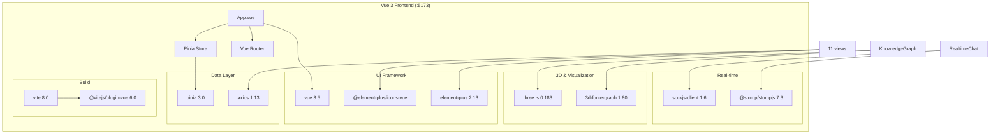
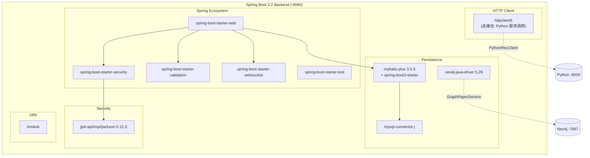
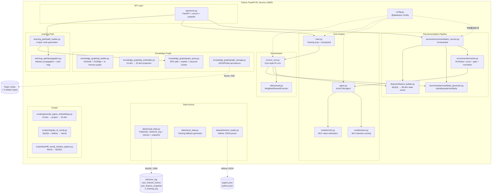

# 科研推荐系统答辩问答 v3

> 本文件续接 `QA_2026-06-02_2026-06-05_v2.md`，记录 2026-06-07 起的后续问答。

---

## Q38: AC 网络的实质是什么？训练中学习的是什么？（2026-06-07）（git: 5ab8357）

### 物理实质：两个 MLP，约 6.6 万参数

AC 网络不是一个"网络"，而是**两个独立的三层 MLP**，各自用 Adam 优化器独立更新：

| 组件 | 文件 | 结构 | 参数量 |
|------|------|------|--------|
| Actor | `models/actor.py` | `Linear(128→128)→ReLU→LayerNorm→Linear(128→128)→ReLU→LayerNorm→Linear(128→1)` | ~33K |
| Critic | `models/critic.py` | `Linear(96→128)→ReLU→LayerNorm→Linear(128→128)→ReLU→LayerNorm→Linear(128→1)` | ~33K |

两者加起来约 6.6 万参数——这是一个非常小的网络（对比：ResNet-18 有 1100 万参数）。之所以够用，是因为输入不是原始像素而是已经高度结构化的 96/128 维特征向量。

### 训练中变化的只有一个东西：权重矩阵

每轮训练中，以下参数被 Adam 优化器更新：

- **Actor 的 6 个权重/偏置矩阵**（3 个 Linear 层 × 2）：`actor.py:36-45`
- **Critic 的 6 个权重/偏置矩阵**（3 个 Linear 层 × 2）：`critic.py:31-40`

除此之外**没有任何东西变化**——没有新神经元、没有结构变化、没有记忆存储。所有的"学习"都编码在这约 6.6 万个浮点数中。

### 学习的是什么：一个打分函数

**Actor 学习的是**：给定用户状态 s 和论文特征 p，输出这篇论文被用户喜欢的概率。

```
π(a_i|s) = softmax( Actor([s | p_i]) )  对 i=1..N 篇候选论文
```

训练前，Actor 的权重是随机正交初始化的（`actor.py:52`，gain=0.01），所有论文的概率几乎均匀。训练后，Actor 学会了区分：与用户兴趣向量余弦相似度高的论文、KG 拓扑距离近的论文会获得更高的 softmax 概率。

**Critic 学习的是**：给定用户状态 s，估计从这个状态开始能获得的期望累积奖励。

```
V(s) = Critic(s)  → 标量
```

### 学习机制：TD 误差是 Actor 和 Critic 之间的唯一桥梁

核心代码在 `agent.py:93-163`，单步更新流程：

```
1. Actor 选论文 a_t → 环境给出奖励 r_t
2. Critic 估计 V(s_t) 和 V(s_{t+1})
3. 计算 TD 误差: δ = r_t + γ·V(s_{t+1}) - V(s_t)
   - δ > 0: 实际比预期好 → 这个动作值得鼓励
   - δ < 0: 实际比预期差 → 这个动作应该抑制
4. Critic 更新: 最小化 δ²（让 V(s) 预测更准）
5. Actor 更新: 最大化 log π(a_t|s_t) · δ（好动作概率↑，坏动作↓）
   + 熵正则项 -β·H(π) 防止过早收敛到单一推荐
```

**关键设计**：Actor 更新用的是 `δ.detach()`（`agent.py:149`），即 δ 的梯度不回流到 Critic。这意味着 Actor 和 Critic 的权重更新是解耦的——Critic 只管把 V(s) 估准，Actor 只管利用 δ 的符号和大小来调整策略。

### 驱动学习的是什么：六维奖励信号

Actor 和 Critic 本身没有"对错"概念——它们只会朝着更高奖励的方向优化。奖励信号来自 `utils/reward.py` 的加权线性函数：

```
r = α·click + β·favorite + γ·read_time + δ·topic_match + η·long_term_value + ζ·kg_topology
  = 1.0·click + 2.0·favorite + 0.5·read_time + 3.0·topic_match + 1.5·long_term + 2.0·kg_topology
```

训练时这些信号并非来自真实用户（`rec_env.py:259-274`），而是用 `cos_sim(user_interest, paper_topic)` 模拟的——兴趣越匹配，模拟点击/收藏概率越高。

### 训练收敛后保存的是什么

`agent.py:198-212` 的 `save_model()` 保存到 `checkpoints/ac_model.pth`，内容包括：

```python
{
    "actor_state_dict":  {...},   # Actor 所有权重
    "critic_state_dict": {...},   # Critic 所有权重
    "train_step": 15000,          # 总训练步数
    "episode_count": 300,         # 总 episode 数
    "config": {...},              # 超参数快照
}
```

推理时 `load_model()` 恢复这两个 state_dict，Actor 的 `score_candidates()` 即可直接用于排序——Critic 在推理阶段不参与计算。

### 一句话总结

AC 网络的实质是**两个小型 MLP 的权重矩阵**。训练改变的唯一东西就是这 ~66K 个浮点数。Actor 学会了一个从 (用户状态, 论文特征) → 推荐概率的映射，Critic 学会了一个从用户状态 → 期望累积奖励的映射。两者通过 TD 误差 δ 耦合：δ 是 Critic 的预测目标，也是 Actor 更新幅度的缩放因子。

---

## Q39: 学习路径的四层节点如何生成？掌握度传播算法如何计算？（2026-06-07）（git: 5ab8357）

### 相关文件

| 文件 | 职责 |
|------|------|
| `learning_path/path_builder.py` | 四层节点生成、边构建、序列化 |
| `learning_path/propagation.py` | 掌握度传播算法、颜色映射、发光强度 |
| `knowledge_graph/graph_query.py:123-172` | `get_keyword_cluster()` — 关键词聚类查询 |

### 四层节点的生成算法

入口：`PathBuilder.build_path()`（`path_builder.py:62-125`），流程如下：

```
1. _extract_known_keywords(history)
   → 从用户历史论文中提取关键词 + 出现频率作为初始掌握度

2. query.get_keyword_cluster(target_topic)
   → 在 KG 中查找目标关键词的共现关键词和相关论文

3. _build_path_nodes(known, target, related, papers)
   → 按深度分四层构建节点序列

4. _build_path_edges(nodes)
   → depth → depth+1 的相邻层之间建边
```

四层节点的生成逻辑在 `_build_path_nodes()`（`path_builder.py:152-208`）：

| 层 | depth | 节点来源 | 数量 | 初始掌握度 |
|----|-------|---------|------|-----------|
| **Layer 0 — 已掌握** | 0 | 用户历史论文中的关键词（最多 5 个） | ≤5 | `_extract_known_keywords()` 计算 |
| **Layer 1 — 相关知识** | 1 | 与目标关键词共现的关联关键词（`get_keyword_cluster` 返回） | ≤k (默认5) | 若在历史中出现过则取其频率，否则 0.0 |
| **Layer 2 — 目标主题** | 2 | 目标关键词本身 | 1 | 若在历史中出现过则取其频率，否则 0.0 |
| **Layer 3 — 目标论文** | 3 | 包含目标关键词的论文 | ≤max_nodes | 0.0（尚未阅读） |

**Layer 1 的关键词是如何找到的**（`graph_query.py:123-172` `get_keyword_cluster()`）：

1. 将 `target_topic` 标准化为 `kw_{topic}` 格式
2. 在倒排索引 `_kw_paper_idx` 中查找包含该关键词的所有论文
3. 遍历这些论文，统计它们携带的其他关键词的出现次数（共现频率）
4. 按共现频率降序排列，取前 k=5 个作为 "related_keywords"
5. 同时取前 k 篇包含目标关键词的论文作为 "papers"

$$\text{co\_occurrence}(kw_i, kw_{target}) = \sum_{p \in papers(kw_{target})} \mathbb{1}[kw_i \in keywords(p)]$$

### 掌握度传播算法

`KnowledgePropagation`（`propagation.py:16-227`）维护一个全局的 `mastery_state: Dict[str, float]`，记录每个 KG 节点的当前掌握度。

#### 传播公式

当一个学习事件发生时（用户阅读一篇论文），掌握度沿 KG 边多跳传播：

```
mastery(event_node) += delta × event_multiplier          ← 直接更新

for hop in 1..max_hops:
    new_delta = delta × decay^(hop) × rel_weight × edge_weight
    mastery(neighbor) += new_delta                       ← 邻居传播
```

**传播边类型及权重**（`propagation.py:187-191`）：

| 边类型 | 方向 | 权重 | 含义 |
|--------|------|------|------|
| `has_keyword` | 论文 → 关键词 | **0.8** | 读一篇论文，对其关键词的掌握提升最多 |
| `cite` | 论文 → 被引论文 | 0.4 | 读一篇论文，对其引用的前置工作有一定了解 |
| `publish_in` | 论文 → 期刊/会议 | 0.3 | 读一篇论文，对发表场馆有微弱认知 |

**衰减机制**：

- `decay = 0.6`：每传播一跳，影响力衰减 40%
- `max_hops = 3`：最多传播三跳
- `min_delta = 1e-4`：低于此阈值停止传播，避免无限扩散

$$\Delta mastery(B) = \delta_0 \times 0.6^{hop} \times w_{rel} \times w_{edge}$$

#### 批量初始化：时间衰减权重

`batch_update(history)`（`propagation.py:87-106`）在加载学习路径时被调用。关键设计：

```python
time_weight = (i + 1) / n    # 第 i 篇论文的权重 = 位置/总数
```

- 最早读的论文（i=0, weight ≈ 1/n）：掌握度贡献最小，模拟遗忘
- 最近读的论文（i=n-1, weight = 1.0）：掌握度贡献最大
- 中间论文线性插值

### 具体例子

假设用户 `student_wang`，历史阅读 3 篇 NLP 论文，目标学习方向是 `"reinforcement_learning"`。

#### 场景设定

**用户历史（按时间顺序，越后越近）**：

| 序号 | 论文 | 关键词 |
|------|------|--------|
| 0 (最早) | `paper_transformer` "Attention Is All You Need" | `kw_attention`, `kw_transformer`, `kw_nlp` |
| 1 | `paper_bert` "BERT" | `kw_transformer`, `kw_pretraining`, `kw_nlp` |
| 2 (最晚) | `paper_gpt` "GPT-3" | `kw_transformer`, `kw_pretraining`, `kw_language_model` |

**目标主题**：`reinforcement_learning`

**知识图谱中该主题的共现关键词**（`get_keyword_cluster` 返回）：

| 相关关键词 | 共现次数 | 含义 |
|-----------|---------|------|
| `kw_mdp` | 8 | Markov Decision Process |
| `kw_q_learning` | 7 | Q-Learning |
| `kw_policy_gradient` | 6 | Policy Gradient |
| `kw_deep_rl` | 5 | Deep RL |
| `kw_exploration` | 4 | Exploration strategies |

**目标论文**：`paper_dqn` "Playing Atari with Deep RL"

---

#### 第一步：生成四层节点

**Layer 0 — 已掌握关键词**（`_extract_known_keywords`）：

遍历用户历史 3 篇论文，统计每个关键词出现次数：

```
kw_transformer:    出现在 paper_transformer, paper_bert, paper_gpt → 3次
kw_nlp:            出现在 paper_transformer, paper_bert → 2次
kw_pretraining:    出现在 paper_bert, paper_gpt → 2次
kw_attention:      出现在 paper_transformer → 1次
kw_language_model: 出现在 paper_gpt → 1次
```

归一化（除以总论文数 3），取前 5：

| 节点 | 掌握度 | 计算 |
|------|--------|------|
| `kw_transformer` | 0.67 | 2/3 |
| `kw_nlp` | 0.67 | 2/3（并列，取前5都会进入） |
| `kw_pretraining` | 0.67 | 2/3 |
| `kw_attention` | 0.33 | 1/3 |
| `kw_language_model` | 0.33 | 1/3 |

**Layer 1 — 相关关键词**（来自 `get_keyword_cluster`）：

| 节点 | 初始掌握度 | 原因 |
|------|-----------|------|
| `kw_mdp` | 0.0 | 用户从未接触过 RL 领域 |
| `kw_q_learning` | 0.0 | 同上 |
| `kw_policy_gradient` | 0.0 | 同上 |
| `kw_deep_rl` | 0.0 | 同上 |
| `kw_exploration` | 0.0 | 同上 |

**Layer 2 — 目标关键词**：

| 节点 | 初始掌握度 |
|------|-----------|
| `kw_reinforcement_learning` | 0.0 |

**Layer 3 — 目标论文**：

| 节点 | 初始掌握度 |
|------|-----------|
| `paper_dqn` | 0.0 |

此时四层节点共 5+5+1+1 = 12 个，Layer 0 有值，Layer 1-3 全部为 0。

---

#### 第二步：掌握度传播（batch_update）

`KnowledgePropagation.batch_update(history)` 按时间顺序对每篇论文执行传播。

**传播 paper_transformer（i=0，time_weight = 1/3）**：

```
delta_0 = 1.0 × 1/3 = 0.333

① 直接更新 paper_transformer 自身:
   mastery(paper_transformer) = min(1.0, 0 + 0.333) = 0.333

② 沿 has_keyword 边传播（rel_weight=0.8，decay=0.6）:
   → kw_attention:    0.333 × 0.6¹ × 0.8 × 1.0 = 0.160
   → kw_transformer:  0.333 × 0.6¹ × 0.8 × 1.0 = 0.160
   → kw_nlp:          0.333 × 0.6¹ × 0.8 × 1.0 = 0.160

③ 沿 cite 边传播（rel_weight=0.4）:
   → 假设 paper_transformer 引用了 paper_elmo:
      0.333 × 0.6¹ × 0.4 × 1.0 = 0.080

④ 二阶传播（从 kw_attention 继续，decay²=0.36）:
   kw_attention 的邻居论文: 0.160 × 0.6 × 0.8 × 1.0 = 0.077
   ...（继续衰减直到 < min_delta 或 hop >= max_hops）
```

**传播 paper_bert（i=1，time_weight = 2/3）**：

```
delta_1 = 1.0 × 2/3 = 0.667

① mastery(paper_bert) += 0.667

② 沿 has_keyword:
   → kw_transformer:  += 0.667 × 0.6 × 0.8 × 1.0 = 0.320
   → kw_pretraining:  += 0.667 × 0.6 × 0.8 × 1.0 = 0.320
   → kw_nlp:          += 0.667 × 0.6 × 0.8 × 1.0 = 0.320
```

**传播 paper_gpt（i=2，time_weight = 3/3 = 1.0）**：

```
delta_2 = 1.0

① mastery(paper_gpt) += 1.0

② 沿 has_keyword:
   → kw_transformer:      += 1.0 × 0.6 × 0.8 × 1.0 = 0.480
   → kw_pretraining:      += 1.0 × 0.6 × 0.8 × 1.0 = 0.480
   → kw_language_model:   += 1.0 × 0.6 × 0.8 × 1.0 = 0.480
```

---

#### 第三步：传播后的掌握度汇总

三篇论文的传播效果累加（只列出在路径节点中的）：

| 节点 | paper_transformer | paper_bert | paper_gpt | **累计** | **截断(≤1.0)** |
|------|:---:|:---:|:---:|------|------|
| `kw_transformer` | 0.160 | 0.320 | 0.480 | 0.960 | **0.960** |
| `kw_pretraining` | 0 | 0.320 | 0.480 | 0.800 | **0.800** |
| `kw_nlp` | 0.160 | 0.320 | 0 | 0.480 | **0.480** |
| `kw_attention` | 0.160 | 0 | 0 | 0.160 | **0.160** |
| `kw_language_model` | 0 | 0 | 0.480 | 0.480 | **0.480** |
| `kw_mdp` | 0 | 0 | 0 | 0 | **0.000** |
| `kw_q_learning` | 0 | 0 | 0 | 0 | **0.000** |
| `paper_dqn` | 0 | 0 | 0 | 0 | **0.000** |

> 注：此例中 NLP 和 RL 领域之间没有跨领域的 KG 边，所以传播停留在 NLP 子图中。如果知识图谱中存在 `kw_transformer → cite → paper_decision_transformer`（一篇用 Transformer 做 RL 的论文），则传播会跨到 RL 领域——这正是 KG 传播的价值。

---

#### 第四步：应用到前端可视化

`KnowledgePropagation.apply_to_path()` 将上述 mastery 值写入每个 `PathNode.mastery`，然后：

**颜色映射**（`_mastery_to_color`）：
```
kw_transformer (0.960) →  #12B573  绿色（接近掌握）
kw_pretraining (0.800) →  #2AB87E  绿色偏黄
kw_nlp         (0.480) →  #E08E10  橙色（学习中）
kw_attention   (0.160) →  #6479E2  蓝紫色（刚接触）
kw_mdp         (0.000) →  #3B82F6  蓝色（未学习）
paper_dqn      (0.000) →  #3B82F6  蓝色（未学习）
```

**发光强度**：直接使用 mastery 值，`kw_transformer` 发光 0.96，`paper_dqn` 发光 0.0。

**三层渐变逻辑**（`propagation.py:213-226`）：
```
mastery 0.0 → 蓝色 #3B82F6（未学习）
mastery 0.5 → 橙色 #F59E0B（学习中，过渡态）
mastery 1.0 → 绿色 #10B981（已掌握）
```

---

### 算法特点与局限

**特点**：
- 掌握度传播是**有向衰减**的：一跳邻居获得 60%×权重，二跳 36%，三跳 22%，自然模拟了"读一篇论文，最直接学会的是它的关键词，间接了解它的引用文献"
- 时间衰减权重是**线性**而非指数的：越晚读的论文贡献越大（`(i+1)/n`），模拟的是近期记忆更清晰
- 掌握度全局累积、有上限（1.0），防止反复阅读同一领域论文导致值无限增长

**局限**：
- 当前 `_propagate` 只沿**出边**方向传播（`edge.dst_id`），不沿入边反向传播
- 传播仅依赖 KG 拓扑结构，未结合论文的实际文本内容或用户行为反馈强度
- `batch_update` 假定用户已完整阅读了历史中的每篇论文（全部以 `read` 事件处理）

---

## Q40: 私信（实时聊天）功能是如何从代码层面实现的？（2026-06-07）（git: 5ab8357）

### 相关文件

| 层 | 文件 | 职责 |
|----|------|------|
| 后端 REST | `controller/PrivateMessageController.java` | 6 个 REST 端点 |
| 后端 WebSocket | `controller/MessageWebSocketController.java` | STOMP 消息处理 |
| 后端服务 | `service/impl/PrivateMessageServiceImpl.java` | 核心业务逻辑 |
| 后端实体 | `entity/PrivateMessage.java`, `entity/UserContact.java` | 两张数据库表映射 |
| 后端配置 | `config/WebSocketConfig.java` | STOMP Broker 配置 |
| 前端页面 | `views/RealtimeChat.vue` | 主聊天页面 (~340 行) |
| 前端组件 | `components/chat/ConversationRail.vue` | 左侧会话面板 |
| 前端 API | `api/message.js` | 6 个 API 调用封装 |
| 数据库 | `private_messages`, `user_contacts` 表 | 消息存储 + 联系人关系 |

### 整体架构：双通道模式

```
┌─────────────────────────────────────────────────────┐
│  Vue 3 Frontend                                     │
│                                                      │
│  ┌──────────────┐    ┌───────────────────────────┐  │
│  │ REST 通道     │    │ WebSocket 通道 (STOMP)     │  │
│  │ axios 请求    │    │ SockJS → STOMP Client     │  │
│  │              │    │                            │  │
│  │ 发送/历史/列表 │    │ 实时推送 / 在线状态         │  │
│  └──────┬───────┘    └──────────┬────────────────┘  │
└─────────┼──────────────────────┼────────────────────┘
          │                      │
          ▼                      ▼
┌─────────────────────────────────────────────────────┐
│  Spring Boot Backend                                │
│                                                      │
│  PrivateMessageController  MessageWebSocketController│
│  (REST @RequestMapping)     (@MessageMapping STOMP)  │
│         │                         │                  │
│         └─────────┬───────────────┘                  │
│                   ▼                                   │
│        PrivateMessageServiceImpl                     │
│        (统一业务逻辑)                                  │
│                   │                                   │
│          ┌────────┴────────┐                         │
│          ▼                 ▼                          │
│   PrivateMessageMapper  UserContactMapper            │
│   (MyBatis-Plus)        (MyBatis-Plus)               │
└─────────────────────────────────────────────────────┘
          │                 │
          ▼                 ▼
   ┌──────────┐    ┌──────────────┐
   │ private_ │    │ user_contacts│
   │ messages │    │              │
   └──────────┘    └──────────────┘
```

### 数据模型（两张表）

**`private_messages`** — 消息本体：

| 字段 | 类型 | 含义 |
|------|------|------|
| `id` | BIGINT PK | 消息 ID |
| `sender_id` | BIGINT FK→user | 发送者 |
| `receiver_id` | BIGINT FK→user | 接收者 |
| `content` | TEXT | 消息内容 |
| `msg_type` | INT | 1=文本, 2=图片, 3=链接 |
| `is_read` | BOOLEAN | 是否已读 |
| `read_time` | DATETIME | 阅读时间 |
| `status` | INT | 0=已撤回, 1=正常 |
| `create_time` | DATETIME | 发送时间 |

**`user_contacts`** — 联系人关系：

| 字段 | 类型 | 含义 |
|------|------|------|
| `id` | BIGINT PK | 关系 ID |
| `user_id` | BIGINT FK→user | 用户 |
| `contact_id` | BIGINT FK→user | 联系人 |
| `relation_type` | VARCHAR | FOLLOW / FRIEND / COLLABORATOR |
| `create_time` | DATETIME | 建立时间 |

> 关键设计：联系人关系是**双向存储**的——A 给 B 发消息后，`user_contacts` 中同时插入 (A, B) 和 (B, A) 两条记录。这样查询"我的会话列表"只需 `WHERE user_id = ?`，无需 OR 查询。

Both mappers (`PrivateMessageMapper.java`, `UserContactMapper.java`) 都是空的 MyBatis-Plus `BaseMapper<T>` 接口——所有 CRUD 通过 MyBatis-Plus 内置方法完成，不需要手写 SQL。

---

### 消息发送的完整链路

以用户 A（id=1）向用户 B（id=2）发送 "Hello" 为例：

#### 第一步：前端输入 → 两级发送

`RealtimeChat.vue:306-338` `sendMessage()`：

```javascript
// 1. 乐观更新：消息立即出现在本地 UI
messages[selected].push({
  id: `tmp_${Date.now()}`,
  from: meId,           // 1
  to: selected.value,   // 2
  content: 'Hello',
  time: new Date().toLocaleTimeString(),
  _tmp: true            // 标记为临时消息
})

// 2. REST 持久化（确保消息一定存入数据库）
await sendMessageRest(2, 'Hello')
// → POST /api/message/send?receiverId=2&content=Hello

// 3. WebSocket 实时推送（让接收方立刻收到）
if (stompClient && connected.value) {
  stompClient.publish({
    destination: '/app/send-private',
    body: JSON.stringify({ token, receiverId: '2', content: 'Hello' })
  })
}
```

> 乐观更新失败处理：如果 REST 调用抛异常，临时消息被 splice 删除，ElMessage 提示错误。

#### 第二步：后端 REST 路径

`PrivateMessageController.java:45-49` → `PrivateMessageServiceImpl.sendMessage()`：

```java
// ① 插入消息
PrivateMessage message = new PrivateMessage();
message.setSenderId(1L);
message.setReceiverId(2L);
message.setContent("Hello");
message.setMsgType(1);    // 文本
message.setCreateTime(LocalDateTime.now());
privateMessageMapper.insert(message);

// ② 维护双向联系人关系
updateContact(1L, 2L);   // A 的联系人列表里有 B
updateContact(2L, 1L);   // B 的联系人列表里有 A
```

`updateContact()` 逻辑（`PrivateMessageServiceImpl.java:180-193`）：

```java
// 查询 (userId, contactId) 是否已存在
UserContact contact = userContactMapper.selectOne(queryWrapper);
if (contact == null) {
    // 不存在 → 插入新记录
    contact = new UserContact();
    contact.setUserId(userId);
    contact.setContactId(contactId);
    contact.setCreateTime(LocalDateTime.now());
    userContactMapper.insert(contact);
}
// 已存在 → 不重复插入（后续可扩展更新 last_message_time）
```

#### 第三步：后端 WebSocket 路径

`MessageWebSocketController.java:28-49` `handlePrivateMessage()`：

```java
@MessageMapping("/send-private")  // 对应前端 destination /app/send-private
public void handlePrivateMessage(@Payload Map<String, Object> messageData) {
    // ① 从 STOMP 消息体中提取 JWT（不是 HTTP Header）
    String token = (String) messageData.get("token");
    jwtUtil.validateToken(token);                    // 验证
    Long senderId = jwtUtil.getUserIdFromToken(token); // 解析用户 ID

    // ② 持久化到数据库（与 REST 路径调用同一个方法）
    privateMessageService.sendMessage(senderId, receiverId, content);

    // ③ 推送到接收者的私人队列
    messagingTemplate.convertAndSendToUser(
        receiverId.toString(),   // "2"
        "/queue/private",        // → /user/2/queue/private
        messageData              // 原始消息体转发
    );
}
```

#### 第四步：接收方前端接收

`RealtimeChat.vue:260-261` — WebSocket 连接时订阅：

```javascript
client.subscribe('/user/queue/private', msg => {
    const d = JSON.parse(msg.body)
    handleIncoming(d)
})
```

`handleIncoming()`（line 284-304）：

```javascript
function handleIncoming(data) {
    const from = Number(data.senderId)
    const to = Number(data.receiverId)
    const other = (from === meId) ? to : from  // 对方 ID

    // 追加到对应会话的消息列表
    if (!messages[other]) messages[other] = []
    messages[other].push({ id, from, to, content, time, isRead })

    // 更新联系人未读计数
    const contact = contacts.value.find(c => c.id == other)
    if (contact) {
        if (from !== meId) contact.unreadCount++
        contact.lastMessage = msg.content
    } else {
        // 从未聊过的新联系人 → 插入联系人列表顶部
        contacts.value.unshift({
            id: other, name: `用户${other}`,
            unreadCount: 1, lastMessage: msg.content
        })
    }
}
```

---

### 会话列表加载

`RealtimeChat.vue:99-122` → `GET /api/message/conversations`：

`PrivateMessageServiceImpl.getUserConversations()`（line 86-118）：

```java
// ① 查询 user_contacts WHERE user_id = ? → 得到所有联系人
List<UserContact> contacts = userContactMapper.selectList(queryWrapper);

// ② 对每个联系人，填充三样东西：
for (UserContact contact : contacts) {
    // a. 联系人 User 对象（头像、昵称）
    contact.setContact(userMapper.selectById(contact.getContactId()));

    // b. 未读消息数
    // SELECT count(*) FROM private_messages
    // WHERE sender_id=contact AND receiver_id=me AND is_read=false
    contact.setUnreadCount(privateMessageMapper.selectCount(unreadQuery));

    // c. 最后一条消息内容
    // SELECT * FROM private_messages
    // WHERE (sender=me AND receiver=contact) OR (sender=contact AND receiver=me)
    // ORDER BY create_time DESC LIMIT 1
    contact.setLastMessage(lastMessages.get(0).getContent());
}
```

### 聊天历史加载

选中联系人 → `GET /api/message/chat/{contactId}`：

```java
// PrivateMessageServiceImpl.java:66-83
QueryWrapper<PrivateMessage> queryWrapper = new QueryWrapper<>();
queryWrapper.and(wrapper -> wrapper
    .eq("sender_id", userId).eq("receiver_id", contactId)
    .or()
    .eq("sender_id", contactId).eq("receiver_id", userId)
).orderByAsc("create_time");

List<PrivateMessage> messages = privateMessageMapper.selectList(queryWrapper);

// 填充 sender/receiver User 对象（MyBatis @TableField(exist=false) 非 DB 字段）
for (PrivateMessage message : messages) {
    message.setSender(userMapper.selectById(message.getSenderId()));
    message.setReceiver(userMapper.selectById(message.getReceiverId()));
}
```

前端加载后自动标记对方发来的未读消息为已读（`RealtimeChat.vue:200-203`）：

```javascript
for (const msg of messages[id]) {
    if (msg.to === meId && !msg.isRead) {
        await markMessageRead(msg.id)  // POST /api/message/mark-read/{messageId}
        msg.isRead = true
    }
}
```

---

### 在线状态广播

`RealtimeChat.vue:268` — WebSocket 连接成功后：

```javascript
// 发布上线事件
client.publish({
    destination: '/app/user-online',
    body: JSON.stringify({ token })
})
```

`MessageWebSocketController.java:76-89`：

```java
@MessageMapping("/user-online")
public void handleUserOnline(@Payload Map<String, Object> data) {
    // 验证 JWT → 获取 userId
    Long userId = jwtUtil.getUserIdFromToken(token);

    // 广播到 /topic/user-status（所有订阅者都收到）
    messagingTemplate.convertAndSend(
        "/topic/user-status",
        Map.of("userId", userId, "status", "online")
    );
}
```

前端订阅（`RealtimeChat.vue:262-266`）：

```javascript
client.subscribe('/topic/user-status', msg => {
    const d = JSON.parse(msg.body)
    if (d.status === 'online') onlineSet.value.add(Number(d.userId))
    else onlineSet.value.delete(Number(d.userId))
})
```

`ConversationRail.vue` 中用 `onlineSet` 显示"在线协作中"/"异步协作中"标签。

---

### 合作者推荐算法

`PrivateMessageServiceImpl.getRecommendedCollaborators()`（line 121-171）：

```
前提条件: 当前用户角色必须是 RESEARCHER，否则直接返回空列表

1. 从 user_interest_history 解析当前用户的兴趣标签 → Set<String> myTags
2. 排除: 自己 + user_contacts 中已有的联系人
3. 查询所有 RESEARCHER 角色的其他用户
4. 对每个用户:
   a. 解析其 user_interest_history 兴趣标签 → Set<String> theirTags
   b. 计算交集: common = myTags ∩ theirTags
5. 过滤: 只保留 overlap > 0 的用户
6. 按 overlap 降序排列
7. 取前 2 个 → 构造 CollaboratorRecommendation 对象
```

示例：
```
myTags    = {"NLP", "Transformer", "Deep Learning"}
user_B    = {"NLP", "Transformer", "BERT"}          → overlap=2 ✓
user_C    = {"RL", "MDP"}                            → overlap=0 ✗
user_D    = {"NLP", "Deep Learning", "Attention"}    → overlap=2 ✓ (并列)

返回: [user_B(overlap=2), user_D(overlap=2)]
```

前端展示在 `ConversationRail.vue` 的推荐面板中，点击"开始对话"自动发送带共同兴趣标签的问候语：

```javascript
// RealtimeChat.vue:170
const greeting = `你好！我是${username}，发现我们在${commonInterests.join('、')}方面有共同兴趣，希望可以一起交流探讨！`
await sendMessageRest(rec.userId, greeting)
```

---

### STOMP Broker 配置

`WebSocketConfig.java` — 三行关键配置：

```java
@Configuration
@EnableWebSocketMessageBroker
public class WebSocketConfig implements WebSocketMessageBrokerConfigurer {

    public void configureMessageBroker(MessageBrokerRegistry config) {
        config.enableSimpleBroker("/topic", "/queue");
        // /topic → 广播（用户状态）
        // /queue → 点对点（私信，通过 /user/{id}/queue/... 路由）

        config.setApplicationDestinationPrefixes("/app");
        // 前端发送到 /app/xxx → 后端 @MessageMapping("xxx") 接收
    }

    public void registerStompEndpoints(StompEndpointRegistry registry) {
        registry.addEndpoint("/ws-messages")
                .setAllowedOriginPatterns("*")
                .withSockJS();  // SockJS 兼容层（自动降级非 WebSocket 环境）
    }
}
```

路由映射：

| 前端 STOMP destination | 后端处理方法 | 功能 |
|------------------------|-------------|------|
| `/app/send-private` | `handlePrivateMessage()` | 发送私信 |
| `/app/mark-read` | `handleMarkAsRead()` | 已读回执 |
| `/app/user-online` | `handleUserOnline()` | 上线广播 |
| `/user/queue/private` | （客户端订阅） | 接收私信推送 |
| `/topic/user-status` | （客户端订阅） | 接收在线状态变更 |

---

### JWT 在 WebSocket 中的特殊处理

HTTP 请求中 JWT 在 `Authorization: Bearer xxx` 头，但 **SockJS 不支持自定义 STOMP 头**。因此：

- JWT 放在 STOMP **消息体**中传输：`{ token, receiverId, content }`
- `MessageWebSocketController` 的每个 `@MessageMapping` 方法都自行从 `messageData.get("token")` 提取并验证
- `/ws-messages/**` 在 `SecurityConfig` 白名单中（line 60），不走 HTTP JWT 过滤器
- 前端每个 STOMP `publish()` 都在 body 中附带 `token`

---

### 前端降级策略

`RealtimeChat.vue:99-122` `loadConversations()` 的 fallback 逻辑：

```
① 尝试 REST 获取真实联系人列表
   ↓ 失败或为空
② 尝试从 /api/knowledge/graph 获取知识图谱节点作为展示
   ↓ 标记 isRealUser=false，禁止发送消息
   ↓ 失败
③ 显示"还没有协作会话"
```

`RealtimeChat.vue:217-282` `connect()` 的 fallback 逻辑：

```javascript
// ① 优先 import 本地 npm 包 (sockjs-client, @stomp/stompjs)
//    ↓ 失败
// ② CDN 加载 UMD 脚本
//    ↓ 失败
// ③ console.debug（静默降级，用户仍可通过 REST 发送消息）
```

---

### 关键设计决策总结

| 决策 | 做法 | 原因 |
|------|------|------|
| 双通道 | REST + WebSocket 并行 | REST 保证持久化可靠性，WebSocket 保证实时性 |
| 乐观更新 | 消息先显示再持久化 | 消除输入延迟感；失败时 splice 回滚 |
| 联系人双向存储 | (A,B) + (B,A) 两条记录 | 查询简化：`WHERE user_id=?` 替代 OR 查询 |
| JWT 在消息体 | 不放 HTTP Header | SockJS 不支持自定义 STOMP CONNECT 头 |
| 所有 @MessageMapping 自行验 JWT | 无全局 STOMP 拦截器 | 每条消息独立验证，安全性与 REST 等价 |
| REST 返回裸实体 | 不用 `Result` 信封 | 前端 `res.data \|\| res` 兼容处理；历史原因 |
| 空白 MyBatis-Plus Mapper | 不写 SQL | 单表 CRUD 完全由 BaseMapper 内置方法覆盖 |
| CDN fallback | sockjs + stomp CDN | 网络受限环境下 npm 包可能加载失败 |

---

## Q41: 前端样式系统如何配置？CSS 文件的分层架构是怎样的？（2026-06-08）（git: 0273855）

### 相关文件

| 文件 | 行数 | 职责 |
|------|------|------|
| `src/styles/tokens.css` | 104 | 设计令牌（CSS 自定义属性 + 双主题） |
| `src/styles/layout-system.css` | 165 | 页面布局系统（root 类、header、响应式） |
| `src/style.css` | 207 | 全局样式入口（reset、工具类、表单） |
| `src/main.js` | 19 | 应用入口，决定 CSS 加载顺序 |
| 所有 `.vue` 文件 | — | 组件级 `<style scoped>` 隔离样式 |

### 五层 CSS 架构

```
┌─────────────────────────────────────────────────────┐
│ Layer 5: Element Plus CSS                           │
│   element-plus/dist/index.css                      │
│   element-plus/theme-chalk/dark/css-vars.css       │
│   (第三方组件库样式，~500KB)                          │
├─────────────────────────────────────────────────────┤
│ Layer 4: Vue Scoped Styles (每个 .vue 文件)          │
│   <style scoped> ... </style>                      │
│   (Vue 自动添加 data-v-xxxxx 属性隔离)               │
│   11 个 view × 1 block + 12 个 component × 1 block  │
├─────────────────────────────────────────────────────┤
│ Layer 3: Global Styles (style.css, 207 行)           │
│   @import './styles/tokens.css'                    │
│   @import './styles/layout-system.css'             │
│   浏览器 reset、工具类 .card/.glass/.btn             │
├─────────────────────────────────────────────────────┤
│ Layer 2: Layout System (layout-system.css, 165 行)   │
│   .xxx-root 页面容器（8 个页面 × 背景渐变 + 侧边栏偏移）│
│   .page-header 通用页头卡片                         │
│   @media 980px 响应式断点                           │
├─────────────────────────────────────────────────────┤
│ Layer 1: Design Tokens (tokens.css, 104 行)          │
│   :root { --color-bg-canvas, --radius-xl, ... }    │
│   [data-theme='light'] { ... } 覆盖亮色值           │
│   65+ 个 CSS 自定义属性                              │
└─────────────────────────────────────────────────────┘
```

### 加载链路

`main.js`（19 行）决定了全部 CSS 的加载顺序：

```javascript
import './style.css'                                  // ① 全局样式（内含 tokens + layout-system）
import { createApp } from 'vue'
import { createPinia } from 'pinia'
import ElementPlus from 'element-plus'
import 'element-plus/dist/index.css'                 // ② Element Plus 基础样式
import 'element-plus/theme-chalk/dark/css-vars.css'  // ③ Element Plus 暗色模式变量
import App from './App.vue'
import router from './router'

// ... Vue 初始化 ...

const initialTheme = localStorage.getItem('theme') || 'dark'
document.documentElement.setAttribute('data-theme', initialTheme)
document.documentElement.classList.toggle('dark', initialTheme !== 'light')
```

加载顺序：
1. `style.css` → 先 `@import tokens.css` → 再 `@import layout-system.css` → 然后全局 reset 和工具类
2. Element Plus 基础 CSS（组件库所有组件的默认样式）
3. Element Plus 暗色 CSS 变量覆盖（根据 `dark` class 自动切换）

> `@import` 在 CSS 中是同步的——浏览器在解析到 `@import` 时会暂停当前 CSS 的解析，先去加载被引用的文件。所以 tokens.css 和 layout-system.css 里的变量在 style.css 后续规则中已经可用。

---

### Layer 1: Design Tokens（`tokens.css`）

65 个 CSS 自定义属性，分为五组：

#### ① 字体栈（3 个）

```css
--font-body:   'Inter', 'Segoe UI', 'PingFang SC', 'Microsoft YaHei', sans-serif;
--font-display: 'Segoe UI', 'PingFang SC', 'Microsoft YaHei', sans-serif;
--font-mono:   'Cascadia Code', 'SFMono-Regular', Consolas, monospace;
```

中英文混排：西文字体在前，中文字体在后。`--font-display` 用于标题，`--font-body` 用于正文，`--font-mono` 用于代码。

#### ② 颜色系统（暗色默认）

```
语义色:
  --color-text-primary:   #edf4ff    主文字（近白）
  --color-text-secondary: #9cafcf    辅助文字（灰蓝）
  --color-text-muted:     #6f84a8    弱化文字
  --color-accent-primary: #7c8cff    主强调色（紫蓝）
  --color-accent-secondary: #37d5ff  次强调色（青蓝）

背景色:
  --color-bg-canvas:   #07111f       画布底层（最深）
  --color-bg-elevated: #0d1b2f       提升层
  --color-bg-panel:    rgba(10,20,36,0.88)  面板（半透明）
  --color-bg-muted:    rgba(15,23,42,0.72)  卡片背景
  --color-sidebar-surface: rgba(8,15,27,0.92)  侧边栏

边框色:
  --color-border-subtle: rgba(148,163,184,0.18)  微妙边框
  --color-border-strong: rgba(124,140,255,0.32)  强调边框
```

#### ③ 功能区域色（8 个）

每个页面模块有独立的强调色，用于左侧彩色装饰条：

```css
--color-area-recommend: #7c8cff    推荐（Home）→ 紫蓝
--color-area-search:    #34d399    搜索 → 绿色
--color-area-knowledge: #f59e0b    知识图谱 → 橙色
--color-area-community: #ec4899    社区 → 粉色
--color-area-profile:   #8b5cf6    个人主页 → 紫色
--color-area-admin:     #ef4444    管理 → 红色
--color-area-learning:  #06b6d4    学习路径 → 青色
--color-area-chat:      #10b981    私信 → 翠绿
```

使用示例（`ConversationRail.vue:165`）：
```css
.conversation-rail[data-area="chat"] {
  border-left: 3px solid var(--color-area-chat);
}
```

#### ④ 别名层（简化引用）

```css
--primary:    var(--color-accent-primary);    /* 缩短引用链 */
--secondary:  #8b5cf6;
--accent:     var(--color-accent-secondary);
--bg-dark:    var(--color-bg-canvas);
--bg-card:    var(--color-bg-muted);
--border:     var(--color-border-subtle);
--design-border: var(--color-border-subtle);
```

组件代码里写 `var(--primary)` 而不是 `var(--color-accent-primary)`。

#### ⑤ 亮色主题覆盖

```css
[data-theme='light'] {
  color-scheme: light;
  --color-bg-canvas:   #f3f7ff;
  --color-text-primary: #10213a;
  --color-accent-primary: #4f46e5;
  /* ... 覆盖所有 30+ 个颜色变量 ... */
}
```

`main.js` 中 `document.documentElement.setAttribute('data-theme', initialTheme)` 设置了 `<html>` 标签的 `data-theme` 属性，CSS 属性选择器 `[data-theme='light']` 自动切换到亮色值。

---

### Layer 2: Layout System（`layout-system.css`）

#### 页面根容器（8 个 `.xxx-root` 类）

每个页面都有一个与路由对应的 root class，统一控制：

```css
.home-root, .search-root, .community-root, .profile-root,
.chat-root, .viz-root, .edit-root, .admin-root {
  min-height: 100vh;
  background:
    radial-gradient(circle at top left,  rgba(124,140,255,0.16), transparent 32%),
    radial-gradient(circle at top right, rgba(55,213,255,0.12),  transparent 26%),
    radial-gradient(circle at bottom center, rgba(94,234,212,0.08), transparent 28%),
    var(--color-bg-canvas);
}
```

三个径向渐变叠加在底色上，形成微妙的深度感。

#### 侧边栏布局偏移

所有页面的主内容区统一向右偏移侧边栏宽度：

```css
.home-root > main.main-content,
.search-root > main.main-content,
/* ... 8 个页面重复 ... */
{
  margin-left: calc(var(--shell-sidebar-width) + var(--space-6));
  width: calc(100% - var(--shell-sidebar-width) - var(--space-6));
  padding: var(--space-7) clamp(1.25rem, 2.5vw, 2.5rem) var(--space-8);
}
```

`--shell-sidebar-width: 18rem`，加上 1.5rem 间距，主内容区左侧留出约 19.5rem 给 `Sidebar.vue`。

以 `Home.vue` 为例（line 2）：
```html
<div class="home-root">
  <Sidebar />
  <main class="main-content">
    <!-- 推荐流内容 -->
  </main>
</div>
```

#### 响应式断点

```css
@media (max-width: 980px) {
  .home-root > main.main-content,
  /* ... */
  {
    margin-left: 0;       /* 取消侧边栏偏移 */
    width: 100%;           /* 内容全宽 */
    padding: var(--space-4);
  }
}
```

980px 以下侧边栏隐藏或改为 overlay 模式，内容区全宽。

#### 通用页头组件

```css
.page-header {
  display: flex; justify-content: space-between;
  padding: var(--space-6) var(--space-7);
  border-radius: var(--radius-xl);
  border: 1px solid var(--color-border-subtle);
  background: linear-gradient(180deg, rgba(124,140,255,0.12), transparent 70%),
              var(--color-bg-panel);
  backdrop-filter: blur(18px);
}
```

`PageHeader.vue` 组件使用 `.page-header` 类，被 `Community.vue` 和 `PaperDetail.vue` 使用。

---

### Layer 3: Global Styles（`style.css`）

207 行，分为四部分：

#### ① CSS imports（line 1-2）

```css
@import './styles/tokens.css';        /* 变量必须先加载 */
@import './styles/layout-system.css'; /* 布局依赖变量 */
```

#### ② 浏览器 Reset（line 4-41）

```css
*, *::before, *::after { box-sizing: border-box; }

html { font-size: 16px; -webkit-font-smoothing: antialiased; }

body { background: var(--color-bg-canvas); color: var(--color-text-primary); }

a { color: inherit; text-decoration: none; }
```

#### ③ 自定义滚动条（line 43-55）

```css
::-webkit-scrollbar { width: 5px; height: 5px; }
::-webkit-scrollbar-thumb { background: var(--color-border-subtle); border-radius: 4px; }
```

#### ④ 工具类（line 61-206）

| 类名 | 作用 | 使用位置 |
|------|------|---------|
| `.card` | 毛玻璃卡片（bg + border + radius + shadow + hover 上浮） | 几乎所有组件 |
| `.glass` | 仅背景虚化（backdrop-filter: blur(12px)） | 页头、面板 |
| `.btn` | 渐变按钮（紫蓝渐变 + hover 上浮 + glow 阴影） | 散落在各 view |
| `.btn.secondary` | 透明边框按钮 | — |
| `.animate-fade-up` | 入场动画（opacity 0→1 + translateY 10px→0） | Profile 等 |
| `.hstack` / `.vstack` | flex 快捷类（水平/垂直排列 + 间距） | 散落使用 |
| `input[type='text']` | 统一样式的输入框 | 全局生效 |
| `h1-h6` / `p` / `code` | 排版基础样式 | 全局生效 |

---

### Layer 4: Vue Scoped Styles

每个 `.vue` 文件内的 `<style scoped>` 块（Vue 编译时自动为选择器追加 `data-v-xxxxx` 属性）：

```
组件模板:  <div class="bubble">
编译输出:  <div class="bubble" data-v-7ba5bd90>
CSS 规则:  .bubble[data-v-7ba5bd90] { ... }
```

这意味着 `.bubble` 样式只影响当前组件内的 `.bubble` 元素，绝对不会泄漏到其他组件。

**统计**：

| 位置 | 数量 | 最大文件 |
|------|------|---------|
| views/ | 11 个 | Profile.vue (1074 行，其中约 550 行是样式) |
| components/ | 12 个 | PaperCard.vue (287 行)，PathInsightRail.vue (570 行) |

**两个例外**：`AdminConsole.vue` 和 `Community.vue` 在 `<style scoped>` 之外还写了 `@import '@/style.css'`——这意味着它们的 scoped 样式中可以使用 `.card`、`.glass`、`.btn` 等全局工具类，同时保持其他样式隔离。

---

### Layer 5: Element Plus CSS

在 `main.js` 中无条件加载：

```javascript
import 'element-plus/dist/index.css'                 // ~500KB，所有组件的默认样式
import 'element-plus/theme-chalk/dark/css-vars.css'  // 暗色 CSS 变量覆盖
```

Element Plus 的暗色模式默认通过 `<html class="dark">` 触发，但本项目的 `tokens.css` 用的是 `data-theme` 属性。`main.js` 同时设置了两种标记：

```javascript
document.documentElement.setAttribute('data-theme', initialTheme)   // 触发 tokens.css 的 [data-theme] 选择器
document.documentElement.classList.toggle('dark', initialTheme !== 'light')  // 触发 Element Plus 的 .dark 选择器
```

---

### 样式文件大小分布

| 文件 | 大小（估算） | 占比 |
|------|:---:|:---:|
| Element Plus CSS（第三方） | ~500 KB | 70% |
| 25 个 `.vue` scoped 样式（合计） | ~15 KB | 20% |
| `style.css` + `tokens.css` + `layout-system.css` | ~6 KB | 8% |
| **总计** | ~521 KB | — |

虽然 Element Plus 占了最大体积，但 Vite 构建时会 tree-shake 未使用的组件样式，最终 `dist/` 中 CSS 约 80-120 KB（gzip 后约 15-25 KB）。

---

### 样式分散问题

当前样式的分散体现在三个层面：

1. **全局工具类和 Vue scoped 之间的断层**：`.card` / `.glass` 定义在 `style.css`，但在 `.vue` 的 `<style scoped>` 中无法直接引用（scoped 隔离了全局类）。因此 `AdminConsole.vue` 和 `Community.vue` 通过 `@import '@/style.css'` 在 scoped 块内重新引入——这是一种 workaround，导致全局样式被重复加载两次（一次在 `main.js`，一次在组件内）。

2. **`layout-system.css` 的 8 重选择器重复**：`.home-root > main.main-content` 的同一段 CSS 被复制了 8 份（每个页面一份），而非使用一个通用类名。这是因为每个页面有独立的 `xxx-root` 类。

3. **组件样式内联度过高**：`Profile.vue` 有 500+ 行 scoped 样式，`KnowledgeGraph.vue` 和 `RealtimeChat.vue` 各有 300+ 行。这些巨型样式块没有拆分为独立的 CSS 模块。

**改进方向**：
- 将 8 个页面的重复布局规则合并为一个 `.page-root > main.main-content` 通用选择器
- 将全局工具类（`.card`、`.glass`、`.btn`）迁移到 `tokens.css` 或独立的 `utilities.css`，避免组件内 `@import` 造成的重复加载
- 将大型组件的样式拆分为独立 CSS 文件（如 Profile.css 的提取，见上文 Q41 修复）

---

## Q42: 推荐链路如何给论文打分？用一个完整例子讲解（2026-06-08）（git: 8098680）

### 相关文件

| 文件 | 职责 |
|------|------|
| `features/feature_builder.py` | 用户特征构建 → 96 维状态向量 |
| `recommender/candidate_generator.py` | 候选召回（相似度 + 热门） |
| `recommender/ranker.py` | 三项打分 + 质量门控 + 归一化 + 加权排序 |
| `models/actor.py` | Actor 网络逐论文打分 |
| `config.py` | 所有阈值和权重 |

### 场景设定

用户 `student_wang`（id=3），研究方向 NLP/Transformer，请求 5 篇推荐。日志显示此前读过 `paper_transformer` 和 `paper_bert`。

---

### Step 1：构建用户状态向量（96 维）

`FeatureBuilder.build_state()`（`feature_builder.py:63-77`）从 MySQL 读取用户行为数据，构建两个 32 维向量后拼接：

```
interest_vector[0:32] (加权兴趣)  +  history_vector[0:32] (历史行为)  +  kg_vector[0:32] (KG 特征)
```

用户 student_wang 的行为日志：
```
paper_transformer: click(×3) + favorite(×1) → 加权 3×0.5 + 1×2.0 = 3.5
paper_bert:        click(×2) + read(×1, 120s) → 加权 2×0.5 + 1.0 + 1.0(时长) = 3.0
```

经 topic_vector 加权池化 + L2 归一化后得到 96 维状态向量：
```
user_state = [0.12, -0.08, 0.33, -0.15, ..., 0.07, -0.22, 0.41]  (96 floats)
                ← interest(0:32) →   ← history(32:64) →   ← kg(64:96) →
```

---

### Step 2：候选召回（50 篇 → 过滤已读）

`CandidateGenerator.generate()`（`candidate_generator.py:116-156`），hybrid 策略：

```
70% 相似度召回 (35篇):  dot(user_interest_vec, paper_topic_vec) → 降序取前35
30% 热门召回 (15篇):    按 citation_count 降序取前15

过滤历史已读 {paper_transformer, paper_bert}
→ 剩余 48 篇候选
```

---

### Step 3：计算三项原始得分

`RLRanker.rank()`（`ranker.py:62-174`）对 48 篇候选逐一计算：

以其中 5 篇候选为例（为了展示清楚）：

| 候选论文 | 主题 | 被引 |
|---------|------|:---:|
| A: "Attention Mechanisms Survey" | NLP, attention, transformer | 520 |
| B: "Deep RL for Robotics" | RL, robotics, control | 180 |
| C: "Graph Neural Networks Review" | GNN, graphs, embedding | 340 |
| D: "BERT Variants in Practice" | BERT, NLP, pretraining | 890 |
| E: "Quantum Computing Basics" | quantum, physics | 65 |

#### 3a. Actor 网络打分

Actor 输入 `[user_state(96) | paper_vec(32)] = 128维`，输出 1 个 logit，softmax 后得到概率：

```
候选A: actor_score = 0.042   (NLP 强相关，概率偏高)
候选B: actor_score = 0.008   (RL 领域，用户无历史，概率低)
候选C: actor_score = 0.015   (GNN 部分相关)
候选D: actor_score = 0.051   (BERT 高度相关)
候选E: actor_score = 0.002   (完全不相关)
```

> Actor softmax 将 48 篇的概率之和约束为 1.0，所以每篇的绝对值都很小（均值 ~0.02）。这就是为什么后面需要归一化——否则原始 0.02 级的 Actor 分数在加权求和时无力对抗 0.7 级的余弦相似度。

#### 3b. 余弦相似度

`dot(user_state[0:64], paper_topic_vector)` 计算用户在基础语义空间上对每篇论文的匹配度：

```
候选A: cos_sim = 0.72    (attention + transformer 与用户兴趣向量高度一致)
候选B: cos_sim = 0.11    (RL 向量方向与 NLP 差异大)
候选C: cos_sim = 0.38    (GNN 有部分 overlap)
候选D: cos_sim = 0.81    (BERT + NLP 与用户高度匹配)
候选E: cos_sim = 0.03    (量子计算与 NLP 基本正交)
```

#### 3c. KG 拓扑分

`dot(user_kg, paper_kg_emb)` 计算知识图谱中用户上下文与论文的拓扑邻近度：

```
user_kg = KGEmbedder.get_user_kg_embedding(["paper_transformer", "paper_bert"])
        → 从 paper_transformer 和 paper_bert 节点出发，聚合邻居结构信息

候选A: kg_score = 0.55   (attention 与 transformer 在引用图中共被引)
候选B: kg_score = 0.02   (RL 在 KG 中与 NLP 子图距离远)
候选C: kg_score = 0.28   (GNN 与 transformer 有弱关联)
候选D: kg_score = 0.68   (BERT 直接邻接 paper_bert 节点)
候选E: kg_score = 0.01
```

三项汇总：

| 候选 | Actor | CosSim | KG | 说明 |
|------|:-----:|:------:|:--:|------|
| A | 0.042 | 0.72 | 0.55 | NLP 强相关，三项均衡 |
| B | 0.008 | 0.11 | 0.02 | RL 弱相关 |
| C | 0.015 | 0.38 | 0.28 | GNN 中等相关 |
| D | 0.051 | 0.81 | 0.68 | BERT 最强相关 |
| E | 0.002 | 0.03 | 0.01 | 完全不相关，三项全低 |

---

### Step 4：质量门控

`ranker.py:127-150`。门控条件（OR 逻辑——**任意一项**满足即可通过）：

```
min_cos_similarity = 0.05    → cos_sim ≥ 0.05
min_actor_score    = 0.001   → actor ≥ 0.001
```

| 候选 | CosSim≥0.05? | Actor≥0.001? | KG≥0? | 通过? |
|------|:---:|:---:|:---:|:---:|
| A | ✓ 0.72 | ✓ | ✓ | ✅ |
| B | ✓ 0.11 | ✓ | ✓ | ✅ |
| C | ✓ 0.38 | ✓ | ✓ | ✅ |
| D | ✓ 0.81 | ✓ | ✓ | ✅ |
| E | ✗ 0.03 | ✓ 0.002 | ✓ | ✅ |

> 5 篇全部通过——E 的 Actor=0.002 刚好踩线。如果有论文三项全低于阈值，会被直接丢弃（不参与归一化），防止归一化"救活"垃圾论文。

---

### Step 5：Min-Max 归一化

`ranker.py:152-155`。对 48 篇通过门控的论文，逐项做归一化：

$$\text{norm}(x_i) = \frac{x_i - \min(X)}{\max(X) - \min(X)}$$

假设 48 篇中各项的极值为：
```
actor:  min=0.001, max=0.058
cos:    min=0.01,  max=0.85
kg:     min=0.00,  max=0.72
```

对 5 篇候选做归一化：

```
候选A: actor_norm = (0.042-0.001)/(0.058-0.001) = 0.719
        cos_norm   = (0.72-0.01)/(0.85-0.01)     = 0.845
        kg_norm    = (0.55-0.00)/(0.72-0.00)     = 0.764

候选B: actor_norm = (0.008-0.001)/0.057 = 0.123
        cos_norm   = (0.11-0.01)/0.84    = 0.119
        kg_norm    = (0.02-0.00)/0.72    = 0.028

候选D: actor_norm = (0.051-0.001)/0.057 = 0.877
        cos_norm   = (0.81-0.01)/0.84    = 0.952
        kg_norm    = (0.68-0.00)/0.72    = 0.944
```

**关键变化**：归一化前 Actor 分数在 0.002-0.051 区间（差异很小），归一化后 0.018-0.877。此时三项在 [0,1] 内公平竞争。

---

### Step 6：加权求和 → Top-K

`ranker.py:158-161`：`final = 0.5 × actor_norm + 0.3 × cos_norm + 0.2 × kg_norm`

| 候选 | 0.5×Actor | 0.3×Cos | 0.2×KG | **最终分** | 排名 |
|------|:---:|:---:|:---:|:---:|:---:|
| D | 0.439 | 0.286 | 0.189 | **0.913** | #1 |
| A | 0.360 | 0.254 | 0.153 | **0.766** | #2 |
| C | 0.246 | 0.131 | 0.081 | **0.458** | #3 |
| B | 0.061 | 0.036 | 0.006 | **0.103** | #4 |
| E | 0.018 | 0.007 | 0.003 | **0.028** | #5 |

最终返回 Top-5 → `[D, A, C, B, E]`。

---

### 为什么需要归一化——核心设计意图

对比归一化前后 Actor 的实际影响力：

**归一化前**（假设直接加权）：
```
D: 0.5×0.051 + 0.3×0.81 + 0.2×0.68 = 0.026 + 0.243 + 0.136 = 0.405
A: 0.5×0.042 + 0.3×0.72 + 0.2×0.55 = 0.021 + 0.216 + 0.110 = 0.347
```
Actor 贡献占比：0.026/0.405 = **6.4%**——名义权重 50%，实际影响力不到 7%。

**归一化后**：

```
D: 0.5×0.877 + 0.3×0.952 + 0.2×0.944 = 0.439 + 0.286 + 0.189 = 0.913
A: 0.5×0.719 + 0.3×0.845 + 0.2×0.764 = 0.360 + 0.254 + 0.153 = 0.766
```
Actor 贡献占比：0.439/0.913 = **48%**——名义权重 50% = 实际影响力 48%。

归一化确保 RL 训练出的 Actor 策略真正主导排序，而非被余弦相似度的量级淹没。

---

### 完整流程总结

```
用户请求 GET /api/recommend?userId=3&k=5
  │
  ▼
FeatureBuilder.build_state(user_id=3)
  → 96 维状态向量: [interest(32)|history(32)|kg(32)]
  │
  ▼
CandidateGenerator.generate()
  → hybrid 策略: 70%相似度 + 30%热门 → 50 篇候选
  → 过滤已读 → 48 篇
  │
  ▼
RLRanker.rank()
  ├─ Actor.score_candidates()   → 48 个概率 (softmax 归一化)
  ├─ dot(topic, user_state)     → 48 个余弦相似度
  ├─ dot(paper_kg, user_kg)     → 48 个 KG 拓扑分
  ├─ 质量门控: cos≥0.05 OR actor≥0.001 → 48/48 通过
  ├─ Min-Max 归一化 ×3          → 每项映射到 [0,1]
  └─ 加权: 0.5×Actor + 0.3×Cos + 0.2×KG → 降序
  │
  ▼
Top-5: [D("BERT Variants"), A("Attention Survey"), C("GNN Review"), B("Deep RL"), E("Quantum")]
  │
  ▼
解释生成: GraphQuery.explain_recommendation()
  → D: "与您阅读的《BERT》共享关键词：pretraining, NLP"
  → A: "与您阅读的《Attention Is All You Need》共享关键词：attention"
  → ...
```

---

## Q43: 余弦相似度的精确计算过程与推荐排序评估值流程（2026-06-08）（git: 8098680）

### 相关文件

| 文件 | 行号 | 职责 |
|------|------|------|
| `recommender/ranker.py:88-103` | 余弦相似度计算 | dot(topic_matrix, base_state) |
| `recommender/ranker.py:86-165` | 排序评估值全流程 | 三项打分 → 门控 → 归一化 → 加权 |
| `features/feature_builder.py:63-81` | 用户状态构建 | L2 归一化的 96 维向量 |
| `recommender/candidate_generator.py:239-249` | 论文向量构建 | 10维特征 → 投影 → L2归一化 |

---

### 余弦相似度：精确公式

**不是**标准的 `dot(a,b) / (|a|·|b|)`，而是简化的 `dot(topic_vector, base_state_slice)` 裁剪到非负。

代码在 `ranker.py:88-103`：

```python
base_state = user_state[:self.config.base_state_dim]  # (64,)  — 用户状态前 64 维

topic_matrix = np.array([
    item.topic_vector                                   # (64,)  — 每篇论文特征
    for item in candidates
])                                                     # → (N, 64)

cos_sims = np.clip(np.dot(topic_matrix, base_state), 0.0, None)  # → (N,)
```

数学上：

$$\text{cos\_sim}_i = \max\!\left(0,\; \sum_{j=0}^{63} \text{topic\_matrix}[i,j] \times \text{base\_state}[j]\right)$$

### 两个向量的构建

**`base_state`（64 维）** — `feature_builder.py:63-81`：

```
user_state = concat(interest[0:32], history[0:32], kg[0:32])   (96 维)
           ↓
user_state = user_state / ||user_state||                         L2 归一化，||user_state|| = 1.0
           ↓
base_state = user_state[0:64]                                   前 64 维切片
           → ||base_state|| ≤ 1.0（Cauchy-Schwarz）
```

**`topic_vector`（64 维）** — `candidate_generator.py:239-249`：

```
raw_10d = [被引率, 0, 关键词数/10, 0, 作者数, 0, 0, 0, 0, (year-2010)/15]
        ↓ Z-score: (raw_10d - projection_mean) / projection_std
normalized_10d
        ↓ 投影: normalized_10d @ P (10×32 正交矩阵)
projected_32d
        ↓ L2 归一化
vec_32d = projected_32d / ||projected_32d||                     ||vec_32d|| = 1.0
        ↓ 补零到 64 维
topic_vector = [vec_32d[0], ..., vec_32d[31], 0, 0, ..., 0]     ||topic_vector|| = 1.0
```

### 为什么叫"余弦"但不除两模长

| 向量 | L2 范数 | 原因 |
|------|:---:|------|
| `topic_vector` | **= 1.0** | `_build_from_metadata` 最后执行 `/ np.linalg.norm()` |
| `base_state` | **≤ 1.0** | 是 96 维归一化向量的前 64 维切片，严格 ≤1.0 |

因为 `topic_vector` 已经是 unit norm，`dot(topic, base) = ||topic|| × ||base|| × cos(θ) = ||base|| × cos(θ)`。

如果 `||base_state|| ≈ 1.0`（KG 段接近零时），dot 退化为真正的 cosine。KG 段非零时，`||base_state|| < 1.0`，dot 比真正的 cosine 略微缩小。对于排序来说，这个缩放是**单调的**——不会改变相对顺序，所以不影响排序结果。

### 裁剪到非负

`np.clip(..., 0.0, None)` — 负值被截为零。语义上：指向相反方向的论文与用户"不相关"而非"负相关"。这避免了负分在后续加权求和时抵消其他维度的正分。

---

### 推荐排序评估值的完整计算（ranker.py:86-165）

以候选 D（"BERT Variants", cos=0.81, actor=0.051, kg=0.68）为例：

```
┌─ Step 1: 计算三项原始得分 ─────────────────────────────────
│
│  base_state = user_state[0:64]              (64,)
│
│  ① cos_D   = dot(topic_D, base_state)      = 0.81
│             = clip(0.81, 0, ∞)              = 0.81
│
│  ② actor_D = softmax(Actor([user_state(96) | topic_D[0:32](32)]))
│             = 0.051  (在 48 篇候选中的概率)
│
│  ③ user_kg = KGEmbedder.get_user_kg_embedding(history_paper_ids)
│     kg_D   = dot(user_kg, paper_kg_D)       = 0.68
│             = clip(0.68, 0, 1)               = 0.68
│
├─ Step 2: 质量门控 ─────────────────────────────────────────
│
│  cos_D=0.81 ≥ 0.05  ✓
│  actor_D=0.051 ≥ 0.001 ✓
│  → 通过门控
│
├─ Step 3: Min-Max 归一化 (在 48 篇通过门控的论文中) ───────
│
│  极值: actor∈[0.001, 0.058], cos∈[0.01, 0.85], kg∈[0.00, 0.72]
│
│  actor_norm_D = (0.051 - 0.001) / 0.057 = 0.877
│  cos_norm_D   = (0.81 - 0.01) / 0.84    = 0.952
│  kg_norm_D    = (0.68 - 0.00) / 0.72    = 0.944
│
├─ Step 4: 加权求和 ─────────────────────────────────────────
│
│  final_D = 0.5 × 0.877 + 0.3 × 0.952 + 0.2 × 0.944
│          = 0.4385 + 0.2856 + 0.1888
│          = 0.913
│
├─ Step 5: 降序排序 → Top-K ─────────────────────────────────
│
│  order = argsort([0.913, 0.766, 0.458, 0.103, 0.028, ...])
│        = [0, 1, 2, 3, 4, ...]
│        = [D, A, C, B, E, ...]
│
│  Top-5 → final_scores = [0.913, 0.766, 0.458, 0.103, 0.028]
│
└────────────────────────────────────────────────────────────
```

### 三项的时间依赖

三项在计算上是**独立的**，没有先后依赖：

```
Actor  → GPU forward pass (self.agent.actor.score_candidates)
Cos    → NumPy vectorized dot product (np.dot)
KG     → CPU dot product loop (for i in candidates)
```

可以并行执行。当前代码是顺序的（line 103 → line 115 → line 123），但对性能影响不大——50 篇候选 + 64 维向量，三项在毫秒级完成。

---

## Q44: 数据库全部 13 张表及各字段作用（2026-06-08）（git: a80ed51）

> DDL 完整定义见 `backend/src/main/resources/research_db.sql`（1794 行）。以下按功能分组说明。

### 一、用户与认证

#### 1. `user` — 用户表

| 字段 | 类型 | 作用 |
|------|------|------|
| `id` | BIGINT PK | 用户唯一 ID |
| `username` | VARCHAR(50) UNIQUE | 登录用户名 |
| `password` | VARCHAR(128) | BCrypt 加密密码（60 chars + salt） |
| `email` | VARCHAR(100) | 邮箱（可选） |
| `role` | VARCHAR(20) | 角色：`STUDENT`/`RESEARCHER`/`ADMIN`，默认 STUDENT |
| `avatar` | VARCHAR(255) | 头像 URL |
| `bio` | TEXT | 个人简介 |
| `research_interests` | VARCHAR(500) | 研究方向（逗号分隔，注册时写入，后续由 user_interest_history 接管） |
| `deleted` | TINYINT(1) | 逻辑删除标记 |
| `create_time` | DATETIME | 注册时间 |
| `update_time` | DATETIME | 最后更新时间 |

---

### 二、论文

#### 2. `paper` — 论文表（AMiner 数据）

| 字段 | 类型 | 作用 |
|------|------|------|
| `id` | BIGINT PK | 内部自增 ID |
| `aminer_id` | VARCHAR(64) UNIQUE | AMiner 原始论文 ID（推荐系统跨服务 key） |
| `title` | VARCHAR(500) | 论文标题 |
| `abstract` | TEXT | 摘要（Java 实体映射为 `abstrakt`） |
| `keywords` | VARCHAR(500) | 关键词（JSON 数组字符串如 `["RL","DQN"]`） |
| `authors` | VARCHAR(500) | 作者列表（JSON 数组字符串） |
| `venue` | VARCHAR(200) | 发表会议/期刊 |
| `year` | SMALLINT | 发表年份 |
| `citation_count` | INT | 被引次数 |
| `embedding` | TEXT | 论文向量 32 维（base64/JSON，离线脚本写入） |
| `embedding_raw` | TEXT | 原始 10 维特征（用于重算 projection） |
| `deleted` | TINYINT(1) | 逻辑删除 |
| `create_time` | DATETIME | 入库时间 |
| `update_time` | DATETIME | 最后更新时间 |

索引：`UNIQUE(aminer_id)`, `INDEX(year)`, `INDEX(citation_count)`, `FULLTEXT(title, abstract)`

---

### 三、用户行为与特征

#### 3. `behavior_log` — 用户行为日志表（RL 训练数据源）

| 字段 | 类型 | 作用 |
|------|------|------|
| `id` | BIGINT PK | 日志 ID |
| `user_id` | BIGINT FK→user | 用户 ID |
| `paper_id` | BIGINT FK→paper | 论文 ID |
| `action` | VARCHAR(20) | 行为类型：`click`/`favorite`/`read` |
| `duration` | INT | 阅读时长（秒，仅 read 有值） |
| `source` | VARCHAR(50) | 来源页面：`recommend`/`search`/`detail` |
| `timestamp` | DATETIME | 行为发生时间 |

作用：RL 训练时 `feature_builder.py` 从此表读取用户行为，加权池化构建用户特征向量（click=0.5, read=1.0, favorite=2.0，时长 bonus +0.5/60s）。

#### 4. `user_interest_history` — 用户兴趣标签表

| 字段 | 类型 | 作用 |
|------|------|------|
| `id` | BIGINT PK | 记录 ID |
| `user_id` | BIGINT FK→user | 用户 ID |
| `interest_tag` | VARCHAR(50) | 兴趣标签（研究方向关键词） |
| `weight` | DOUBLE | 兴趣权重 0-1（注册时 0.5，行为反馈后更新） |
| `source` | VARCHAR(50) | 来源：`register`/`behavior`/`feedback` |
| `record_date` | DATE | 记录日期（按天追踪兴趣变化） |

作用：合作者推荐算法从此表解析用户兴趣交集；Admin 用户管理页从此表回填 researchInterests。

#### 5. `user_feature_snapshot` — 用户 RL 特征向量缓存表

| 字段 | 类型 | 作用 |
|------|------|------|
| `id` | BIGINT PK | 快照 ID |
| `user_id` | BIGINT | 用户 ID |
| `feature_type` | VARCHAR(30) | 特征类型：`interest`/`history`/`kg` |
| `feature_vector` | JSON | 特征向量（64 维 float 数组） |
| `feature_dim` | INT | 向量维度 |
| `source` | VARCHAR(50) | 来源：`computed`/`cached`/`fallback` |
| `created_at` / `updated_at` | DATETIME | 创建/更新时间 |

作用：6 小时 TTL 缓存。推荐服务优先读缓存（`UNIQUE(user_id, feature_type)`），过期后从 behavior_log 实时重建。

---

### 四、收藏

#### 6. `favourite` — 用户论文收藏表

| 字段 | 类型 | 作用 |
|------|------|------|
| `id` | BIGINT PK | 收藏 ID |
| `user_id` | BIGINT FK→user | 用户 ID |
| `paper_id` | BIGINT FK→paper | 论文 ID |
| `folder_name` | VARCHAR(50) | 收藏夹名称（默认"默认收藏夹"，预留多收藏夹功能） |
| `remark` | VARCHAR(200) | 收藏备注 |
| `create_time` | DATETIME | 收藏时间 |

约束：`UNIQUE(user_id, paper_id)` — 同一用户不能重复收藏同一论文。

> 2026-06-08 重构：收藏查询从 `behavior_log WHERE action='favorite'` 迁移到本表。行为日志继续保留收藏记录（供 RL 训练），但 `GET /api/user/favorites` 和 `POST /api/behavior/favorite` 改为读写本表。

---

### 五、社区

#### 7. `post` — 社区帖子表

| 字段 | 类型 | 作用 |
|------|------|------|
| `id` | BIGINT PK | 帖子 ID |
| `user_id` | BIGINT FK→user | 发帖用户 |
| `paper_id` | BIGINT | 关联论文 ID（可选） |
| `title` | VARCHAR(200) | 帖子标题 |
| `content` | TEXT | 帖子正文 |
| `status` | TINYINT | 状态：0=待审核, 1=已发布, 2=已驳回 |
| `review_comment` | VARCHAR(500) | 审核备注 |
| `reviewed_by` | BIGINT FK→user | 审核管理员 ID |
| `reviewed_time` | DATETIME | 审核时间 |
| `deleted` | TINYINT(1) | 逻辑删除 |
| `create_time` / `update_time` | DATETIME | 创建/更新时间 |

角色影响：RESEARCHER 和 ADMIN 发帖 `status=1` 直接发布，STUDENT 发帖 `status=0` 待审核。

#### 8. `comment` — 评论/回复表

| 字段 | 类型 | 作用 |
|------|------|------|
| `id` | BIGINT PK | 评论 ID |
| `post_id` | BIGINT FK→post | 所属帖子 |
| `user_id` | BIGINT FK→user | 评论者 |
| `parent_id` | BIGINT FK→comment | 父评论 ID（支持嵌套回复树） |
| `root_id` | BIGINT | 根评论 ID（查询整个回复子树的快捷索引） |
| `content` | TEXT | 评论内容 |
| `like_count` | INT | 点赞数（冗余存储） |
| `is_best` | TINYINT(1) | 是否精选 |
| `status` | TINYINT | 0=删除, 1=正常, 2=审核中 |
| `create_time` / `update_time` | DATETIME | 创建/更新时间 |

嵌套回复通过 `parent_id → id` 自引用外键实现。`root_id` 冗余字段加速"获取帖子下所有回复"的查询。

#### 9. `post_like` — 帖子点赞表

| 字段 | 类型 | 作用 |
|------|------|------|
| `id` | BIGINT PK | 点赞 ID |
| `user_id` | BIGINT FK→user | 点赞用户 |
| `post_id` | BIGINT FK→post | 被赞帖子 |
| `create_time` | DATETIME | 点赞时间 |

`UNIQUE(user_id, post_id)` — 同一用户对同一帖子仅能点赞一次。点赞计数通过 `batchCountLikes()` 动态计算而非存储在 post 表中。

---

### 六、作者认领

#### 10. `paper_author_claim` — 论文作者认领表

| 字段 | 类型 | 作用 |
|------|------|------|
| `id` | BIGINT PK | 认领记录 ID |
| `paper_id` | BIGINT FK→paper | 论文 ID |
| `user_id` | BIGINT FK→user | 被匹配的用户 |
| `author_name` | VARCHAR(100) | 论文中匹配到的原始作者名 |
| `match_method` | VARCHAR(20) | 匹配方式：`exact`（精确）/`fuzzy`（模糊）/`manual`（手动） |
| `confidence` | DECIMAL(3,2) | 匹配置信度 0.00–1.00 |
| `status` | TINYINT | 0=待确认, 1=已确认为本人, 2=已否认, 3=已过期 |
| `responded_at` | DATETIME | 用户确认/否认的响应时间 |
| `admin_note` | VARCHAR(500) | 管理员备注 |
| `create_time` / `update_time` | DATETIME | 创建/更新时间 |

作用：管理员导入论文时自动匹配作者 → 用户可在 Profile 页确认/否认自己的论文。

---

### 七、消息

#### 11. `private_messages` — 私信表

| 字段 | 类型 | 作用 |
|------|------|------|
| `id` | BIGINT PK | 消息 ID |
| `sender_id` | BIGINT FK→user | 发送者 |
| `receiver_id` | BIGINT FK→user | 接收者 |
| `content` | TEXT | 消息内容 |
| `msg_type` | TINYINT | 1=文本, 2=图片, 3=链接, 4=系统通知（认领提醒） |
| `is_read` | TINYINT(1) | 是否已读 |
| `read_time` | DATETIME | 阅读时间 |
| `status` | TINYINT | 0=已撤回, 1=正常 |
| `create_time` | DATETIME | 发送时间 |

#### 12. `user_contacts` — 联系人表

| 字段 | 类型 | 作用 |
|------|------|------|
| `id` | BIGINT PK | 关系 ID |
| `user_id` | BIGINT FK→user | 用户（关系拥有者） |
| `contact_id` | BIGINT FK→user | 联系人（被添加者） |
| `relation_type` | VARCHAR(20) | 关系类型：`FOLLOW`/`FRIEND`/`COLLABORATOR`/`MENTOR`/`CLASSMATE`/`COLLEAGUE` |
| `remark` | VARCHAR(50) | 备注名 |
| `create_time` | DATETIME | 建立时间 |

设计要点：双向存储（A↔B 互为对方联系人表中的一条记录），简化"我的会话列表"查询为 `WHERE user_id = ?`。

---

### 八、训练

#### 13. `rl_training_log` — RL 训练日志表

| 字段 | 类型 | 作用 |
|------|------|------|
| `id` | BIGINT PK | 记录 ID |
| `episode` | INT | 训练轮次 |
| `user_id` | BIGINT FK→user NULL | 目标用户（系统级训练时为 NULL） |
| `state` | TEXT | 状态表示（用户兴趣向量文本） |
| `action` | TEXT | 动作（推荐论文 ID 列表） |
| `reward` | DOUBLE | 本轮获得奖励 |
| `cumulative_reward` | DOUBLE | 累积奖励 |
| `loss` | DOUBLE | Actor 平均损失 |
| `model_version` | VARCHAR(20) | 模型版本号 |
| `create_time` | DATETIME | 记录时间 |

作用：训练结束后 `train.py` 写入训练摘要，用于追踪模型性能和版本演进。

---

### 表间关系总览

```
user ──┬── behavior_log (user_id)
       ├── user_interest_history (user_id)
       ├── user_feature_snapshot (user_id)
       ├── favourite (user_id)
       ├── post (user_id, reviewed_by)
       ├── comment (user_id)
       ├── post_like (user_id)
       ├── paper_author_claim (user_id)
       ├── private_messages (sender_id, receiver_id)
       ├── user_contacts (user_id, contact_id → user)
       └── rl_training_log (user_id NULL)

paper ──┬── behavior_log (paper_id)
        ├── favourite (paper_id)
        ├── post (paper_id optional)
        ├── paper_author_claim (paper_id)
        └── (Neo4j: Paper nodes + 5 relation types)

post ──── comment (post_id)
     └─── post_like (post_id)

comment ─ comment (parent_id → id, 自引用嵌套回复树)

---

## Q45: 三端包依赖图（2026-06-08）（git: 3503491）

### 一、前端：npm 包依赖



### 二、后端：Maven 包依赖



### 三、Python：功能模块划分

Python 没有包管理器文件（无 requirements.txt），依赖散落在各模块 import 语句中。按功能模块划分 8 组：



### 外部依赖清单

#### npm（10 运行时 + 2 构建）

| 包 | 版本 | 用途 |
|----|------|------|
| `vue` | 3.5 | 响应式 UI 框架 |
| `vue-router` | 4.6 | SPA 路由 |
| `pinia` | 3.0 | 状态管理 |
| `element-plus` | 2.13 | UI 组件库（暗色主题） |
| `@element-plus/icons-vue` | 2.3 | 图标集 |
| `axios` | 1.13 | HTTP 客户端（拦截器自动带 JWT） |
| `3d-force-graph` | 1.80 | 知识图谱 3D 可视化 |
| `three` | 0.183 | 3D 引擎底层 |
| `@stomp/stompjs` | 7.3 | STOMP WebSocket 客户端 |
| `sockjs-client` | 1.6 | WebSocket 兼容层 |
| `vite` | 8.0 | 构建工具 |
| `@vitejs/plugin-vue` | 6.0 | Vue SFC 编译 |

#### Maven（10 依赖）

| 依赖 | 版本 | 用途 |
|------|------|------|
| `spring-boot-starter-web` | 3.2.0 | REST 框架 |
| `spring-boot-starter-security` | 3.2.0 | JWT 认证 |
| `spring-boot-starter-validation` | 3.2.0 | `@Valid` 校验 |
| `spring-boot-starter-websocket` | 3.2.0 | STOMP Broker |
| `mybatis-plus-spring-boot3-starter` | 3.5.5 | ORM |
| `mysql-connector-j` | — | MySQL 驱动 |
| `neo4j-java-driver` | 5.28.5 | Neo4j Bolt 客户端 |
| `jjwt` | 0.12.3 | JWT 签发/验证 |
| `httpclient5` | — | Python 服务调用连接池 |
| `lombok` | — | 编译期代码生成 |

#### Python（8 个第三方库，零配置）

| 库 | 用途 |
|----|------|
| `fastapi` + `uvicorn` + `pydantic` | REST API 框架 |
| `torch` | Actor/Critic 网络前向/反向传播 |
| `numpy` | 向量运算（dot product、归一化） |
| `pymysql` | MySQL 连接（行为日志、兴趣查询） |
| `neo4j` (Python driver) | KG 构建模块连接 Neo4j |

> Python 服务无 `requirements.txt`，依赖在代码中 `import` 时按需加载。`config.py` 的 `default_config` 通过 `@dataclass` 和 `os.getenv()` 提供全部连接参数，无额外配置文件。
```